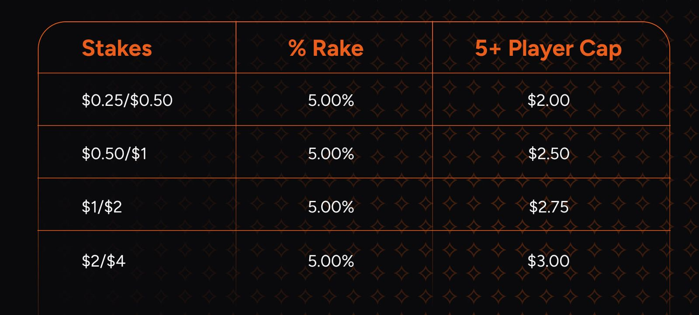
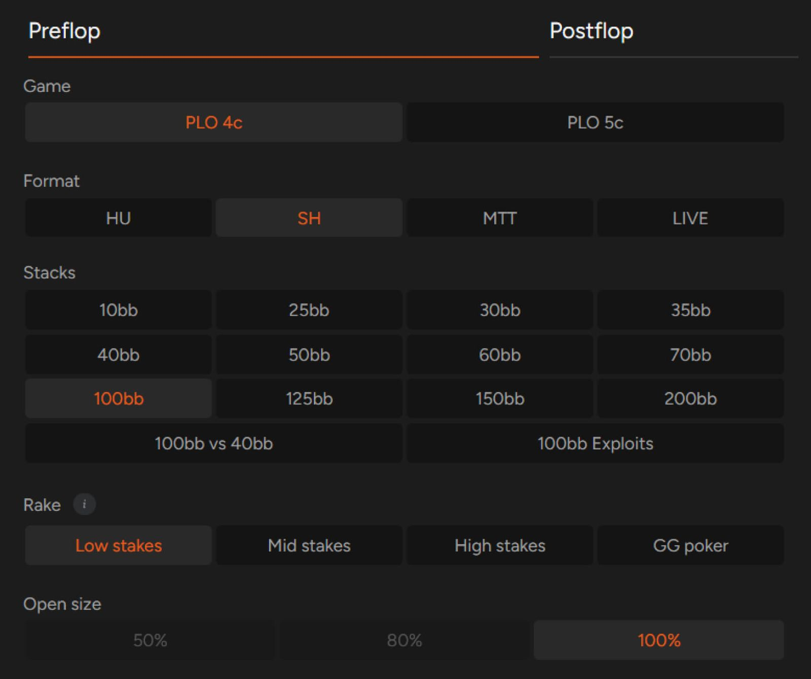

PLO 游戏中的抽水金额会影响你的决策，而且应该影响！

影响扑克胜负的因素有很多，其中最关键的是你对游戏的理解、强大的心理素质以及对手的实力。扑克游戏中的抽水（或称 “抽水”）是一个不太受关注且容易被忽视的因素，尤其对于经验不足的玩家而言。

如果你想成为一名盈利的玩家，就必须重视抽水对你最终收益的影响。因此，本文将探讨与抽水相关的最重要问题。

## 扑克中的抽水是什么？

首先，我们来看一下定义：扑克中的抽水是什么？抽水是指游戏组织者收取的费用，在讨论线下扑克时通常指赌场，而在讨论线上扑克时则指扑克室。

抽水的收取方式有多种，但几乎可以肯定的是：除非你是在朋友家的地下室玩牌，否则 “庄家” 很可能收取某种形式的抽水。

在扑克锦标赛中，抽水的收取通常最为直接。行业标准是，每场锦标赛报名费的 10% 左右会支付给组织比赛的线上扑克网站。在线下扑克中，扑克室通常会扣除报名费的 10-20%，但通常还会收取额外的费用，用于支付荷官或为玩家提供的服务。

例如，当你参加一场 $215 的线上多桌锦标赛时，扑克室会收取 $15 的抽水，而剩余的 $200 将直接进入奖池。在现场扑克环境中，当你参加一场 $1100 的多桌锦标赛（MTT）时，通常 $100 是赌场抽水，大约 3% 的买入用于支付工作人员的费用，剩余的资金（在本例中为 $970）构成奖池。

无论抽水有多高，它只会在你支付锦标赛买入时收取，而且在你之后的游戏过程中，抽水不会影响你决策的正确性。

## 不过，现金游戏的情况有所不同

无论何时，只要你在牌桌旁（虚拟或实体）玩现金游戏，你参与的每一个底池都会被抽取佣金 - 除非适用 “无翻牌，无抽水” 规则，即只有在翻牌发出时才会抽取佣金。

由于 PLO 主要以现金游戏的形式进行，因此每位有志于此的玩家都应该了解佣金对最佳策略的影响。在深入探讨这一点之前，让我们先来看看佣金的计算规则。

谈到现金游戏中的佣金，需要考虑两个因素：佣金占底池的比例以及佣金上限。关于佣金比例，最常见的数字在 3% 到 5% 之间，以下是实际操作示例。

假设你在 PokerStars 的 PLO 10 游戏中全押 $10 并赢得了这手牌。底池金额为 $20，该级别抽水为 4.25%。因此，牌局结束后，你将获得 $19.15（抽水为 $0.85，即 $20 底池的 4.25%）。乍一看，这个数字似乎不多，但随着时间的推移和牌局的增多，累积起来也是一笔不小的数目。

说到抽水，一个更重要的参数是抽水上限，即从底池中抽取的最高金额。

如果你在相同级别（PokerStars 上的 PLO 10）的游戏中赢得 $60 底池，而不是 $20，那么你需要支付的抽水金额为 $2.55。幸运的是，5 人及以上游戏的抽水上限为 $1.50，因此你这次只需支付 $1.50 的抽水。

以下是 PokerStars 上 PLO 和无限注德州扑克现金游戏的抽水结构。

::: info 附注：

大多数情况下，线下现金游戏的抽水方式与线上游戏相同。但有时也会采用限时抽水，这意味着每位玩家在一小时内需支付固定数量的大盲注（通常是几个）。

:::

## 抽水结构为何如此重要

你可能听说过一种说法，认为抽水是低级别玩家最大的敌人。原因如下（我们以 PokerStars 的抽水结构为例，但其他线上扑克室的抽水结构也类似）。

将抽水金额换算成大盲注后，PLO 5、PLO 10 和 PLO 25 的抽水上限分别为 20、15 和 8 BB。

相比之下，低 / 中级别 PLO 50、PLO 100 和 PLO 200 的抽水上限分别为 4、2.5 和 1.375 BB。

扑克玩家的胜率以每百手牌赢得的大盲注数（BB/100）来表示。那么，抽水对胜率的影响有多大呢？PokerStars 的平均每百手抽水从 PLO 10 的 7.57 到 PLO 200 的 4.65 不等。这些数字会因不同的在线扑克室而异，因此我们建议你查看你所在平台的抽水比例。你可以参考 [primedope](https://www.primedope.com/online-poker-rake-comparison-rake-calculator/) 网站的数据。

正如你所见，在微级别玩扑克时，你需要支付的抽水远高于低级别玩家。当然，微级别的胜率更高，但总的来说，如果你认真考虑自己的扑克生涯，就应该将低级别作为训练场和通往更高级别的跳板。

线下现金游戏的情况也类似，低级别（$5/5）的抽水通常设定为 5%，上限为 $20-30。通常情况下，线下游戏的实际水平会高于其标示的限注，而且比线上中低级别游戏更容易一些。因此，除了极少数极端情况外，线下游戏的抽水对胜率的影响应该不会像线上游戏那么大。更重要的是，高级别游戏的抽水影响更小。

## 抽水对扑克策略的影响

每次在现金游戏中投入资金时，你都必须意识到抽水会降低最终的底池大小。换句话说，当你准备在河牌圈跟注 $100 的底池大小的注时（假设抽水为 5%，上限为 $25），你实际上是在跟注 $100，最终赢取 $285（300 - 300 * 5%），而不是 $300。

由于会损失 $15，你手牌的平均权益（作为跟注候选人）应该更高（35%，而不是无抽水游戏中所需的 33%）。因此，扑克游戏中的抽水越高，你的跟注范围就应该越紧（我们假设当你加注未被跟注的金额时，这部分金额不会被抽水）。

这种依赖关系虽然微妙，但适用于现金游戏的每一轮。那么，在玩 PLO 时，你该如何运用这些知识呢？

使用 GTO 解算器时，你可以选择与你所玩游戏中的抽水结构相对应的抽水结构，共有三种设置可供选择。

幸运的是，不同的抽水结构对最优策略的影响并不大，但为了方便记录，以下几点可能会随着抽水值的变化而改变：

- 有些牌在抽水较低时可以盈利地开池，但在抽水较高时则会弃牌。
- 抽水越高，你就越有动力采用 3-bet / 弃牌策略（因为你要么在翻牌前赢得底池，要么作为进攻方继续）。
- 在低级别（高抽水）游戏中，一些 BB 跟注会变成弃牌。

## 不要忽视返水

有些人讨厌返水，有些人则喜欢，但几乎不可能在现金游戏中忽略返水。返水是指在满足特定条件后返还给你的抽水金额。不同的游戏平台提供不同的返水方案，但最常见的方案是根据玩家的游戏时长返还一定比例的已支付抽水。

虽然你不应该完全依赖返水（因为返水比例可能波动很大），但不可否认，好的返水优惠确实能显著提升你的盈利。因此，这是一个值得花时间研究的话题。幸运的是，截至本文撰写之时（2024 年初），两大在线扑克平台 PokerStars 和 GG Poker 都提供约 50% 的返水，这让许多职业扑克玩家的体验更加轻松。

无论你现在在哪里玩牌，都应该查看其他平台是否提供更适合你级别水平的返水条件。

## 抽水和返水固然重要，但真正转化为盈利的是你的牌技

规划你的扑克生涯时，你应该考虑所有上述因素，但你的扑克技巧才是影响盈利的最关键因素。

尽管面临诸多挑战，PLO 游戏仍然是线上线下最容易的扑克游戏之一，而且这种情况很可能会持续一段时间。

利用这一点，制定一套完善的策略，战胜你的对手。使用 GTO 解算器磨练你的翻牌前技巧，避免重蹈对手的覆辙！