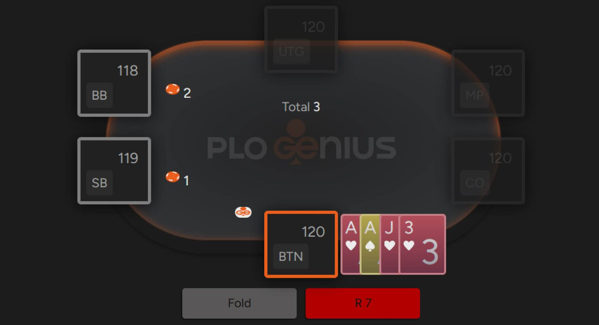
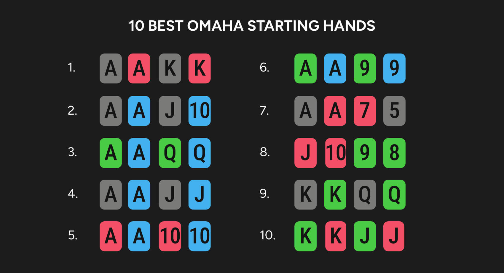
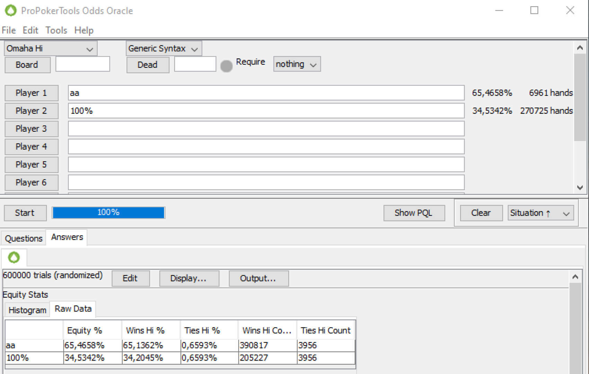

# 奥马哈最佳起手牌：快速指南

什么样的牌才算是好的奥马哈起手牌？

说到 NLHE，找出最佳起手牌非常容易：A-A、K-K、Q-Q、J-J、T-T、9-9 和 A-K 到 A-J。在牌型矩阵上可视化所有可能的组合也相对简单。然而，当我们谈到 PLO 时，情况就变得复杂起来。

毕竟，底牌数量是德州扑克的两倍，这意味着翻牌前有超过 270,000 种独特的牌型组合（而德州扑克只有 1,326 种）！

即使你已经有奥马哈的经验，要理解如此庞大的数字也并非易事。别担心，我们会为你提供帮助，列出奥马哈的最佳起手牌，以及某些组合脱颖而出的原因。

任何 A-A 组合在 BTN 都是简单模式

## 奥马哈中起手牌的权益比德州扑克要接近得多

这是什么意思呢？在 NLHE 中，情况很简单：当你拿到口袋 A-A 时，你对抗任何其他牌型的权益都在 80% 左右（例如，A-A 对抗 K-K 的权益接近 82%）。K-K 和 Q-Q 对抗随机牌型也拥有巨大的优势，而且每少一个点数，优势就会缩小（顺便一提：德州扑克中翻牌前最大的优势是 94.63% 对 5.37% - K-K 对抗 K-2o）。

在 PLO 中，情况就复杂得多。在奥马哈中，牌型可以根据其对抗所有其他牌型的原始权益进行排名，但这种方法不如德州扑克那样准确。除了原始权益之外，每手起手牌还有一些可以用来评估其权益的因素。不过，我们先来看看奥马哈中权益最高的几手牌。

最佳的起手牌

与德州扑克最显著的区别在于，奥马哈中最好的起手牌 - A-A-K-K 双同花 - 相对于所有可能牌型的总和，权益 “仅” 为 67% 比 33%。同样的牌型相对于第二好的牌型 - A-A-J-T-ds（双同花）- 的权益也只有 52%。当我们比较 A-A-K-K-ds 和最好的 K-K，K-K-Q-Q-ds 时，权益优势提升至 69% 比 31%，但仍然比 NLHE 中的差距要小得多。

这是 PLO 的一个关键特征 - 翻牌前的权益差距远小于 NLHE。从这一事实中，我们应该得出什么结论呢？

首先，你很少有动力在翻牌前全押。用最好的牌全押是有利可图的，只是不如在德州扑克中那么有利可图。PLO 的大部分盈利都集中在翻牌后，你通常可以利用对手在翻牌前的失误来获利。

其次，翻牌前选择合适的牌至关重要。如今，即使是水平一般的玩家，在德州扑克锦标赛和现金游戏中，也大致知道在特定位置应该开池、跟注还是加注。但 PLO 就不同了。经验不足的玩家很容易因为底牌看起来不错（符合 NLHE 的标准）就盲目地选择开池或跟注。

第三，位置的重要性不容忽视。在不利位置开池或防守范围过宽，无异于自取灭亡。

PLO 中 A-A 的威力不如在 NLHE 中那么强

再加上没有一张牌型图表可以直观地展示所有可能的组合，很容易得出结论：学习 PLO 的翻牌前策略，更不用说翻牌后的策略，几乎是不可能的。

如果情况如此不利，该怎么办？你必须智胜对手。好消息是，游戏环境是公平的，更棒的是，对手犯错的机会越多，你就能创造越多的优势。

## 底池限注奥马哈的翻牌前策略讲究的是分类

全面的最佳翻牌前 PLO 策略是一个庞大的主题，需要大量使用扑克工具（例如 GTO 解算器）才能掌握。当然，记住 PLO 中所有可能的翻牌前决策几乎是不可能的，因此你必须学会如何快速准确地评估你手中的牌。

以下是我们的指导原则 - 缩小 PLO 新手与高手之间差距的第一步。

为了控制你的翻牌前加注频率，在决定投入筹码之前，你应该考虑以下三个因素：

1. 坚果性
2. 连接性
3. 同花性

## 坚果性

在摊牌时，奥马哈中获胜的平均牌型通常比德州扑克中获胜的平均牌型更强。原因很简单，4 张底牌给了你更多组成强牌的机会。

因此，无论何时决定加注或跟注，都要优先考虑那些能够组成最大牌型的牌。除非是在单挑，否则你应该主要目标是组成坚果牌型。

这就是为什么你应该如此重视 A 高同花听牌和尽可能好的顺子听牌。这些牌型能让你压制对手，而不是反过来。虽然在德州扑克中，任何同花在摊牌时通常都不错，但在奥马哈中，尤其是在多人底池中，如果你没有坚果同花，很可能其他人有。三条也是如此。多个玩家同时击中两对、三条、三条或葫芦的情况并不少见，所以你应该玩那些能够压制对手牌型的牌！

由于在底 PLO 中更容易凑成坚果同花，因此拥有特定花色的 A 就显得尤为重要 - 当同花听牌完成时，你手中握有牌组中最重要的一张牌，这能让你有效地进行诈唬。

## 连接性

除了持有高对子的牌之外，最好的奥马哈起手牌通常都具有很强的连接性。像 K-Q-J-T、J-T-9-8 甚至 J-T-8-7 这样的组合，在翻牌后都能非常有效地发挥其优势。这类牌通常要么成牌很差，要么成牌很好，因此很容易上手。

在评估你的牌型时，要警惕那些带有所谓 “悬垂牌” 的牌。悬垂牌是指那些无法与其他牌组成连张的牌（例如 K-Q-J-5 中的 5），它会削弱你牌型的整体价值。

## 同花性

还有什么比连接牌的奥马哈牌更好呢？那就是同花连接牌。同花性与连接性同样重要。拥有同花听牌在很多情况下都很有帮助，有时，你会在转牌圈同时持有两种同花听牌。在这种情况下，即使你的一种同花听牌不是最强的，阻止对手获得同花听牌仍然很有用。

一般来说，由于无法组成同花，在满员奥马哈游戏中，只有最好的彩虹牌型才有生存空间。此外，请记住，同花色牌越多，补牌机会就越少，因此理想的情况是只有两张同花色牌，也就是双同花牌型。

## 如果你遵循这些基本原则，在奥马哈中选择开池手牌将会更加容易

当然，率先加注只是翻牌前策略的一部分，但扎实的基本功对于如此复杂的游戏至关重要（而且在翻牌前的每个阶段识别边缘牌的能力更是必不可少）。

由于 PLO 主要以现金游戏的形式进行，因此另一个需要考虑的因素是抽水。抽水越高，你在翻牌前能够盈利的牌型组合就越少。另一个需要考虑的因素是筹码量 - 它也会影响你在翻牌前选择开池手牌还是弃牌。

正如你所见，有很多因素需要考虑，而且由于变量众多，即使是最好的玩家也需要大量的练习才能保持对对手的巨大优势。