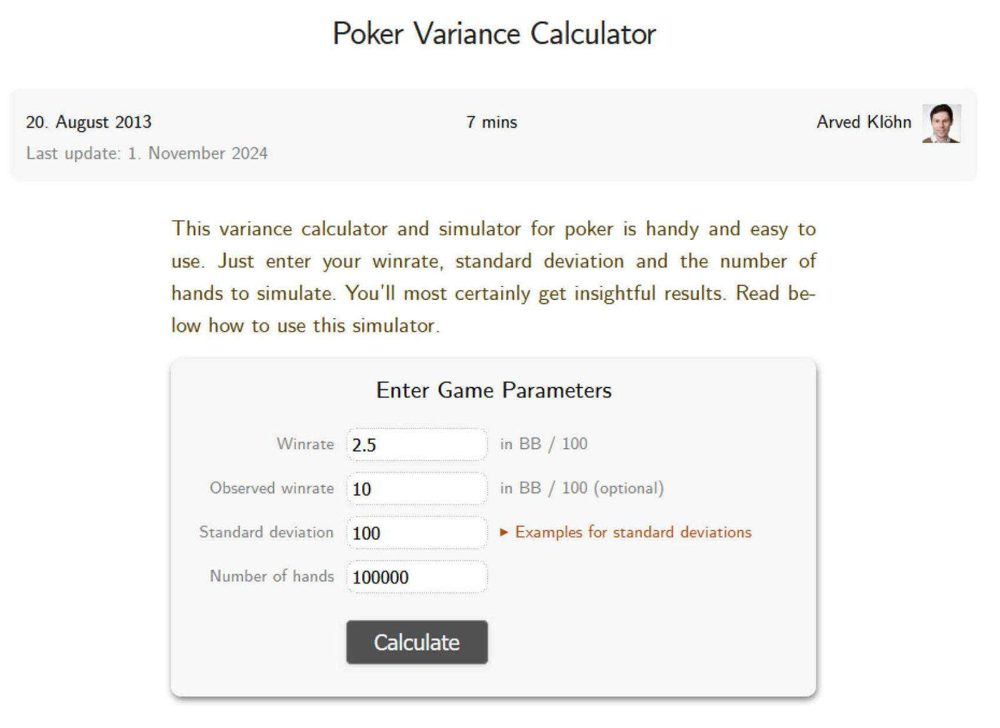
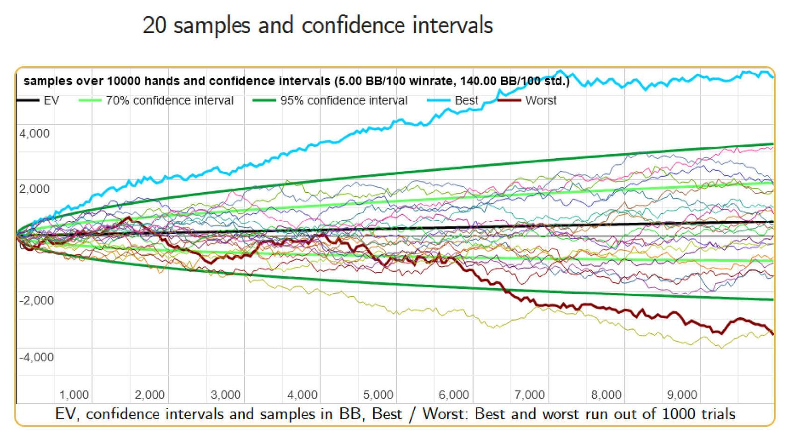
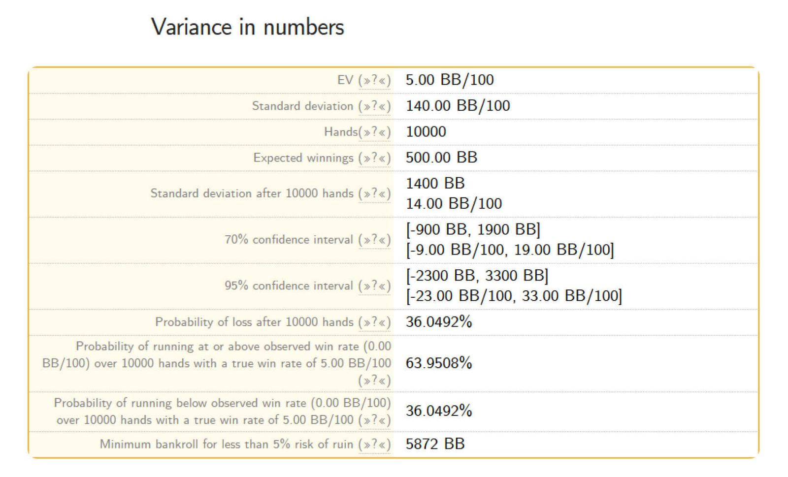

# PLO 的资金管理与波动：你应该预期什么，如何做好准备？

如何为 PLO 制定合理的资金管理策略？

无论你最喜欢哪种扑克形式，如果你想提升牌技，发展你的扑克生涯，就必须了解波动性对盈利的影响，以及你应该如何管理你的资金。

波动性这个词让很多扑克玩家感到恐惧。这不难理解，因为一旦遭遇连败，你就会觉得束手无策。但你真的在这种情况下如此无能为力吗？让我们一探究竟。

要最大限度地减少波动性对你的盈利和心理状态的负面影响，第一步就是了解它的运作方式。因此，在本文中，我们将探讨在 PLO 游戏中，你可能会遇到的顺境（或逆境）情况，你应该做好哪些准备，以及你的扑克资金应该有多大。

## 为什么以及何时需要谈论扑克中的波动性？

波动性是一个源自统计学的术语，它衡量的是一组数字与其平均值之间的离散程度。在扑克中，“方差” 一词用来描述在特定条件下运气好坏的程度。

方差在扑克中最常见的用途是估算玩一定数量的牌局或锦标赛的可能结果。了解在常规游戏中可能赢多少钱或输多少钱，可以帮助你决定应该准备多少资金，从而让你能够安心游戏，不必担心破产。

人类的思维天生难以理解许多与概率相关的问题。由于我们的自然倾向，我们很容易受到认知偏差的影响。我们常常低估或高估运气对我们行动结果的影响。因此，我们对方差的直觉理解本身就存在缺陷。

我们该如何应对这些自然不利因素？当然是借助扑克工具。[“Primedope 扑克方差计算器”](https://www.primedope.com/poker-variance-calculator/) 就是这样一款工具。它能让你模拟在特定情况下你的牌局可能出现的各种结果。借助方差计算器，你可以研究各种潜在情景，例如你的胜率、牌局数量以及你选择的牌局形式是如何相互影响的。

让我们深入了解一下可能出现的各种结果。

这仅仅是个开始

首先，要获得任何结果，你需要输入几个变量：你假设的胜率（以 BB/100 手牌为单位）（如果你的扑克室允许追踪手牌，你可以在追踪软件中找到它，例如 Hold'em Manager 或 Poker Tracker），实际胜率（你可以省略），标准差（这是统计学中的一个术语；有一些预设值可供选择），以及要模拟的手牌数量。

让我们看看假设胜率为 5 BB/100 手牌，标准差设置为 140，模拟 10,000 手牌后的结果。

潜在结果的范围非常广泛

我们该如何分析这些数据呢？上图展示了 20 个理论样本的结果，涵盖了各种可能的结果。

浅蓝色线代表最佳结果；在我们的例子中，这意味着大约能赢 5,400 BB（相当于 54 个买入，仔细想想，对于 10,000 手牌来说，这简直是不可思议的结果）。棕色线代表最差结果，即输掉 4,100 BB。深绿色线代表 95% 的置信区间，这意味着 95% 的情况下，你的结果会落在这个区间内。

在我们的例子中，这个区间介于 +2,300 BB 和 -1,900 BB之间。最后，浅绿色线代表 70% 的置信区间，这意味着 70% 的情况下，你的结果会落在这个区间内（+1,900 BB 和 -900 BB 之间）。

你可以在下表中找到所有这些信息（以及一些附加信息）。

36% 的输钱概率是一个你应该重视的数字

表格中最重要的两项信息是：在一定手数后输钱的概率以及避免破产所需的最低资金。在我们的例子中，分别是 36% 和 5,872  BB。

我们该如何解读这些数字？和扑克中的许多事情一样，这些结果也与具体情况密切相关。要更好地理解方差的运作方式，最好的方法是使用不同的数据集运行相同的模拟。换句话说，你可以自行调整这些数值，并观察当你的胜率更高或更低时，结果会如何变化。模拟 5 手、10 手或 25 手牌又会如何呢？

运行几次不同的模拟后，你就能更容易地估算出你的波动幅度、在特定手数下可能遇到的情况以及你的资金应该有多大。

## 模拟的手数应该达到多少才算足够？

这很大程度上取决于一些因人而异的变量。你每天、每周或每月玩多少手牌？

在小样本量的情况下，即使胜率很高也意义不大。我们强烈建议你模拟超过 100,000 手牌的情况。举例来说，将手牌数从 10,000 手增加到 100, 000 手后，亏损概率从 36% 降至 13%；而当手牌数达到 500,000 手时，亏损概率仅为 0.6%。

PLO 是一款受波动影响较大的游戏。使用波动计算器可以帮助你更好地理解 “运气” 在 PLO 中的作用。

## 如何才能充分利用这些数据？

对于每一位有抱负的扑克玩家来说，需要考虑的几个方面是他们的游戏习惯。

- 你每周花多少时间玩牌？
- 你是注重质量还是数量的玩家？
- 你同时玩多少张牌桌？

许多玩家试图同时玩尽可能多的牌桌，但这会影响他们的胜率。

如果玩家 A（我们称他为丹尼尔）只玩 4 张牌桌，胜率为 10 BB/100，每月牌局数为 50,000 手，那么他最终的盈利可能与玩家 B（菲尔）相当。菲尔玩的牌局数是丹尼尔的两倍（100,000 手），牌桌数也是丹尼尔的两倍（8 张），但胜率只有丹尼尔的一半。

虽然结果可能相同，但两位玩家的整体体验却截然不同。菲尔更有可能进入所谓的 “自动驾驶” 模式，思考当前牌局的时间更少，同时还要面对多个决策。另一方面，丹尼尔则在一个压力较小的环境中游戏；他有更多的时间思考自己的选择，并且可以在思考对手的倾向的同时应用新的理念。

或许有些人会感到惊讶，尽管丹尼尔和菲尔的预期盈利都是 5,000 BB，但丹尼尔破产的风险却远低于菲尔（假设打 50,000 手牌，胜率为 10 BB/100 手，丹尼尔的破产风险约为 12%；而菲尔的破产风险约为 5.5%；假设打 100,000 手牌，胜率为 5 BB/100 手）。与此同时，更高的胜率让丹尼尔的心态更加健康，也让他觉得游戏不再那么枯燥乏味；而菲尔则可能为了追求预期的盈利目标而投入更多时间。

## 那么， PLO 适合你的资金量是多少呢？

扑克游戏的魅力之一在于其错综复杂的规则和细微差别，因此没有万能的解决方案。抛开个人打法不谈，适合丹尼尔的策略未必适合菲尔，反之亦然。考虑到这一点，在玩 PLO 时，你应该如何管理资金呢？

我们认为，最佳（也可以说是保守的）起点是每个级别 100 个买入。这意味着你从 100 个买入开始（例如，PLO10 的买入为 $1000），并在达到更高级别的 $100 个买入时（例如，PLO25 的买入为 $2500）再增加买入。一段时间后，你会发现最适合自己的策略，并判断是否应该更严格地管理资金，或者是否只需 50 个买入就能发挥出最佳水平。