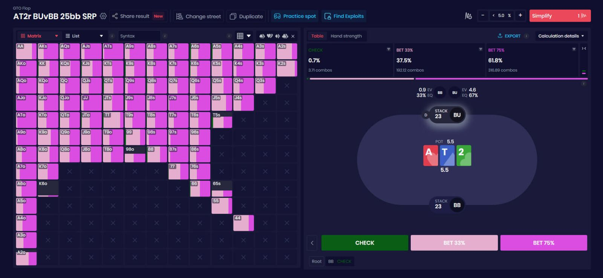
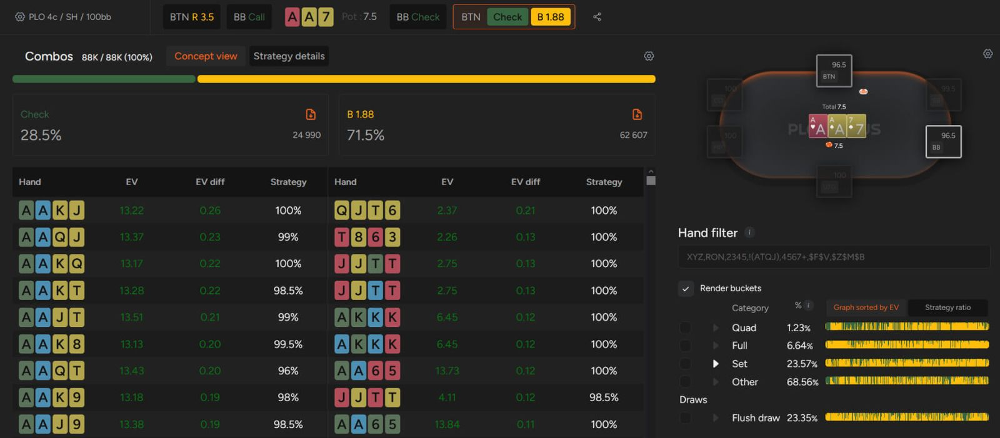

# PLO 中 C-Bet 背后的逻辑是什么？

就像 NLHE 一样，在 PLO 中，一个稳健的 c-bet 策略至关重要。

尽管 PLO 和德州扑克存在差异，但在这两种游戏中，c-bet 同样至关重要。成功的关键在于理解在构建 PLO 持续下注策略时需要考虑哪些细节。

在深入探讨这一主题之前，我们想强调以下三个方面。

首先，由于 PLO 的牌型组合数量庞大，牌型范围更难直观地呈现。

其次，由于对手拥有四张（甚至五张！）底牌，他们更容易与公共牌形成某种联系。因此，你通过 c-bet 赢得底池的概率会降低（你的对手通常都不愿意在翻牌圈弃掉大部分牌）。

第三，由于对手持续下注的频率更高，位置的重要性远高于德州扑克。

这些特点会极大地影响你在玩 PLO 时如何进行持续下注。考虑到这些因素，让我们来看看 PLO  c-bet 策略的基础知识。

## 我们为什么要 c-bet 呢？

这是一个值得探讨的问题， 当你作为翻牌前加注者，而你的对手（或对手们）跟注时，你的牌型范围应该比其他玩家更强。由于你更有可能持有最佳牌型，因此你更有动力投入更多筹码。

在德州扑克中，有很多因素可以验证 c-bet 的合理性；让我们来看看在 PLO 中持续下注或过牌的原因。

在 PLO 中，事情很少会像在德州扑克中那样简单明了

## c-bet：PLO 篇

c-bet 的基本逻辑与 NLHE 类似。

如果你在翻牌前加注，并且犹豫是否继续下注，你必须问自己：在当前的牌面上，谁拥有范围优势和坚果牌优势？牌面较大通常更有利于进攻方（因为加注者应该持有更多口袋 [“A-A”](pg04.md)），而牌面较小则往往更有利于翻牌前防守的玩家，尤其是 BB 玩家。值得注意的是，在 PLO 中，翻牌前跟注者通常比加注者拥有更多 K-K 组合。在 PLO5 中，甚至在某些情况下，A-A 组合也同样如此！

那么在单挑底池中如何进行 c-bet 呢？构建 c-bet 策略的一个好起点是极值策略。它假设在特定情况下，你既要下注你所能持有的最佳牌，也要下注你所能持有的最差牌。所谓最差牌，指的是权益较低但具有一些优势的牌，例如后门听牌或重要的阻挡牌。

用你牌型范围内最好的牌下注，这应该不言而喻；因为你很有可能赢得底池，所以你想尽可能快地扩大底池，而 c-bet 是实现这一目标的最佳工具。然而，你必须注意判断你的牌在后续回合中的可玩性。即使是 PLO 中的顶级对子（如果你的其他牌与公共牌没有互动），也不是必须 c-bet 的。

但用弱牌下注的逻辑是什么呢？你之所以下注这些牌，是因为它们通常在摊牌时价值很低；它们很少会变强，而且你也不介意被过牌 - 加注，因为你可以毫不犹豫地弃牌。此外，它们还能 “平衡” 你的牌型范围，这样你的对手就无法通过过度弃牌来利用你的弱点。

极化投注还有另一个值得一提的原因。

## 在 PLO 中，慢玩远不如在德州扑克中那么有意义

由于游戏的特性，你的牌很少能完全避免被对手的听牌击败。有时，在动态的牌面上，顶暗三条对上顺子和同花听牌也只是略占优势。

c-bet 的另一个原因是上面提到的 - 通常情况下，你的对手会持有比你弱但足以继续下注的牌。由于中低级别玩家在翻牌前和翻牌后往往都很顽固，你经常会遇到大暗三条对小暗三条，或者坚果同花对第二坚果同花听牌的情况。

每当出现这种情况，你都有充分的理由让对手付出代价，从而扩大底池；毕竟，在扑克桌上正确地进行价值下注是赢钱最有效的方法。

总而言之：除非你完全锁定了公共牌，否则绝对没有理由慢玩那些虽然强但容易被反制的牌。

此时，你可能会疑惑为什么通常不建议用中等强度的牌下注。这类牌不喜欢被过牌 - 加注，因为它们通常不够强，无法对抗激进的对手。此外，即使对手跟注了你的持续下注，中等强度的牌也没有转牌可以 c-bet。

因此，一条经验法则是：如果一手牌几乎没有好的转牌可以 c-bet ，那么它可能就不是 c-bet 的好选择。

## c-bet 策略与 SPR 密切相关

无论是线上扑克还是线下游戏，PLO 主要以现金游戏的形式进行，因此通常情况下，你的 SPR 会很高。SPR 越高，你的牌在后续回合的可玩性就越重要。随着后续回合的进行，牌型范围会逐渐缩小，阻挡牌（尤其是坚果同花阻挡牌）变得更加关键。

由于游戏的特性，玩家往往会对自己的底牌比较谨慎。因此，你遇到多个对手的频率会比在 NLHE 中更高。

在单挑底池中，你的 c-bet 频率可以相对较高，尤其是在你处于有利位置时。然而，如果你处于不利位置或底池已变成多人底池，你必须更加谨慎地进行 c-bet，因为这种情况更难应对，你的弃牌权益也会大大降低。

这是 GTO 解算器对 c-bet 的可视化展示

## 如何构建你的 c-bet 策略？

让我们运用 c-bet 的知识，来看一个简单的例子。假设你在一个单次加底池中，翻牌前在 BTN 加注，对手是 BB，牌面是 Q-T-5-，你持有同花听牌。

你该如何构建策略？由于在这种情况下你拥有的组合数量庞大，你需要使用一些技巧，并根据牌型的基本特征进行分类。

我们先来看看哪些牌型通常适合下注。

在这种情况下，适合下注的牌型包括：大多数带有坚果同花听牌的大对子（尤其强调那些具有额外权益的牌型）、你的最好的听牌（带有同花听牌的包牌）以及顶两对。这些牌型中的许多牌型都有利于扩大底池，并且可以在对手加注的情况下继续对抗。

哪些牌型应该过牌？没有后备的底两对是很好的选择（因为你无法像在德州扑克中那样保护它们的权益）；对于低顺子的听牌也是如此。这两类牌都不喜欢被过牌 - 加注，但在面对转牌圈的领打时，它们作为跟注牌的表现相当不错。

虽然要为每一种可能的牌型都制定精确的策略需要花费相当长的时间，但为最重要的几类牌创建启发式方法将有助于你决定何时下注，何时过牌。

这需要一些时间，但通过足够的练习，你将学会自动识别持续下注的好机会。

## 好的 c-bet 策略能帮你避免在后续回合中陷入困境

这个话题涵盖面广，让你有很大的空间去建立超越对手的优势。GTO 解算器是磨练 PLO 策略的绝佳起点。使用工具学习将极大地提升你的翻牌前技巧。