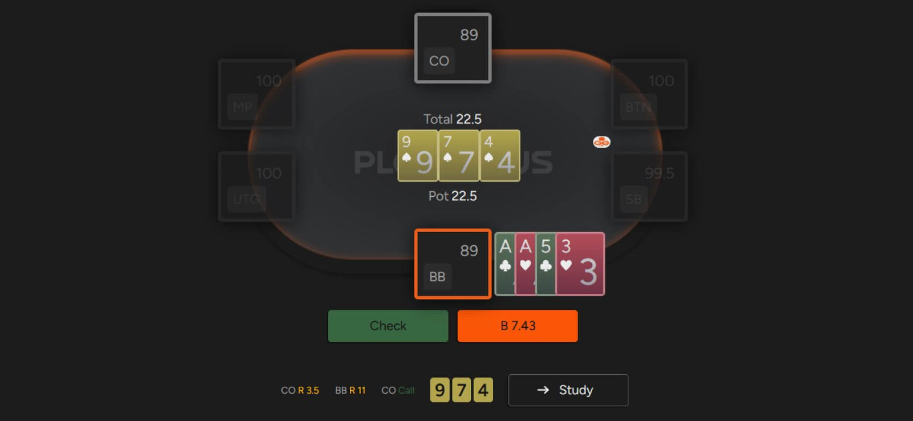
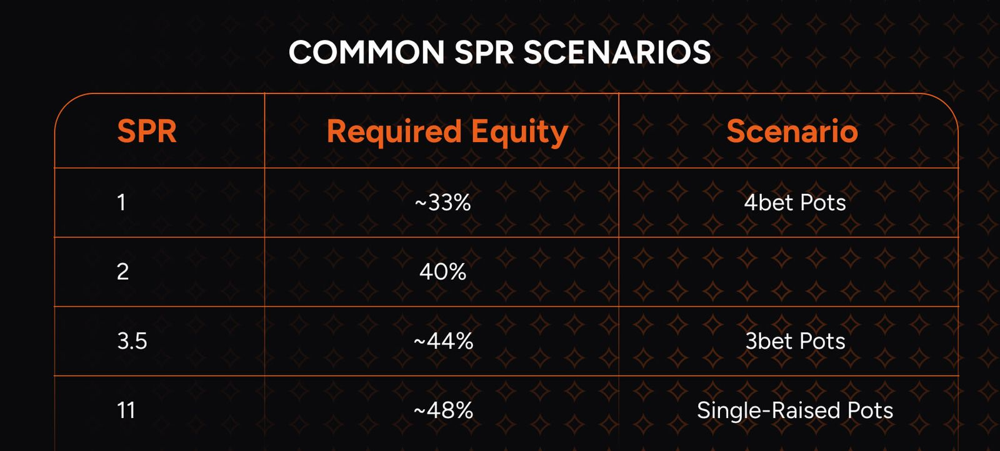

越容易实现你手中牌的权益，就越好！

权益实现是 NLHE 和 PLO 中一个至关重要的概念，也是每位有抱负的扑克玩家都必须掌握的术语。了解何时以及为何能够实现手牌的权益，将极大地帮助你在这些热门扑克变体中应对各种翻牌后局面。

让我们深入了解一下基础知识 - 权益是指如果你和你的对手（或多个对手）在牌局的某个特定时刻全下，你平均能赢得多少底池。

例如，假设你和你的对手决定在翻牌前全下。你持有 [“A-A”](pg04.md) 双同花，而对手的牌型随机。在这种情况下，你大约有 69% 的权益，这意味着平均能赢得 69% 的底池。当然，这在 PLO 中并不常见，因为在 PLO 中，翻牌前全下不像在 NLHE 中那么简单。

最显著的区别在于，在 NLHE 中，你可以在牌局的任何阶段全下，这样就能实现你手牌的全部权益。但在 [“底池限注游戏”](pg02.md) 中，你的最大下注额是有限制的。因此，你无法通过全下来 “逼迫” 摊牌，而必须在翻牌后谨慎行事。

这就是权益实现机制发挥作用的地方。想象一下这样的场景：你在 BB 用 A-A 双同花（红桃和梅花）加注 CO 的对手。然而，翻牌圈只有三张黑桃，你只剩下一对超对和一个弱的顺子听牌。你应该怎么做？

这是个令人不快的场景

很多时候，翻牌你的牌会是最好的（意味着你的牌力比对手的牌力更大），但接下来还有两张牌，而且出现好结果（比如凑成葫芦）的机会很少，你几乎不可能赢得摊牌（因为你的对手有机会在河牌圈诈唬你，或者用比 A-A 好但一般的牌过牌）。

因此，弃牌可能是最佳选择，因为即使你的权益不错，你也很难将实现其权益。

## 权益实现取决于几个因素

**位置**

无论情况如何，有利位置都是扑克中最关键的优势之一。

位置优势对权益实现也很有帮助：只要你处于有利位置，平均而言，你就能比对手实现更多的权益。在每一条街上，最后一个行动都是一个巨大的优势，因为你总是比对手掌握更多信息。这在河牌圈尤其重要，因为河牌圈的底池最大。如果你处于有利位置，你就能控制牌局是否会进入摊牌阶段，从而更有效地进行价值下注和诈唬。

**筹码深度**

筹码越浅，玩家能实现的权益就越高。如果翻牌你的 SPR 为 1（例如，底池为 66 BB，而你或对手的筹码也为 66 BB），那么实现权益就很容易，因为你可以选择在翻牌全下，跟注对手的全下，或者在对手下注较小时选择过牌 - 加注。

你只需要判断自己能否诈唬对手，或者是否有足够的权益在对手不弃牌的情况下全下。

我们以一个常见的 PLO 情况为例。你和对手的初始筹码都约为 100 BB，你用 A-A 在翻牌前 4-bet，对手跟注。翻牌底池大约是 70 BB，你还剩下差不多数量的筹码，因此 SPR 值约为 1。在这种 SPR 值下，要想盈利地全下（假设对手总是跟注），你的权益至少需要达到 33% 以上。

经过一些练习，你就能估算出你的 A-A 在哪些牌面上足以继续下注。幸运的是，在如此低的 SPR 值下，不加思索地全下很少会犯错。无论你的 A-A 在某个翻牌有多少权益，你最终都会全部兑现，因为要么对手弃牌，要么你会看到转牌和河牌。

在更深的筹码量下，情况会变得复杂得多。如果我们把筹码深度调整到你在深筹码现场游戏中常见的水平，并假设双方玩家都以大约 500 BB 开始这手牌，那么翻牌的 SPR 值将约为 7（要得到精确值，你需要用底池大小除以筹码量较少的一方）。

在筹码如此之深的情况下，位置不利的玩家在很多牌面上都会遇到困难；因此，他们往往无法实现手牌的权益。

## SPR 越低，实现权益就越容易

在 PLO（以及在某种程度上在 NLHE 中）中，我们可以区分出一些常见的场景，这些场景对应着特定的 SPR 以及你继续游戏所需的权益。将特定情况与最常见的 SPR 和所需的全下权益联系起来，是一个很好的思维练习，因为它能帮助你评估在这些情况下你的策略。

几个值得记住的数字

## 技能差距

如果你的对手完全不了解自己在做什么，你就能获得比 “应该” 更高的权益。很多时候，经验不足的玩家会根据当下手中的牌来做决定，而不是从牌型范围以及由此产生的优劣势来考虑。

了解哪些牌型范围在哪些牌面上具有优势是提升牌技的绝佳途径，而如果你想提高你的 PLO 水平，GTO 解算器就是最佳工具。

让我们回顾一下之前的例子。如果你面对的是一个技术不精的对手，他只有在牌力很强的时候才会施压，那么即使你拥有位置优势和大量筹码，在不利的牌面上玩 A-A 也不会像预期那样困难，这会让你比面对技术娴熟的对手时实现更高的权益。

同时，如果你了解对手的弱点（例如在错过 c-bet 后面对下注过度弃牌），你就能剥削利用他们的倾向，并剥夺他们手牌的权益。

## 掌握权益实现的概念将使你的游戏体验更加轻松

了解影响玩家如何更有效地实现权益的因素，将有助于你制定正确的策略，并避免许多不必要的困境。希望我们已经向你介绍了这个概念，并使其更容易理解。借助 GTO 解算器，你可以确定哪些类型的牌在特定情况下表现最佳。