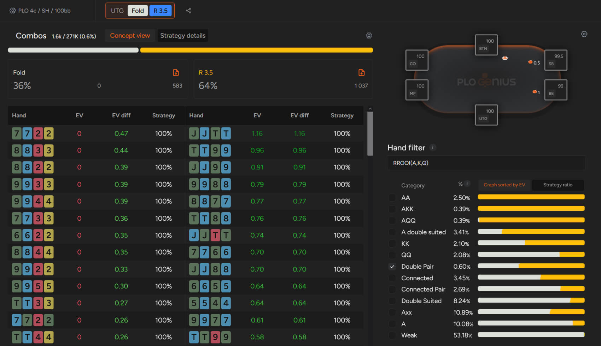

你应该努力采用 GTO 策略打 PLO，还是专注于剥削策略更好？

自从扑克求解器被引入 NLHE GTO 策略以来，它就一直是扑克圈最热门的词汇。如今，几乎每个玩家都对 GTO 有所了解（至少在他们看来是这样），或者至少听说过它。

## 什么是 GTO？

当我们在扑克语境下谈论 GTO 时，我们指的是不可被剥削利用的策略。一个完整的 GTO 策略假设你所有的决策都是最优的，而你的对手在这种策略下所能取得的最佳结果是平局（假设牌局数量无限）。也就是说，虽然 GTO 不会输，但它也不是最赚钱的策略。

毕竟，如果你几乎可以肯定你的对手从不诈唬，那么抓诈唬就毫无意义了。

虽然我们对 GTO 的理解越来越深入，但扑克的复杂性使得人类永远无法做到最优解。最早开发的求解器旨在帮助人们学习 NLHE，但即使是这种游戏也过于复杂，人类永远无法完美驾驭。PLO 不仅包含更多翻牌前组合（这使得翻牌前策略更难掌握），而且翻牌通常是 [“多人游戏”](pg08.md)，这无疑增加了游戏的复杂性。

简而言之，使用 GTO 策略并不能让你获得最高的胜率。

## 什么是剥削打法？

剥削打法假设对手的牌技中必然存在漏洞，而你的目标就是找出这些漏洞并最大程度地利用它们。这是一种非常传统的打法，也是许多扑克高手职业生涯和财富积累的基石。虽然它曾经是一种非常有效的策略，但如今我们知道，除了完全采用剥削型打法之外，还有更好的选择（至少在面对高手时是如此）。

了解哪些两对牌型适合开牌以及何时开牌非常重要

那么，如果追求 GTO 并非最有利可图的策略，而剥削性打法在面对强劲对手时又难以奏效，该怎么办呢？你应该学习最优策略的运作原理，并根据实际对手的打法调整你所学到的策略。

正如我们前面提到的，如果你在低级别牌桌上与不愿弃牌的对手对战，诈唬意义不大。例如，寻找带有同花阻挡牌的最佳组合来诈唬，对付一个在河牌圈不会弃掉任何同花的对手，就不是一个好主意。

## 关于扑克最优策略的常见误区

我们必须强调：没有人，包括世界上最优秀的扑克玩家，能够完全掌握 GTO。即使是他们也会偏离最优策略，并因此变得具有剥削性。当你认为几乎没有优势可言时，务必牢记这一点！

GTO 是一个经常被提及的术语，导致扑克圈内存在许多误解。很容易就会落入这些误解的陷阱。最常见的误解之一是，如果你不玩 GTO，其他玩家就会剥削利用你，你也很难赢钱。

扑克（任何形式的扑克）都是一场不断剥削利用和反剥削利用的游戏。既然没有人能做到 “完美”，你也不必担心自己做不到。你应该专注于理解某些情况下 “应该” 如何发展，你每天遇到的对手是如何偏离理论的，以及你应该如何设计你的反制策略。

另一个误解是，如果一个打法没有经过解算器验证，那就绝对不行。除非我们讨论的是像四条这样最差的牌型，或者像 J-7-4-2 这样糟糕的翻牌前组合就全下，否则还是有一些调整空间的。

比预期更松一些的开池并不一定意味着你犯了错误，因为你必须考虑对手的行动。他们是否能恰当地应对加注？他们是否经常进行 3-bet？如果不是，你或许可以比 GTO 建议的更松一些开池，并将这些开池转化为盈利。

最后一个误解是，现在的牌局非常难，每个人都在日夜研究 GTO 策略。诚然，扑克玩家的平均水平比几年前高，但仍然有很多水平不错的玩家，而且 PLO 游戏通常是最容易的。

PLO 是一款充满细微差别的游戏，它能让你比 NLHE 获得更大的优势。了解 GTO 的运作原理将帮助你找到 EV 最高的策略。了解正确的打法，并根据实际情况调整策略。

## 如何将理论付诸实践？

如何在 PLO 现金游戏中运用理论知识来击败对手？如果你有与水平相近的玩家长期对战的经验，你很可能会观察到一些规律。

在微级别、低级别扑克（包括线上和线下扑克）中，你可能会注意到以下几个趋势：

- 玩家在翻牌前特别热衷于冷跟注
- 玩家的 3-bet 范围不够宽
- 4-bet 范围极度偏重 A-A-x-x
- 很少出现主动领先下注的情况

如何调整策略来利用这些趋势？

在冷跟注频繁的牌局中，往往会出现很多多人底池。因此，根据 GTO 理论，翻牌前加注时，你的弃牌权益会低于预期。如何调整策略？你应该在翻牌前打得更紧一些，因为这是创造更有利的 “爆冷” 局面的最佳方法。

此外，在 3-bet 方面，大多数低额玩家更倾向于在翻牌前跟注而不是 3-bet，因此他们的 3-bet 会比理论上更注重价值。为了利用这一点，你可以比面对实力均衡的对手时弃牌更多，而不用担心弃牌过多。

这种趋势在 4-bet 时更为明显，因为 4-bet 几乎都是 A-A-x-x 这样的牌。在这种情况下，根据你当前情况的牌力和 SPR，你可以相对轻松地选择继续跟注的牌，同时弃掉那些面对 [“A-A”](pg04.md) 时表现很差的牌。

最后，与 NLHE 不同，在 PLO 中，面对翻牌前加注者领先下注是一种更可行的策略。由于你的对手通常不会注意到这一点，你必须假设他们的牌型范围比算法预测的更广。你该如何应对呢？你必须更频繁地过牌，因为你面对的是一个实力强劲的牌型范围。

## 在扑克游戏中，智胜对手是最令人兴奋的部分

这不仅感觉很棒，也是你胜率的基础。记住，要想战胜任何人，你必须知道他们的错误之处以及他们应该怎么做。