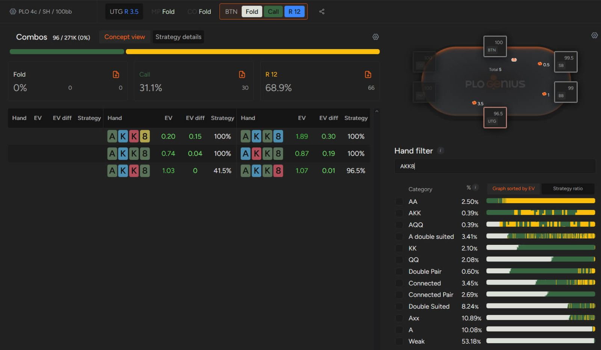

让学习 PLO 的时间物有所值。

学习任何一种扑克形式都需要时间和投入。其中有很多陷阱需要避免，也有很多诱惑需要抵制，但你越是认真、深入地学习，就越有可能在牌局中有所收获。

由于扑克牌局的成绩很大程度上受 [“运气和波动”](pg12.md) 的影响（尤其是在短期内），很多时候你会感到沮丧。这是游戏的一部分，你可以通过两件事来克服这种感觉：训练心态和提升扑克技巧。

良好的心态对生活的方方面面都很有帮助，而培养良好的心理健康是一个广泛的话题 - 我们将在另一篇文章中详细探讨。

在本文中，我们将探讨你应该如何学习 PLO（但如果你对其他扑克形式感兴趣，我们相信你也能从中找到一些有用的信息）。

## 合理安排时间进行游戏和学习

刚开始学习一种新的游戏或扑克形式时，你会感到兴奋。然而，一段时间后，这种兴奋感会逐渐消退，学习也常常变得枯燥乏味。扑克是一项不断发展的游戏，如果你不持续进步，你的技巧很可能会退步。

许多玩家在达到一定的游戏理解水平后便停止了进步。正如一位著名的古希腊哲学家所说：“我知道我一无所知。” 将其应用到扑克学习中，你掌握的理论越多，就越能意识到自身的不足。

许多扑克玩家认为学习枯燥乏味，浪费时间；毕竟，学习的时候赢不了钱。但实际上，你在学习的过程中掌握的是能够带来收益的概念，而在游戏中，你则是将这些概念 “兑现”。归根结底，如果你不如对手，那么无论你花多少时间玩牌，都无法赢钱。

因此，每周 / 每月安排一定时间学习 PLO 对你的进步至关重要。你可能会想偷懒，但这是无法避免的 - 忽视学习迟早会付出代价。

学习扑克是一个永无止境的过程

你应该学习多少？这取决于你的生活状况；你越依赖扑克收入，就越应该学习。一个合理的最低标准和起点应该是 80/20，也就是说，你每花 10 个小时玩扑克，至少应该花 2 个小时学习。当然，学习越多越好。

另一点需要强调的是，要为你的学习设定目标。每一种扑克形式（包括 PLO）都涉及广泛的内容，有些人甚至毕生致力于精通它。当然，你不必成为最顶尖的玩家才能从扑克中赚到可观的收入，但拥有扎实的基本功并了解自己的优势和劣势至关重要。

## 为你的学习时间设定目标

练习你所玩扑克形式的各个方面至关重要。以 PLO 为例，最需要练习的内容包括翻牌前加注和防守、有利位置和不利位置下的 3-bet 底池、[“多人底池”](pg08.md)、盲抓底池等等。

对许多玩家来说，花大量时间练习翻牌前策略似乎是在浪费时间，但他们可能并不了解 PLO 的翻牌前策略与 NLHE 相比有多么复杂。如果你是一名 6 人桌 NLHE 现金游戏玩家，学习在特定位置应该用哪些牌开池 / 3-bet / 4-bet 确实需要一些时间，但这并不算什么了不起的成就，因为你可以很快记住大多数牌型范围。

然而，在 PLO 中，要知道在特定位置应该用哪一类牌开池，则需要对游戏机制有更深入的理解，因为同一手牌似乎有很多种不同的组合。

这时，GTO 解算器的翻牌前功能就派上了用场。每当你不确定在翻牌前应该如何处理某手牌时，你可以保存牌局记录，以便在学习过程中分析你的决策。

你不仅可以查看你的手牌应该加注还是跟注，还可以尝试类似的牌型组合，寻找选择特定行动所需的牌型特征模式。

例如，假设你正在玩一场 100 BB 的低级别现金游戏。你的对手在 UTG 下注底池，而你坐在 BTN，手持 A-K-K-8 双同花。这相对来说是一个比较容易找到的 3-bet 机会。但是其他 [“K-K”](pg05.md) 的组合呢？你知道 K-K 最差的 3-bet 组合和最佳的平跟组合吗？此外，你知道哪些组合应该弃牌吗（这些组合的数量肯定会让一些有 NLHE 背景但 PLO 经验不多的人感到惊讶）？借助 GTO 解算器，你将在几秒钟内找到这些问题的答案，并且你将能够学到更多，例如当你面对 4-bet 时该怎么做。

有时候，你只需要几秒钟就能弄清楚应该怎么玩

由于 PLO 翻牌前的复杂性，有很多方面值得研究，也正因如此，你才能在竞争中脱颖而出。你会很快发现对手的打法与博弈论最优策略之间的差距。而这一切都发生在每手牌的初始阶段 - 也就是公共牌尚未发出的时候。你积累的知识和经验越多，就越容易判断对手在每条街上的打法，以及他们会如何应对你的行动，并决定自己如何处理特定类型的牌。

## 私人辅导

有时你需要帮助来正确评估自己在游戏中的优势和劣势。GTO 解算器的 “训练” 功能也能帮到你，它允许你通过询问在特定情况下你会如何应对，并评估你的答案，来测试你当前的 PLO 知识水平。

此外，如今许多在线学习资料可以帮助你了解如何高效学习，并向你介绍最关键的学习方法。然而，要消化所有信息需要花费大量时间。因此，如果你更喜欢与真人学习，且空闲时间有限，不妨考虑私人扑克教练。

扑克教练提供多种方法来分析和提升你的牌技，从数据库和牌局回顾到讲解理论概念，应有尽有。

通常，不同的教练专注于扑克的不同领域；有些擅长单挑，有些则擅长 PLO  MTT 或现场游戏。如果你正在考虑聘请教练，务必找到一位在你感兴趣的领域拥有丰富经验，并且你也能与他 / 她相处融洽的教练。

## 无论是否接受教练指导，都要善用社群的力量

社群在生活的许多方面都扮演着强大的集体角色，扑克也不例外。从识别作弊者到发现软件故障，扑克社群一次又一次地展现了其强大的力量。

学习或分析新的扑克概念时也是如此。虽然没有扑克教练的帮助，你也能打得很好，但忽略其他扑克玩家的意见很可能会阻碍你的进步。

一群 “扑克好友” 是寻找牌桌信息、获取应对特定局面的思路或不同策略观点的绝佳途径。此外，与你水平相近的扑克玩家比扑克圈外的人更能理解你遇到的问题。所以，如果你认识可以讨论 PLO 相关想法的人，那就去找他们；如果遇到让你困扰的牌局，就拿出来给其他人看看，听听他们的意见；这对每个人都有好处。

借鉴他人的经验很少会出错，所以你越早开始这样做越好。当然，找到一群志同道合的扑克爱好者并非易事，但也并非不可能。如果你身边没有对 PLO 感兴趣，想要学习和提高牌技的朋友，那就该去找找了。

有很多地方可以找到同好：论坛、Facebook 群组和 Discord 服务器。

此外，在 PLO 中，你还可以从其他玩家的经验中学习到许多尚未探索的领域：现代 PLO 游戏中经常会出现多个盲抓、炸弹底池以及各种不同的场地规则。你可以与其他玩家讨论他们在这些现场游戏中的应对方法，并尝试找出最佳策略。

## 不要忽视你的心理素质

要想成为一名成功的扑克玩家，如果不关注游戏之外的一些关键领域，几乎是不可能的。掌握 GTO 策略固然重要，但良好的心理状态才能让你在实践中运用这些知识。

保持良好的心理状态始于健康的生活方式。良好的营养、规律的运动、充足的睡眠以及远离有害的人际关系，这些都有助于你发挥出最佳水平。当然，关于这些主题的书籍不计其数，我们将在不同的场合仔细研究它们，但必须强调的是，不关心自己的健康也会损害你的扑克生涯。