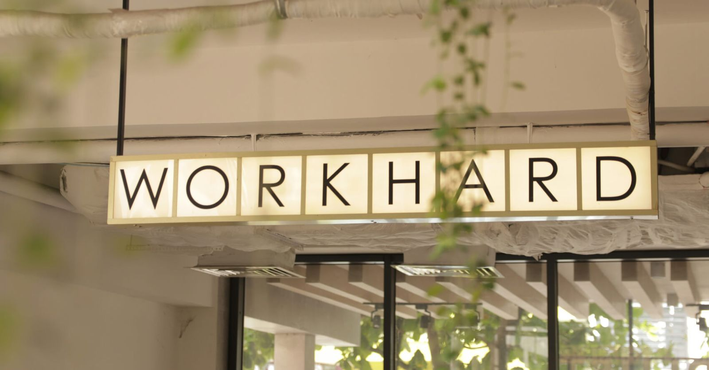
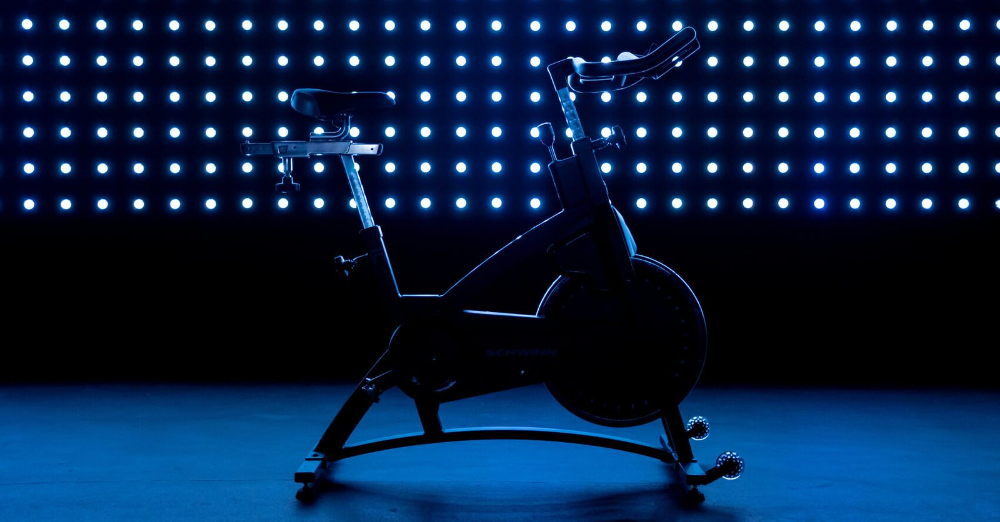
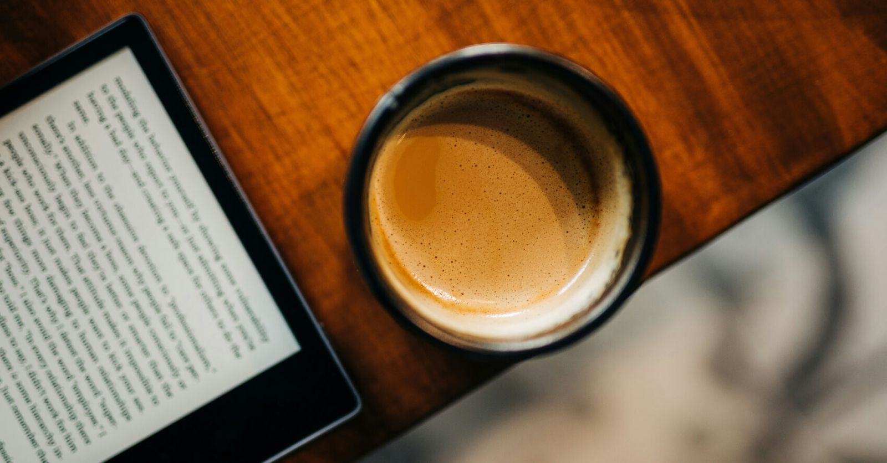

有时候，一些细微的行为调整就能显著提升你的牌技。

要想在 2024 年（及以后）成为一名成功的 PLO 玩家，需要掌握广泛的技能。你必须了解最新的策略研究成果（通常源自 GTO 研究），意识到自身的弱点并加以改进，并投入大量时间练习已学知识。除此之外，你还必须做好心理和生理上的准备，应对不顺的局面，并避免养成任何会降低胜率的坏习惯。

这次，我们将着重介绍你在离开牌桌时应该做些什么。

成功没有捷径

## 要想在扑克领域取得成功，自律至关重要

无论你是否认为扑克是一项运动，它无疑是一款需要你在长时间内发挥最大心理潜能的游戏。而要想做到这一点，你必须做好充分的准备。

要想成为一名更优秀的玩家，你应该专注于两个主要方面。

首先是对游戏的理解和知识。虽然 PLO 是一款非常复杂且回报丰厚的游戏，但相对来说，你可以很容易地找到一些需要学习的特定领域（就像我们在博客文章中分享的扑克技巧和建议，例如如何在 PLO 中利用 GTO 策略）。

其次是你运用知识的能力，以及将知识融入到实际游戏中的能力。即使你拥有最全面的 PLO 策略知识，如果你无法将其运用到你的决策中，也无济于事。

如何才能发挥出你的最佳水平呢？合理规划你的扑克相关活动，并好好照顾你的身心。

## 养成好习惯，戒除坏习惯

习惯是提升效率、增强能力和改善整体幸福感的强大工具。

一个提升扑克水平的绝佳习惯是每周设定学习时间。学习时间不必很长（除非你是职业选手或立志成为职业选手），但设定这样的时间安排会带来翻天覆地的变化。

这是人们最常犯的错误之一 - 无法平衡学习和游戏时间。当然，学习不如游戏那么刺激，但它就像体育训练一样。学习过程中，你的大脑会逐渐学会如何在牌桌上高效运作。

我们最近也讨论过这个话题，欢迎阅读 [“明智地学习 PLO”](pg16.md) 这篇文章。

训练大脑与训练肌肉类似

## 做好充分准备

无论你是即将开始学习还是游戏，准备工作对你即将做的事情的效率都至关重要。这听起来可能有点傻，但许多专业人士都强调，一些小事（比如整理桌面或倒垃圾）能显著提高他们的专注力。学习和游戏耍都会占用你的大脑一定程度，所以你周围的干扰越少越好。

说到干扰，我们不能忽略一个显而易见却又难以忽视的问题：无处不在的通知。无论是通讯工具、电子邮件还是应用程序，它们都非常有效地吸引你的注意力（而这正是它们的设计初衷）。

许多现代科技产品几乎无时无刻不在争夺你的注意力，严重阻碍你专注于学习或运用已学知识。这很成问题，因为人类的大脑在一次只专注于一件事时效率最高，而不是试图同时处理多件事。

即使你认为自己可以高效地同时处理多项任务，也不要自欺欺人；许多已发表的研究否定了人类有效进行多任务处理的能力。科学家们认为，同样重要的是，每次你分心，你快速重新集中注意力回到之前专注的事情上的能力就会下降。

解决方法很简单，但实施起来却并不容易：屏蔽所有可能分散你注意力的事物。

我们知道养成这个习惯非常困难，但一段时间后，关闭所有可能的通知来源应该能够提高你的专注力，无论是在学习还是娱乐时（这绝对是一项值得培养的优势）。

让我们举个实际例子：如果你经常玩 PLO 现金扑克，不妨问问自己，你花了多少时间浏览手机而不是关注牌桌动态？其他人呢？我们相信，你可以在现场游戏中收集到大量信息，如果运用得当，这些信息可以大幅提升你的胜率。

## 热身总是有益的

练习和应用扑克理论的一大好处在于，你可以将两者结合起来。许多玩家都乐于在游戏开始前抽出时间进行热身，这能向大脑发出信号：游戏时间到了。

诚然，学习新概念最好留到更长时间、更密集的学习环节，但练习最常见情况下的牌型范围、估算特定情况下的权益或使用 GTO 训练器进行练习，都是很好的扑克游戏前热身方式。

此外，当你准备开始一场较长时间的游戏时，别忘了准备一些零食（健康的零食，例如坚果或干果）和水。

## 每个行动都会消耗你的能量

根据你以往的经验，你可能已经意识到自己能够保持专注和高效工作的时间有多长。

上面提到的各种干扰会不断降低你的专注力，从而消耗你的精力，让你发挥失常。因此，你应该努力延长自己能够发挥最佳水平的时间（而不仅仅是玩游戏）。

了解自己的感受、发挥水平以及能否解释当前行为背后的逻辑，是克服那些会降低胜率的负面行为的绝佳方法。

几乎所有扑克玩家都会犯的一个坏习惯就是追逐亏损。对大多数人来说，亏损带来的打击远大于盈利带来的喜悦。因此，许多玩家很难接受一天中至少有一场亏损局。如果你是一位经验丰富的扑克玩家，那么几乎可以肯定，你曾经有过这样的经历：即使牌局已经不太好，你很疲惫，而且你在玩 B 或 C 游戏，你仍然执着于收支平衡。

识别出这种情况，并培养自律性地离开牌桌，将有助于提高你的胜率。有时候，如果你强迫自己从 “鱼” 手中赢回本钱，那么你可能就是那个 “鱼”。

有时候，你需要离开赌桌一段时间

## 适当休息

由于玩扑克（包括 PLO）会非常耗费精力，压力也很大，因此适当休息对于保持头脑清醒、能够更好地运用之前学到的知识非常有益。

幸运的是，如果你在线玩现金游戏，休息相对容易。如果你玩的是 “急速” 版本，那就更方便了，因为你可以随时暂停。即使你的主要游戏是线下现金游戏，你通常也可以休息一段时间而不会受到任何影响。

在休息期间，最好快速进行自我评估，看看你的状态如何，你如何评价自己的牌技，以及是否有任何可以快速改进的地方。

## 尽可能利用一切优势

现代扑克竞争非常激烈，因此你应该利用一切可能的优势。

从宏观层面来说，你应该关注那些影响你生活方方面面的习惯，例如保证充足的睡眠和健康的饮食，以及定期锻炼。记住，你不必做出剧烈的改变；从小的改进开始。网上有很多资料可以帮助你调整卧室环境或改善饮食。

更细致地来说，你应该专注于认真规划和执行每一次游戏。所有这些细微的调整最终都会带来显著的效果。

## 这是一场马拉松，而非短跑

几年前，一位资深且颇受欢迎的职业扑克玩家写了一本书，名为《像经营生意一样对待你的扑克》。虽然这本书出版已久，我们未必会推荐，但其背后的理念却经受住了时间的考验。

规划你的扑克活动。不要忽视身心的需求。通过不断尝试，找到最适合自己的方法。同时，也不要忽视扑克的社交属性 - 与其他志同道合的玩家交流经验。

无论你选择哪条路，最重要的是迈出第一步。