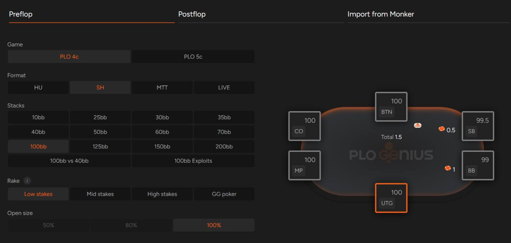
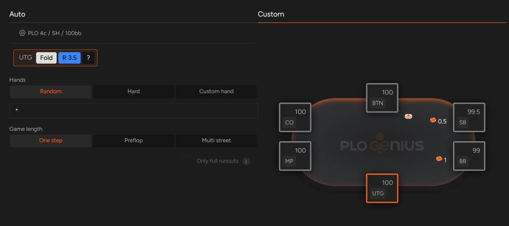
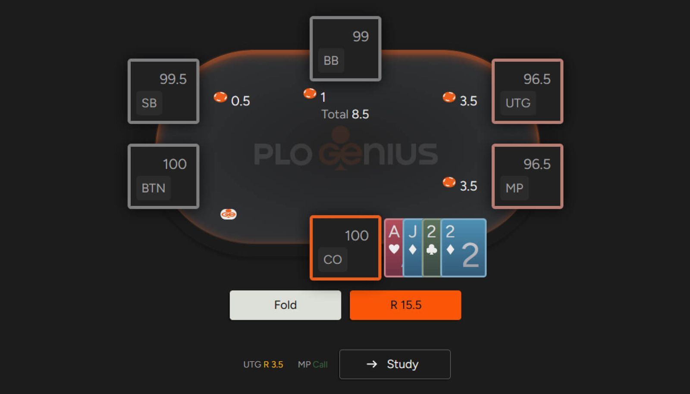

想快速高效地测试你的 PLO 技巧吗？试试 GTO 解算器！

在最近的文章中，我们重点介绍了如何 [“明智地学习 PLO”](pg16.md) 以及 [“如何成为一名更优秀的玩家”](pg17.md)。在像 PLO 这样复杂的游戏中取得显著进步需要时间和精力 - 因此，你应该优先安排固定时间进行定期学习，以保持大脑对最佳 PLO 策略的掌握。

如何每天训练你的 PLO 技巧？使用 GTO 训练器。

与其他 AI 扑克解算器一样，GTO 解算器允许你在正式上牌桌前测试所学概念 - 这要归功于其 “训练” 选项。

此功能仍在不断完善中，因为我们会持续尝试不同的选项，以打造最佳的训练体验。鉴于 PLO 和 PLO5 的设置众多，我们无法同时包含所有可能的解决方案，因此我们的扑克软件也在不断更新迭代。因此，应用程序中的训练器界面可能与你在屏幕上看到的有所不同。

也就是说，目前已有的训练选项（撰写本文时即可使用）是提升牌技的绝佳工具。

那么，如何才能充分利用 GTO 训练器，又该从何入手呢？答案很简单：从基础开始，在 PLO 中，基础指的是翻牌前阶段。对翻牌前阶段的透彻理解对于避免在后续回合中犯下不必要的错误至关重要。

有很多设置选择

PLO 的翻牌前策略错综复杂，由于组合数量庞大，你无法像在 NLHE 中那样快速掌握。此外，不同的抽水结构也增加了复杂性。

就我们的 GTO 训练器而言，目前你可以设置以下参数：

- 游戏类型（PLO 或 PLO5）
- 赛制（单挑、短桌、MTT 和现场，适用于 PLO）（单挑和短桌，适用于 PLO5）
- 筹码量（根据赛制不同，从 10 BB 到 200 BB 不等，包含一些 ICM 模拟！）
- 抽水（最多可选择四种抽水方式）

当然，我们几乎每周都会添加新的选项，但即使在撰写本文时，我们的数据库也已包含数千种场景。

为了简单起见，我们假设我们的大多数读者都在中等级别的 100BB 筹码深度中玩短桌 PLO，所以让我们以此为起点。

你的 PLO 开池范围准确吗？

在 PLO 中，即使是掌握所有位置的开池范围这样简单的技巧也需要花费一些时间，因此它是绝佳的训练起点。

使用 GTO 训练器，你可以选择想要研究的位置。此外，你还可以选择面对随机牌型、困难牌（最佳两手牌的 EV 差异很小）或具有预设特征的自定义牌型（选择你认为棘手的牌型组合，例如 A-K-x-x 或 J-J-x-x）。

这样的训练不仅是日常学习的好方法，也是扑克游戏前热身的重要组成部分；如果你经常阅读我们的博客，应该已经了解热身的重要性。希望一段时间后，开池范围能够成为你的拿手好戏，并且你能用相当高的正确率来证明这一点；你可以提高难度了。

当然，掌握 PLO 翻牌前策略的下一步是分析其他玩家的行动并做出相应的反应。你可以使用我们的 GTO 训练器来模拟有人已经通过加注、跟注或再加注而进入底池的情况。

当 UTG 开池加注，MP 跟注，而你在 CO 时，你应该跟注 / 3-bet 还是弃牌？你需要亲自体验！此外，你还可以使用与之前相同的牌型筛选器（随机牌型、硬牌型或自定义牌型）。

这是弃牌，这里最差的跟注组合是什么？

## 得益于 AI，我们的扑克解算器为你提供更多功能

选择你想要使用的设置，你将看到以扑克桌形式呈现的训练视图。在此视图中，我们的应用程序会向你展示一系列符合你提供的描述的情境，并总结你的表现。

一个很好的评分指标是每百手牌的 EV 损失，它概括了你的决策与最优策略的偏差程度。当然，数值越低，损失越小，你就越接近理论最优策略。

此外，你还可以更改特定会话的设置（选择不同的条件），查看你想要研究的牌局（例如，开池 / 跟注或弃牌的阈值），查看此牌局中显示的牌局历史记录，以及重置你的统计数据。

即使我们只考虑翻牌前的情况，也还有很多训练要做，所以我们暂时就讲到这里。

## 使用 GTO 解算器成为翻牌前大师

使用 GTO 训练器是快速演练多种翻牌前场景的最佳方法之一。定期使用 GTO 工具进行训练，无疑会提升你的翻牌前意识和信心。