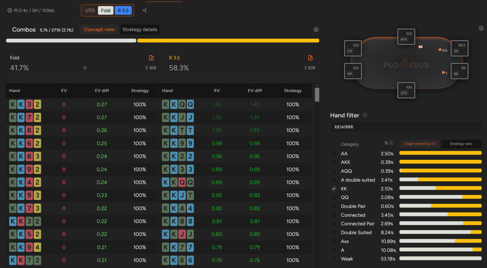

你永远无法达到扑克牌技的完美境界 - 你的对手也一样！

扑克和其他任何专业一样，都需要 [“系统的方法才能精通”](pg17.md)。尽管你所面对的扑克玩家的平均水平在不断提高，但扑克始终（至少我们希望如此）是一款与人对战的游戏，这其中蕴含着一些你必须时刻牢记的特殊之处。

记住，扑克是一个零和游戏（当然，[“抽水”](pg10.md) 除外），这意味着你的盈利来自他人的损失（或者更直白地说，你剥削利用对手的失误）。虽然大部分人都了解在许多常见情况下最佳策略的运作方式，但在面对更复杂的决策时，每个人都会犯错。原因显而易见 - 人可以追求完美，但永远无法达到完美。

无论何时，当你试图征服特定级别的牌局（无论是 NLHE 还是 PLO），你都必须关注诸多因素。总的来说，你必须考虑两个方面：你的打法模式和对手的倾向。

在这篇博文中，我们将重点讨论第二个方面 - 关注对手的行动。这在低级别到中级别（有时甚至更高级别）的牌局中至关重要，因为你的对手往往会采取类似的策略。

## 要想剥削利用对手的弱点，你必须了解他们的倾向

扑克是一项需要不断调整的游戏，但要做出正确的调整，你首先必须能够看出对手何时采取了不明智的策略（例如每隔几手就溜入 / 跟注），其次，你必须知道如何做出恰当的回应（例如更频繁地加注）。

制定游戏计划时，你需要将整体策略划分为一些通用类别：例如，你的开池范围、你进行 3-bet 的牌型、你对 3-bet 的反应、你在有利位置和不利位置进行 c-bet 的频率等等。

你也应该以类似的方式思考对手的行动，注意他们的习惯并尝试找到利用这些习惯的方法。

在牌桌上，你应该根据对手的策略来调整你的策略。首先，你会如何定义对手的模式？他们是翻牌前喜欢溜入 - 跟注的被动型玩家，还是几乎每手牌都下注的激进型玩家？

如果你是或计划成为一名经常玩线上扑克的玩家，那么制定一套规则来对其他玩家的行为进行分类，将使你更容易适应当前的牌桌，并找到合适的牌桌。

你与同一对手对战的次数越多，通过对他们进行分类或添加一些笔记 / 分类方法，你就能获得越多的优势。

如何给对手贴标签完全取决于你，因为不同的系统适用于不同的玩家。

在构建你的分类系统时，有几点需要考虑。

首先，你应该考虑对手的翻牌前倾向：

- 他们开池加注的范围有多宽？
- 他们跟注的频率如何？
- 他们是喜欢 3-bet 还是更倾向于跟注？

记住，最优范围是针对所有玩家都按照 GTO 策略下牌的均衡状态而设计的；你在普通 PLO 牌桌上遇到的对手，很可能连 GTO 算法的准确度都达不到。

你的对手是否经常在 UTG 用 K-K 开池？

翻牌前另一个重要的因素是盲注位的打法。你的对手是会顽强防守还是愿意放弃一些底牌？

翻牌圈最重要的观察模式之一是对手的 [“c-bet 方式以及对 c-bet 的反应”](pg13.md)。即使在今天，你仍然可能会遇到一些玩家，他们几乎不加思考地用所有牌型下注，或者用任何有一定权益的牌跟注 c-bet。

另一个关键因素是你的日常对手如何看待诈唬。他们是否愿意诈唬？他们会用 A-x 同花阻挡牌来下大注吗？他们会抢注无人争夺的底池吗？

或者他们是否存在其他漏洞，例如在糟糕的牌面上过度游戏 [“A-A”](pg04.md)？

虽然根据预先设定的规则评估对手有助于了解他们的倾向，但请记住保持开放的心态，不要过度依赖你的假设。

如果有人在翻牌前跟注每一次加注，这是否一定意味着他们会在河牌圈进行诈唬？通常情况下，事实恰恰相反；那些在翻牌前打得太宽的玩家，在翻牌圈往往是跟注站，但很少在河牌圈诈唬。

通常情况下，如果你忽略了之前可以观察到的信息，那么做出牵强的假设会让你付出惨痛的代价。

想想你当前级别中最常见的几种玩家行为。一个好的起点是标记休闲玩家，并注明他们是偏向被动还是激进。此外，别忘了识别那些疯狂玩家（或者那些表面上不像疯狂玩家，但一眼就能看出破绽的玩家）。

即使是水平远超休闲玩家的熟客玩家，也存在弱点，如果你能发现这些弱点并加以利用，就能取得优势。

## 你所玩的游戏形式会影响你观察其他玩家的能力

当然，常规牌桌能让你更有机会对对手进行分类，但即使是快节奏的牌桌（例如 Zoom）或线下游戏，对手之间也存在一些重复的模式。

这需要一些时间，但通过练习，你会发现哪些分类是合理的，哪些是不合理的（哪些有用，哪些没用）。即使在现场游戏中，当你只玩一张牌桌时，理清你的思路也能简化你的决策（对手的翻牌前倾向会影响他们的翻牌圈打法和范围，等等）。

许多扑克应用程序允许你创建自己的分类和颜色编码系统。给对手贴上颜色标签可能非常耗时，但绝对值得。然而，为了高效地做到这一点，你必须专注于发挥出最佳水平，这意味着质量比数量更重要。但如果你想在 2024 年及以后继续玩扑克，最重要的经验之一就是：专注于发挥出自己的最佳水平，而不是尽可能同时开多桌。

最后，如果你使用的软件可以追踪对手的统计数据，那就好好利用它；一段时间后（积累足够的样本量），你就能得出一些有价值的结论，而这些结论很难通过其他方式得出。

## 你的扑克策略越有条理，就越有可能成功

如今，扑克是一项竞争非常激烈的游戏。尽管 PLO 蓬勃发展，但要想从中获利，你必须在牌桌上和牌桌下都比其他人更聪明。提高策略的一个方法是更有条理地分析对手的行动。GTO 解算器无疑是帮助你了解对手失误以及如何应对这些失误的工具。