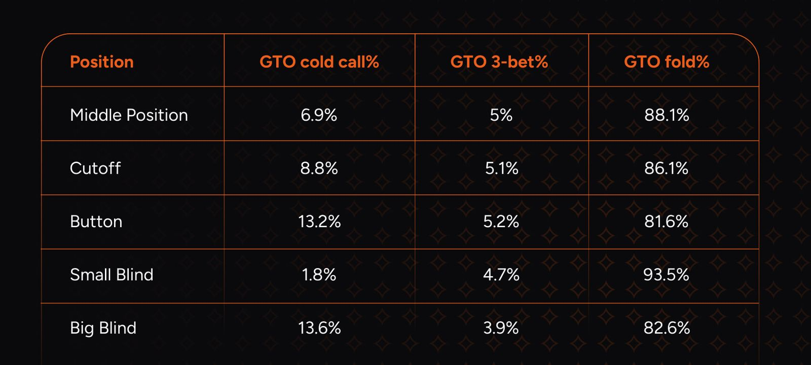
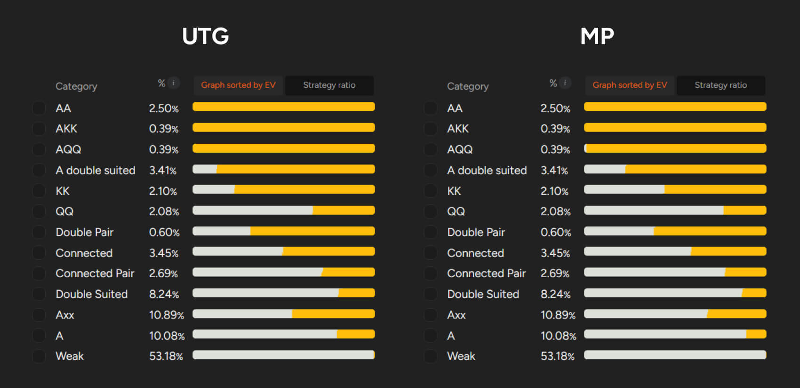
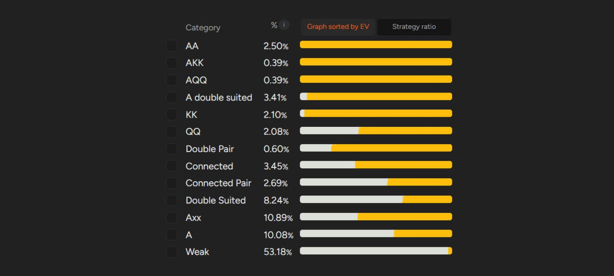
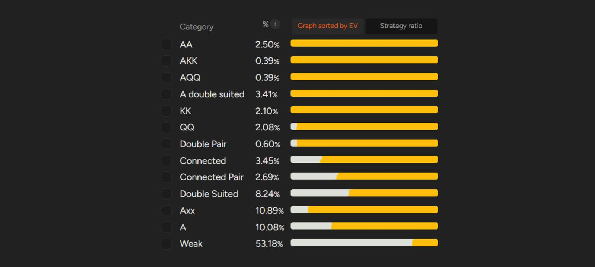

在 PLO 现金游戏中，最多可以开池多宽的范围？

PLO 主要以现金游戏的形式进行，无论是在线上还是现场。由于游戏的特性，玩家经常会积累到很深的筹码（尤其是在现场游戏中），筹码量甚至高达数百个大盲注。疯狂的动态变化、大量的大底池以及松散的玩家，都表明你正身处一个合适的牌桌。这样的 PLO 游戏并不少见，提供了绝佳的机会，但也需要极强的自律性和对游戏策略的深刻理解。

深筹码扑克通常复杂且充满挑战，因此，为了充分利用它，你必须做出相应的调整。其中一项基本但至关重要的调整就是确保你使用合适的开池范围。

许多玩家都会陷入一个常见的陷阱：因为其他玩家也开池松散，所以他们也放宽了自己的开池范围。结果，筹码四处乱飞。

一个简单而有效的翻牌前手牌评估方法是考虑 [“坚果性、连牌性和同花性”](pg11.md)。你还应该在一定程度上考虑 [“抽水”](pg10.md) 的影响，尤其是在你主要在线上游戏时。

此外，我们的文章中汇总了一些关于如何玩好 [“A-A”](pg04.md)、[“K-K 以及其他高对子的实用技巧”](pg05.md)。

## 扑克（包括 PLO）的关键在于位置

想必你对此已经非常清楚。牌局中位置优势的玩家越多，你掌握的信息就越少，也就越难实现手牌的 EV。这一点在每手牌的每个阶段都适用，位置的重要性甚至从翻牌前就开始显现，这一点你应该始终牢记。

最重要的结论是，你的位置越靠前，你的开池范围就应该越紧。在每个位置开局前你应该考虑哪些因素？

## 前位和中位

在构建 GTO 范围时，解算器会假设其他玩家会对你的开池做出正确的反应，因此所有范围都是针对均衡状态准备的 - 在均衡状态下，三人、四人或更多玩家的底池非常罕见。

如果你有低级别和中级别 PLO 的经验，你就会知道多人底池非常常见。[“多人底池”](pg08.md)（尤其是在筹码较深的情况下）可能难以应对，当多名玩家拥有位置优势时，情况会变得更加复杂。

你应该记住，无论何时你处于前位或中位，你的对手几乎肯定会过度 [“冷跟注”](pg06.md)，这会影响你的游戏计划（过度跟注指的是远超 GTO 策略假设的跟注频率）。当然，你可以利用这种倾向，但首先，你必须调整你的翻牌前范围。

如果你查看 GTO 解算器提供的 GTO 频率，你会发现，面对 EP 开池，GTO 策略大致如下所示（我们以低级别抽水结构为例，考虑 100 BB）：

根据 GTO 理论，面对 UTG 开池，你应该这样应对

如果你遇到了解 GTO 的对手，他们很少会冷跟注，3-bet 的概率大约只有 5%。此外，请注意，SB 几乎不应该跟注你在 UTG 的开池，而 BB 跟注的概率应该低于 14%。

如果你有追踪软件收集的数据库，你可以将这些数值与你的实际游戏情况进行比较。即使你没有这类数据，你也可能认同冷跟注的发生频率远高于理论预期。

关键是什么？当你处于前位或中位时，你应该非常谨慎地选择开池的牌，避免开池那些 GTO 建议下最差并且 EV 最低的牌。你无法将这些牌转化为盈利，而且它们很可能会让你陷入非常复杂但本可避免的局面。

别忘了，底池中玩家越多，翻牌后角色互换的隐含赔率的影响就越大。

当你想了解哪些牌应该加入你的牌型范围，哪些不应该加入时，将它们分类是一种高效的学习方法。只要你了解特定类别中你牌型范围的底线，你就能取得不错的成绩。记住我们之前强调过的 - 放弃表现最差的组合。如果你主要玩中低级别牌局，那么在 EP 或 MP 时，考虑开池通常意味着弃牌。

换句话说，如果你的牌在翻牌后位置不利时表现很差 - 那就放弃它。[ProPokerTools](http://www.propokertools.com/) 是一个非常棒的工具，可以帮助你更深入地了解某些牌型的 EV。

以下是我们的解算器如何处理 EP 和 MP 开池范围，从而给你一个粗略的估计。

UTG 的 16.8%，MP 的 21.5%

## 从 CO 开始，情况就大不相同了

CO 是第一个位置，这意味着在开池时拥有更大的自由度（无论是在经典的线上 6 人桌还是 8 人桌的线下游戏中，这一点都适用）。当你坐在 CO 时，只有一个玩家的位置优势会凌驾于你之上，而你也应该特别关注他的倾向 - 那就是 BTN 的玩家。

因此，你的策略应该很大程度上依赖于你左边的玩家。他们越乐于接受主动入池（无论是冷跟注还是 3-bet），你就越应该谨慎。如果他们的打法比较紧，你就可以更严格地遵循 GTO 的范围；毕竟，即使盲注位置的玩家打法不合理，你仍然拥有位置优势。

在之前相同的假设下，CO 的 GTO 开池范围约为 29%，如下所示：

几乎任何 K-K 组合都足以在 CO 中开池

此外，值得注意的是，如果你有数据库，可以实时查看以下情况的频率：

- BTN 冷跟注 / 3-bet 对抗 CO
- SB 和 BB 弃牌对抗偷盲

这些统计数据将帮助你根据当前对手调整开池范围。

## BTN 保证你在翻牌后拥有有利位置

这是你能想象到的最重要优势之一。如果你身处深筹码牌局，这一点就更加关键了。这也体现在 BTN 的胜率应该是所有位置中最高的。

由于翻牌前只有两位玩家在你之后行动，因此 BTN 的保证有利位置允许你更自由地开池，您始终拥有优势。

这就是为什么 BTN 的开池频率最接近 GTO 的原因，在所采用的条件下，GTO 开局频率约为 48%。

在 BTN 你拥有很大的自由度

如果你遇到翻牌前盲注过紧（即对手对加注过度弃牌）或翻牌后盲注过紧（即对手对 c-bet 过度弃牌）的情况，你甚至可以加注得更宽。在中低级别牌桌上，这样的对手并不常见，但你肯定会偶尔遇到，而且你最好做好准备去识别他们，因为……

## 翻牌前赢下底池的价值远超你的想象

但与此同时，这种情况发生的频率远低于理论值。

根据理论，在 6 人桌上，如果你在 UTG 开池，你应该有大约 50% 的概率轻松赢得底池。这种情况在你玩的牌桌上发生的具体概率会有所不同，但我们几乎可以肯定它会低得多（级别越低，翻牌前赢下底池的概率就越低）。

重要的是，每次你在翻牌前拿下底池，你都能赢得 1.5 BB。这看起来收益不大，但如果换算成标准的胜率指标 - 每百手牌赢大盲注 - 那就是 150 BB/100 手，这在任何具有代表性的、像样的牌局样本中几乎都不可能达到。

作为参考，在中高级别中，每百手牌赢下超过 5 BB 已经是非常不错的成绩了。

所以，一方面，你应该在前位开池非常紧，避免在多人对局中处于不利位置；另一方面，你应该在后位寻找那些容易赢盲注的机会。

## 合适的开池范围是稳定胜率的最佳基础

完善你的翻牌前范围绝对值得花时间；它能帮你避免许多不必要的麻烦，让你在面对经验不足或缺乏耐心的对手时，创造更多有利局面。因此，我们强烈建议你使用 GTO 解算器进行学习，并通过其 GTO 训练器功能检验所学 - 你的 PLO 翻牌前技巧将迅速提升。