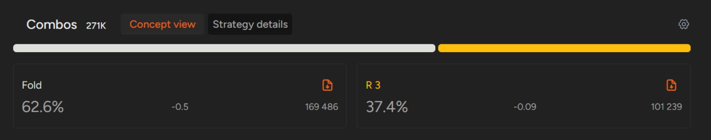
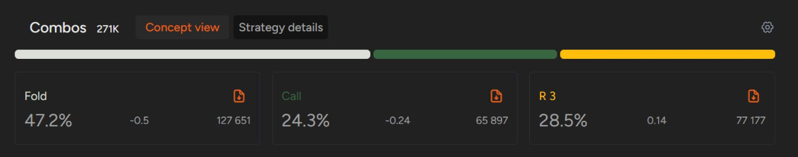
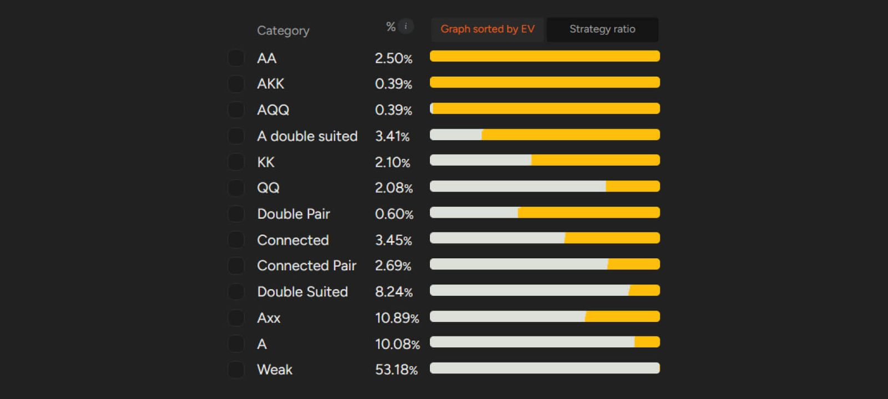

SB 正确的翻牌前策略是什么？

我们最近的文章探讨了在 [“前位、中位、CO 和 BTN 的开局范围和需要考虑的因素”](pg20.md)。

这次，我们将探讨最后一个你可以在翻牌前积极进攻的位置：SB

在 PLO 和 NLHE 中，SB 都是一个非常特殊的位置。当你在 SB，其他玩家都已弃牌，而你考虑是否参与这手牌时，有几点需要注意。首先，底池将以单挑的形式进行，你的对手很可能持有范围很广的牌。其次，你在整个牌局中都处于不利位置，并且在翻牌前的每一轮都是第一个行动的。

## 默认处在不利位置

虽然单挑无疑会让制定翻牌后策略变得更加直接（因为更容易想象出所有可能行动的决策树），但不利位置绝对会带来诸多不便。

我们建议你首先避免在低级别游戏中溜入，因为在翻牌前拿下底池并避免抽水是有利的。在 SB，最佳策略会根据 [“抽水的大小”](pg10.md) 而发生显著变化。

如果我们比较 GTO 解算器中的 “低级别”（相当于 PLO 50 短桌现金局的抽水）和 “高级别”（相当于 PLO 5000 短桌）设置，我们会发现策略截然不同。在低级别游戏中，你应该采用加注 / 弃牌策略（加注 / 弃牌比例为 37.4% 对 62.6%）；而在高级别游戏中，你应该溜入 24.3% 的牌型范围，加注 28.5%，弃牌 47.2%。

如果你的游戏抽水结构更类似于 “中等级别” 结构（在我们的例子中，是 Pokerstars 上的 PLO ZOOM 500），你也应该放弃溜入，加注 38.9%。

低级别 SB 策略

高级别 SB 策略（假设抽水较低）

在本文的剩余部分，我们将假设大多数读者都在逐步提升级别，因此我们将使用低级别的模拟数据作为参考。

SB 与其他位置还有一点不同：无论你处于前位、中位还是后位，都应该加注你认为有利可图的牌。

在这些位置，弃牌的 EV 为 0，因为弃牌不会损失任何筹码。因此，即使一手牌的 EV 很低，但如果它的期望值大于 0，你也应该考虑加注入池。这个概念在 SB 有所不同，因为每次弃牌都会损失你投入的小盲注 0.5 BB。

因此，SB 的最优策略（从 GTO 的角度来看）包括加注一些 -EV 的烂牌（例如 Q-T-8-6 单同花）。然而，在这些情况下，这些 -EV 仍然优于弃牌的 EV（开池 Q-T-8-6-ss 会损失 0.41BB，而直接弃牌会损失 0.5 BB）。

当然，SB 策略 EV 的大部分并非来自开池那些边缘牌型，而是来自那些最有利可图、最具价值的牌型。但是，如果你想提升级别，就应该了解 SB 中某些牌型的可玩性阈值。

## SB 对抗 BB：独特的动态

在上一篇关于开池范围的文章中，我们强调了你应该根据后位玩家对你行动的反应来调整你的开池策略。当然，在你之后行动的玩家越多，你的准确度就越低。但当你处于 SB 时，找到合适的调整就容易得多，因为你只需要考虑一个玩家 - BB 玩家的倾向。

你的对手是激进的 3-bet 玩家吗？你应该避免用边缘牌开局（因为你经常会遇到 3-bet，不得不弃牌）。你的对手 3-bet 的频率是否低于理论上的水平（根据我们的模拟，大约是 13%）？你的开池权益实现会高于预期，所以你可以稍微放松一些！

你的对手经常弃牌吗？（这时，BB 弃牌偷盲的统计数据就派上用场了 - 你可以在 HEM 中找到它。）如果对手弃牌率超过约 63%，那么你可以用任何牌开池盈利（平均盈利会随着弃牌率的增加而增加，但请记住，这个假设的前提是你不会在翻牌后犯错）！

还有一些其他因素需要考虑（例如对 c-bet 弃牌或对手在错过 c-bet 时选择偷池下注），但上述倾向是你在 SB 分析对手游戏策略时首先要考虑的。

此外，由于底池限注游戏的特性，翻牌前最大加注额为 3BB，所以你无法加注到更大的金额。

最后，让我们更深入地了解一下 SB 的整体加注策略。

只有最强的 Q-Q 和双同花牌型才会在 SB 开池

如上图所示，最佳开池组合非常简单明了：你应该加注所有 A-A、K-K 以及绝大多数 Q-Q 和两对牌型。

更棘手的决策始于以下几类牌型：连接牌、连对和双同花。一个好的经验法则是避免开池三条（A 除外），并格外谨慎地处理包含 2、3、4 以及一定程度上包含 5 的牌型。通常情况下，2 和 3 会严重影响你的牌型可玩性，只有像 A-Q-5-3-ds 或 J-J-5-3-ds 这样最佳的边牌组合才能构成适合开池的牌型。

有些牌型在 SB 上可能反直觉，并可能导致你犯下自己都意识不到的错误。幸运的是，当存在提升空间时，也存在提高胜率的机会。

在决定何时开池或弃牌时，使用 GTO 解算器进行学习将对你大有帮助。记忆哪些牌型组合应该开池、哪些牌型应该弃牌的有效方法是使用我们的 GTO 训练器，它可以帮助你快速培养直觉。

## 掌握 SB 策略比你想象的要容易

尽管处境不利，但只要你了解当前游戏的动态，制定一套稳健的 SB 策略并不难。记住，在这种情况下，几乎不可能取得正的胜率，但关键在于比对手在相同情况下输得更少。