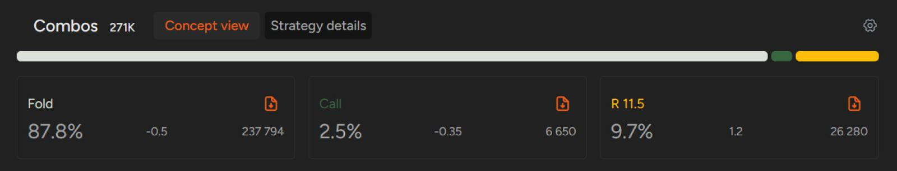
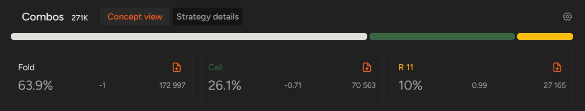

# SB 和 BB 的冷跟住

在 SB 要么选择 3-bet，要么选择弃牌！

我们最近研究了 [“前位、中位、CO、BTN”](pg20.md) 和 [“SB”](pg21.md) 的开池范围。

现在是时候看看盲注位的 [“冷跟注”](pg06.md) 策略了，因为位置不利在盲注位几乎肯定会输钱。因此，你的目标应该是尽可能少地输钱。

在盲注位输钱背后的数学原理是什么？当你处于 BB 时，你必须投入一个大盲注。因此，如果你在翻牌前每手牌都弃牌，你每次都会损失 1  BB。虽然看起来不多，但换算过来就是 -100 BB/100 的胜率，这是一个灾难性的结果。因此，当你在 BB 位跟注加注时，你的目标是获得比弃牌更高的胜率。

当你在 SB 时，这种机制也类似，你的初始胜率（意味着你弃掉所有牌）为 -50 BB/100。然而，相似之处仅限于此。虽然 GTO 策略假设你应该通过频繁跟注来防守 BB，但我们强烈建议你在 SB 时避免冷跟注。

## 为什么在 SB 冷跟注行不通？

在 SB 对抗单次加注时，采用 3-bet 或弃牌策略有几个原因。

首先，SB 是翻牌后最不利的位置 - 你总是处于不利位置，有时甚至要对抗多个对手，这会让你的所有决策都变得更加困难。

第二点是，当你跟注加注时，你限制了你的范围，同时 “邀请” BB 玩家进行挤压。一旦他们挤压，行动就会重新开始，之前的加注者仍然可以再次加注，让你投入底池的筹码变成死钱。即使最初的加注者跟注，允许你也跟注，你最终也会在不利位置对抗两个（据推测）牌力范围不错的玩家，打一个很大的 3-bet 底池。

最后，你应该尽量用你最好的牌在翻牌前扩大底池。此外，每当你决定 3-bet 时，你都会降低翻牌后的 SPR，从而降低对手的位置优势，因为在较低的 SPR 下游戏更容易。

因此，除非你玩的是极其软弱的 PLO 游戏，否则你应该避免在 SB 进行冷跟注，以免让自己陷入复杂的 [“多人局面”](pg08.md)。即使你坐在一个没有挑战性的牌桌上，你也应该仔细选择你的潜在跟注牌，因为其他玩家很容易惩罚你玩得太宽（这种情况会意外发生，因为在不利位置与多个对手对战很少是件容易的事）。

SB vs BTN 开池的策略

这就是你在 SB 对抗 BTN 加注时应该如何运用你的牌型范围。

正如你所见，低级别 GTO 策略几乎不包含跟注。为了便于理解，我们不妨对比一下 BB 对抗 BTN 时策略的巨大变化。

BB vs BTN 开池的策略

## BB 对抗 SB 的防守

要想成为一名优秀的扑克玩家，你必须正确地防守你的大盲注。否则，你将损失惨重。大多数情况下，当你防守对方的加注时，你都会处于不利位置；只有在对抗 SB 时，你才能占据有利位置。由于这种情况相对简单，我们将从它开始讲解。

首先，让我们来描述一下这种情况。在 BB 对抗 SB 的场景中：

- 你保证在整手牌中都处于有利位置
- 假设起始筹码为 100 BB，翻牌圈的 SPR 为 16.2（有效筹码为 97 BB，底池为 6 BB）
- 假设是 [“低级别牌局的抽水”](pg10.md)，SB 应该采取加注 / 弃牌策略，加注 37.4% 的手牌。
- 作为 BB 的你，应该跟注 52% 的手牌，并对 13% 的牌型进行 3-bet。

当然，对手的实际打法与理论预测会有所不同。然而，由于你处于有利位置，即使不根据对手的具体情况调整策略，实现手牌的 EV 也比在不利位置防守 BB 要容易得多。

你可以在 GTO 解算器中学习针对这种情况的 GTO 扑克策略，但如果你想大致了解你的牌型范围，这里有一个简要概述。

作为 BB 玩家，面对 SB 的加注，你应该：

- 用所有 A-A 组合进行 3-bet
- 用所有 K-K 和 Q-Q 组合防守，加注最好的组合
- 防守所有两对
- 防守大多数连接牌（弃掉带 2 或 3 的牌）
- 防守大多数对子连接边牌（5-5 及以上）
- 防守几乎所有 A 同花
- 弃掉三条和非连接牌的三同花牌

## BB 对抗 SB 相对容易

因此，它是学习如何应对对手加注的绝佳起点。在 PLO 中，要清晰地构筑自己的牌型范围绝非易事，但由于 BB 对抗 SB 是唯一一种既能应对翻牌前加注又能占据有利位置的情况，即使你在翻牌前犯了错误，也可以在后续回合中弥补。

真正的难点在于盲注位置如何应对有利位置的加注，而这正是我们将在下一篇文章中探讨的主题！