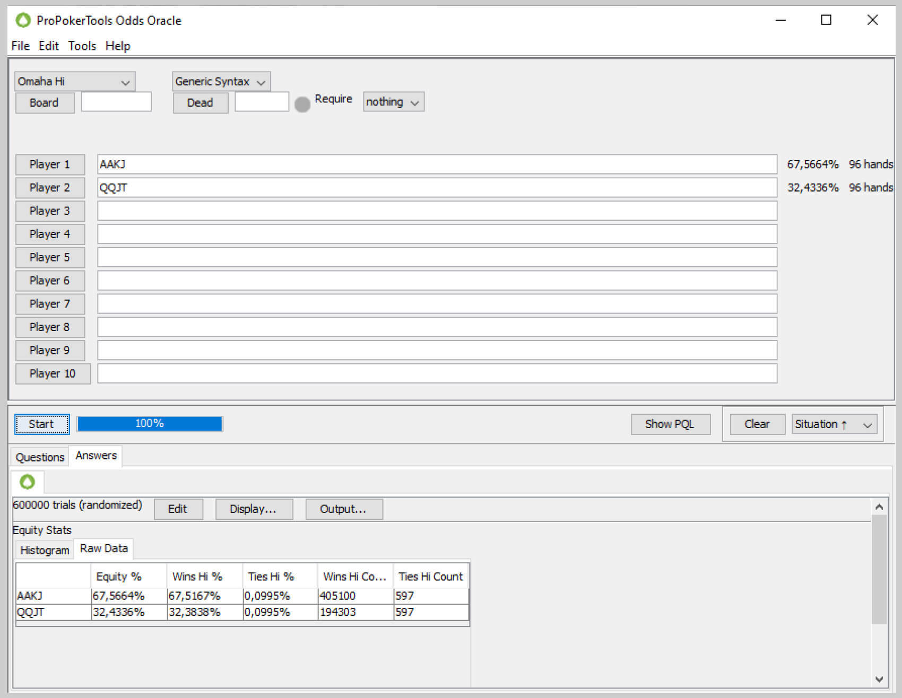
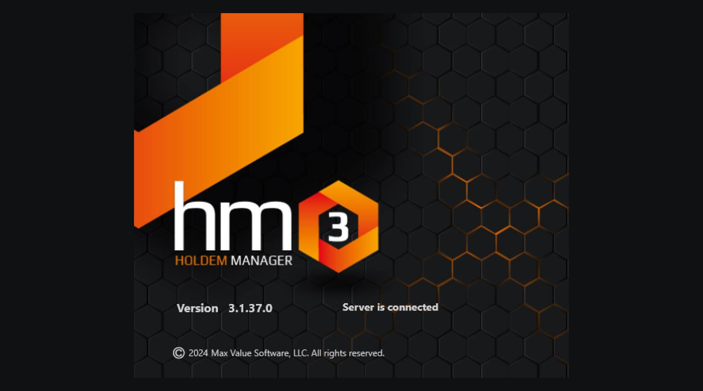
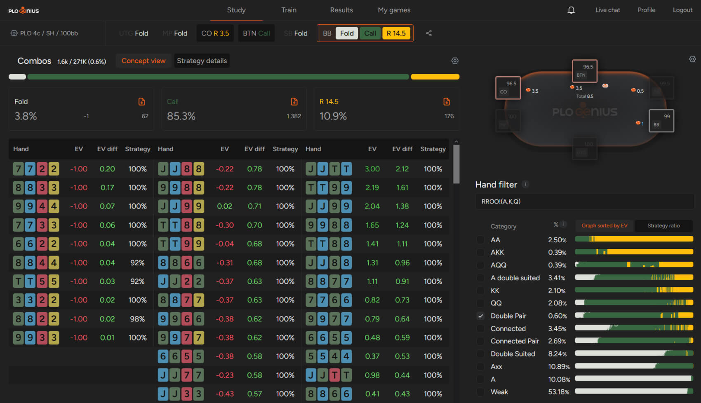

# 提升 PLO 技巧的扑克工具！

学习 PLO 最省时的工具有哪些？以下是一些例子。

与 NLHE 一样，扑克工具和软件对于提升牌技至关重要，甚至可以说是必不可少。由于 PLO 游戏更为复杂，难以直观呈现，因此设计实用的软件难度更大，但这并非不可能。

今天的文章将探讨三种对渴望提升 PLO 牌技的玩家最有价值的扑克工具。

## 权益计算器

毋庸置疑，了解自己在 PLO 中的权益是你能掌握并精进的最关键技能之一。

PLO 的权益分布十分微妙，在不同的情况下差异显著，因此学习如何估算权益至关重要。

例如，在 NLHE 中，A-A 的权益相对稳定，几乎在所有情况下都徘徊在 80% 左右。但在 PLO 中，[“A-A”](pg04.md) 的权益则截然不同，因为同花和边牌会极大地影响 A-A 的可玩性和牌力。

考虑到所有包含 A-A 的牌型（包括三条 A 和四条 A），它们相对于随机牌型的权益约为 65%。当我们缩小范围，只考虑 A-A-7-2 彩虹组合时，权益会下降到略高于 61%，但当我们将牌型改进为漂亮的 A-A-J-T 双同花组合时，权益会提升到 70%！

在权益计算器中手牌对手牌的权益计算是最简单的操作

正如你所想，这只是众多潜在情况之一，而权益计算器可以帮助你了解不同牌型之间的权益差异。当然，由于底池限注规则，PLO 的翻牌前权益不如 NLHE 那么重要，但就像在德州扑克中一样，你可以使用权益计算器来计算包含公共牌在内的情况。

考虑到你底牌的众多可能组合、它们与不同翻牌的互动方式以及其他玩家的范围，可能会出现复杂的情况。记住所有这些情况几乎是不可能的，因此使用权益计算器进行训练至关重要；它可以帮助你更准确地评估手中牌的权益。

Pokerstrategy Omaha Equilab 和 Poker Pro Tools 是两款流行的扑克权益计算器，你可以尝试一下。截至撰写本文时，后者是免费的，它甚至允许你计算其他游戏（包括奥马哈高 - 低、PLO5 和 PLO6！）的权益！

## 追踪软件

扑克游戏融合了数学和心理学，PLO 也不例外。在心理学方面，除了那些专注于提升心态的应用程序之外，其他应用程序提供的帮助有限；但在数学方面，却有很多工具可以用来处理和分析各种数据。虽然扑克权益计算器可以帮助你评估不同情况下各种牌型的优劣，但追踪软件可以让你做出更复杂的假设，包括评估你实际的游戏情况。

追踪软件是如何工作的？它会将你玩过的所有牌局存储在数据库中，并将收集到的数据以单页显示的形式呈现，把你（以及其他玩家）玩过的牌局转化为统计数据。

借助这些扑克工具，你可以收集信息来分析你的游戏。你的开池加注频率是否接近最佳水平？你的 3-bet 和防守 3-bet 是否足够？你的 c-bet 是否过度？追踪软件提供的数据将帮助你找到这些问题的答案。但这还不是全部；随着时间的推移，你的数据库会不断增长，足以让你分析更复杂的数据，例如在转牌圈过牌 - 加注后，你在河牌圈下注的频率，或者你在河牌圈跟注时能赢多少钱。

此外，如果你长期与同一批玩家对战，你将积累大量关于他们游戏的信息，甚至可以分析对手的打法，了解他们的优势和弱点！

市面上有很多数据追踪工具，但从历史数据来看，最受欢迎和最值得信赖的当属 Holdem Manager、Poker Tracker 和 Hand2Note。

Holdem Manager 的第一个版本于 2009 年发布

## 扑克解算器

最后一种，也是迄今为止最复杂的扑克软件类型是扑克解算器。解算器旨在构建无法被对手利用的策略（这意味着，如果你能 100% 准确地执行此类策略，从长远来看，对手将无法从你身上赢钱）。

当然，没有人能够完美地复制复杂的扑克解算器的指导原则。幸运的是，这并非使用解算器的目的。花时间使用像 GTO 解算器 这样的软件可以让你在许多方面有所提升，包括两个关键方面。

首先，使用解算器研究翻牌前场景将帮助你更好地理解哪些类型的牌会在特定的翻牌前场景中选择加注、弃牌或 3-bet。这种知识应该是所有 PLO 策略的基础，而且由于翻牌前可能出现成千上万种不同的场景，因此需要掌握的知识量非常大。

哪些两对牌型应该在 BB 挤压 CO 加注和 BTN 随后跟注？只需几秒钟就能找到答案！

使用 GTO 解算器，你可以研究如何应对对手的行动。更棒的是，你可以分析翻牌前有多名玩家活跃的情况，而且你的问题几乎可以实时得到解答！

PLO 的翻牌前阶段已经很复杂，但翻牌后阶段更具挑战性；因此，GTO 解算器孜孜不倦地每隔几天就添加新的模拟（而且还有很多工作要做：PLO 和 PLO5 在不同筹码量下，单次加注、3-bet 和 4-bet 底池的模拟！）。

## 在 2025 年使用扑克工具是提升扑克技巧的有效途径之一

如今，扑克工具是学习和改进策略最省时的方法之一。使用扑克软件是超越对手的绝佳途径，没有任何理由不使用它；越早开始，效果就越好。