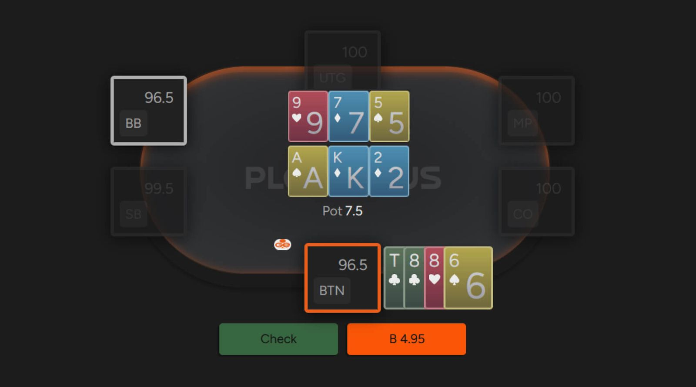

# PLO 双公共牌（以及炸弹底池）是怎么回事？

让我们来介绍一下双公共牌 PLO 和炸弹底池！

不同地区的 PLO 游戏经常会出现一些变化，这些变化会改变游戏的玩法和正确的 GTO 策略。在众多玩法和变体中，最受欢迎的是使用两组公共牌（有时采用 “炸弹底池” 模式）。

如果你从未玩过双公共牌 PLO（或 [“PLO5”](pg07.md)），你会惊讶于游戏玩法的差异。额外的公共牌增加了游戏的复杂性，而许多玩家（当一种小众玩法流行起来时，这种情况很常见）对此并不了解。这种玩法如此新颖且充满挑战性，以至于一些现场 NLHE 游戏甚至会在每次换荷官时玩一手 PLO 炸弹底池！

双公共牌 PLO 和炸弹池似乎越来越受欢迎。不出所料，如果一种技巧性很强的游戏变体受到追捧，那么它就值得学习，因为很大一部分人完全不知道该如何玩。

那么，让我们深入探讨一下，看看如何驾驭双公共牌 PLO。

双公共牌 PLO 是一个崭新的世界

## 双公共牌 PLO 的玩法是怎样的？

我们先从基础知识讲起。双公共牌 PLO（有时 PLO5 或 PLO6）是一种分池游戏，这意味着底池会被分成两半，分别对应两组公共牌，通常称为上池和下池。分池机制类似于 “发牌两次” 功能。

最重要的是，在摊牌时，你必须在两组公共牌上都拥有最佳牌型才能赢得整个底池。正如你可能已经猜到的，这并非易事，因此你经常会与他人平分底池，有时甚至会平分其中一半（例如，如果有多名玩家拥有相同的顺子）。

双公共牌 PLO 还有一个更复杂的变体，叫做 “炸弹底池”。根据你所在地区的流行程度，炸弹底池可能偶尔出现（例如，在 NLHE 游戏中，荷官更换后的一手牌），也可能成为常规游戏。

## 炸弹底池没有翻牌前

炸弹底池有两个显著特点。

最重要的一点是没有翻牌前下注 - 所有玩家在翻牌圈就进入底池。这意味着一手牌最多可能有 8 个人参与！

第二点需要注意的是，在炸弹底池发牌之前，玩家下注的是前注（ante），而不是大盲注 和小盲注。因此，平均底池要大得多，因为前注（取决于牌桌规则）最高可达 10 BB。虽然没有固定的上限，但最常见的前注是 5 BB。

## 双公共牌 PLO 和炸弹底池：一些需要掌握的要点

与其他扑克游戏一样，PLO 炸弹底池也充满了各种细微差别，并有其自身的游戏机制，需要时间去学习。现在，让我们专注于一些重要的基本要点，它们可以帮你省下不少钱。

**考虑底牌移除情况**

在任何扑克游戏中，你很少能确切地知道哪些牌还在牌堆里，哪些牌已经弃牌（这种情况主要发生在现场游戏中，荷官或玩家不小心翻开牌）。

虽然过一段时间后你会明白，但你应该记住，一张公共牌上的牌在另一副牌上是 “死牌”。假设两副牌分别是 A-4-6（彩虹牌）和 A-A-7（彩虹牌）。如果你持有最后一张 A，那么其他玩家就不可能组成三条。类似的情况也适用于一副公共牌牌是 K♣-J♣-2♦，下副牌是 A♣-6♠-5♥ 的情况；如果你手牌中有 Q♣ 和至少一张其他 ♣，那么在上面牌上你正在听取坚果同花，而在下面牌上你则有后门坚果同花听牌。

**目标是免费赢下底池（或者至少有相当大的机会赢得整个底池）**

通常，在双公共牌 PLO 游戏中，要想继续进行后续回合，你的牌必须满足以下两个条件之一：要么在其中一组公共牌上碾压对手（这意味着你持有独特的坚果牌，例如在无对牌面上拿到坚果同花，或者在有对牌面上拿到不错的葫芦），要么在两张牌上都拥有相当不错的权益，例如在一组牌面上持有中等三条并有后门同花听牌，而在另一组牌面上持有坚果同花听牌并有坚果卡顺听牌。

这个想法背后的逻辑是什么？你的目标和最佳结果是赢得整个底池，而且大多数情况下，当你在一手牌上拥有高权益时，你应该选择主动进入底池策略。如果你至少赢了一手牌，你就能保证收支平衡（不考虑抽水）或赢钱，这意味着你在另一手牌上的任何权益基本上都是白送的。第二好的结果是在两手牌上都拥有稳定的权益（单挑底池超过 50%，或 3 人底池超过 33%）。

**顺子不如常规 PLO 那么好**

双公共牌 PLO 中的坚果牌可以是绝对坚果牌（意味着它们永远不会平分底池），也可以是 “共享” 坚果牌。绝对坚果牌是坚果同花、顶葫芦或更好的牌型，它们总是能保证你赢一手牌。共享坚果牌比你想象的要差得多；在常规 PLO（甚至 NLHE）中，平分底池是一个中性的结果。在双公共牌 PLO 中，你的顺子通常只能平分一半底池，这意味着如果你在一组牌上成牌，最好的结果也只能拿到 1/4 的底池。

**明确你的目标（推走对手还是拉入更多对手）**

你经常会遇到这种情况：你已经锁定一组牌的胜局，但几乎不可能赢得第二组牌。你应该怎么做？这取决于牌局中还有多少人。如果只有一个对手，那么下大注会是更好的策略，因为最坏的结果也只是平分底池，有时你甚至能逼走对手，独揽整个底池。

然而，如果底池是多人底池，而你有信心赢下一盘牌，但第二盘牌毫无胜算，那么不妨考虑采取更为被动的策略，将更多对手拉入底池。当你只打算赢一半底池（假设你持有四条或同花顺）时，你的目标是尽可能地扩大 “你的那一半”，因此明智的做法是让其他玩家追赶上来，投入更多筹码。通常情况下，如果你开始主动下注，除了已经锁定第二盘牌的玩家之外，你会把其他玩家都赶出底池，最终自己反而无法赢得更多筹码。

## 为什么要学习炸弹底池？

当然，有些扑克玩家会认为学习双公共牌 PLO 和炸弹底池的玩法是徒劳的。虽然你可以选择不玩双公共牌 PLO，或者选择不参与甚至弃牌炸弹底池，但我们并不建议这样做，原因如下。

如果你玩的是现场扑克，而炸弹底池每次换荷官都会出现，那它会占用你大量的游戏时间。假设荷官每 30 分钟换一次，一手炸弹底池牌大约需要 5 分钟，那么它就占了你整个游戏时间的 1/6，这无疑相当可观！

此外，炸弹底池比普通底池大得多（假设在 8 人桌 PLO 中，普通前注是 5 BB，那么翻牌圈就是 40 BB！），这意味着如果运用得当，它们将显著提高你的整体胜率。

通常情况下，大多数现场玩家都是根据经验和直觉来玩，而不是遵循最优策略。即使是 PLO 的常客也一样，因为他们往往不会花太多精力去研究炸弹底池的原理。所有这些都导致在玩炸弹底池（甚至“常规” 双公共牌 PLO）时，玩家可以获得很大的优势。 

要不要下注？

## 一些让你的游戏更轻松的小技巧

由于其复杂性以及主要流行于现场扑克游戏，炸弹池游戏相对来说仍未得到充分破解。因此，你应该尽可能简化你的决策。

与其他使用公共牌的游戏一样，底池大小通常以动态或静态的方式展开：动态变化（意味着每轮的 “坚果牌” 都可能发生变化，尤其是在存在多个听牌的情况下）或静态变化（意味着翻牌圈的 “坚果牌” 很可能在河牌圈仍然是 “坚果牌”，尤其是在牌面不连贯或出现对子的情况下）。每当你面临下注时，你应该思考你的对手更可能关注哪种牌面，以及当他们与多名玩家对赌时，是什么因素驱动着他们的决策。

大多数情况下，下注会受到相对静态的牌面的影响，因为这类牌面能带来更多直接的价值（以及保护）。而且，如果玩家的牌正在听成牌，他们通常会选择过牌。

记住，在双公共牌游戏中，数学的运作方式有所不同。在常规 PLO 中，每当对手下注底池大小时，你的权益必须达到 33%。而在双公共牌 PLO 中，如果你只能赢一手牌，那么每次面对底池大小的下注，你的权益必须达到 66% 才能勉强收支平衡。这之间的差别非常巨大，使得 “抓诈唬” 的吸引力大大降低。

这就引出了另一点：在双公共牌 PLO 中，下注和跟注相同金额的情况截然不同。如果你在一手牌上用一手强牌（但不是坚果牌）下注底池，而在另一手牌上用一手较差的牌下注底池，你可能会被跟注并平分底池，也可能被加注并弃牌，或者迫使对手弃牌并赢得底池。如果你在相同情况下选择过牌，而对手也过牌，那么你最有可能的结果就是平分底池。

然而，如果你用同样的牌选择过牌，最好的结果就是平局，因为实际上你摊牌时只能赢一副牌！

这是双公共牌游戏独有的动态，也使得双公共牌游戏比普通 PLO 更考验脑力。

## 双公共牌 PLO 和炸弹底池乐趣无穷

即使你觉得双公共牌 PLO 不适合你，我们也鼓励你尝试一下，即使是微级别。乍一看，这款游戏似乎纯粹是赌博，但我们保证它远比表面看起来更有深度，而且非常精彩。