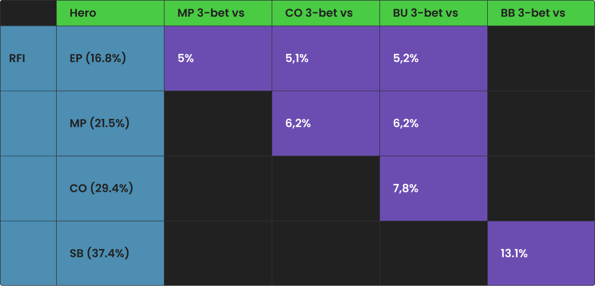
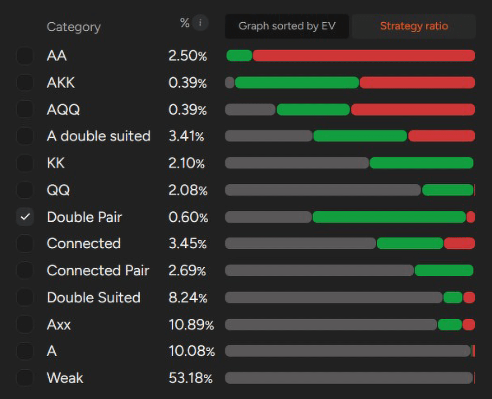
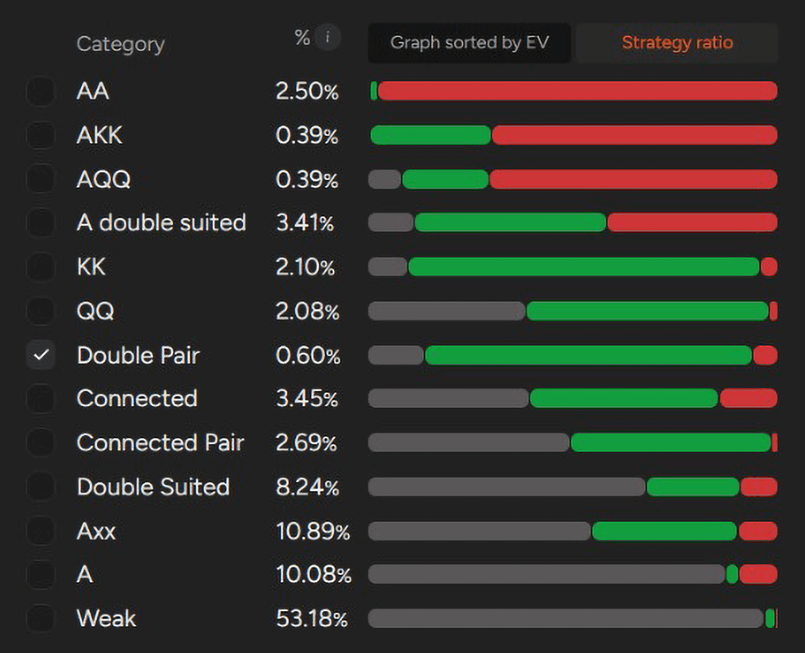
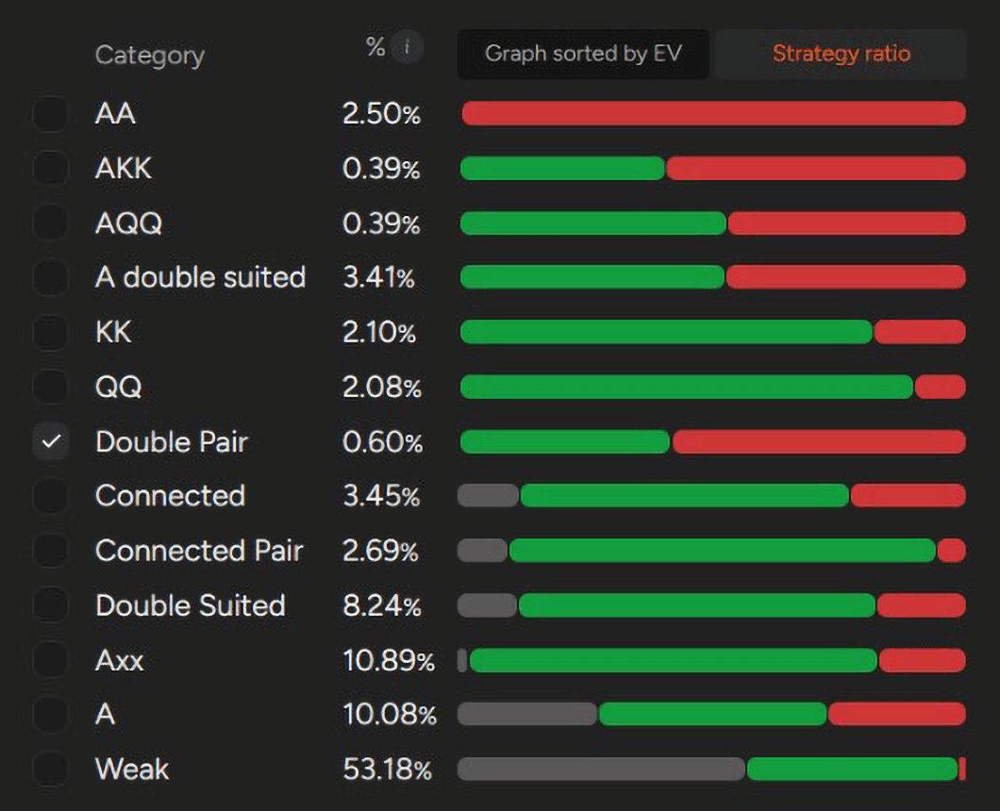

# PLO 有利位置的 3-bet：范围、逻辑、调整

PLO 有利位置 3-bet 的实用指南 - 学习如何构建强大的范围、根据对手调整策略，并在低级别牌桌上获取最大价值。

在所有打法中，3-bet 对你的胜率影响最大。它能建立更大的底池，并立即表明你的牌型范围比对手更强。如果你在翻牌后还拥有位置优势，就能获得战略优势，更容易实现你的权益并施加压力。

对于任何持续盈利的玩家来说，一个结构完善、理论指导下的 3-bet 策略都至关重要。使用错误的牌型范围、3-bet 频率过低或选择糟糕的时机都会让你损失巨大的 EV。

那么，如何通过 3-bet 策略最大化预期收益呢？让我们来详细分析一下。

## 在 PLO 中你应该如何看待 3-bet？

与 PLO 的大多数方面一样，由于牌型组合的数量庞大，3-bet 比 NLHE 更加复杂。额外的底牌以及 PLO 牌型权益的动态性使得牌型范围的构建不再那么直接，而是更加依赖于牌型结构和位置优势。

那么，如何构建一个有效的 3-bet 范围？一个优秀的 3-bet 候选牌又具备哪些特征？需要考虑的因素有很多，本文将重点介绍一些在低级别 PLO  现金游戏中占据有利位置时适用的基本原则。

首先，我们对范围进行一个概览。使用PLO 解算器，你可以立即获取完整的位置 3-bet 范围。从出现频率来看，它们大致如下：

有利位置 3-bet 的 GTO 频率

在决定对一手牌进行 3-bet 之前，评估几个影响该策略盈利的因素至关重要 - 这其中就包括了解对手的打法与理论的偏差。

几乎所有级别的玩家，尤其是低级别玩家，都会偏离最优的 3-bet 频率。因此，你的 3-bet 策略应该根据玩家群体的倾向进行调整。由于 PLO 的权益通常非常接近，你的优势很大程度上取决于你如何适应这些偏差。

例如，许多对手会比 GTO 建议的频率更频繁地防御 3-bet。以 UTG vs MP 为例：UTG 玩家应该有大约 42% 的概率弃牌。但在实战中，这个数字通常要低得多 - 有些玩家甚至会在位置不利的情况下，用宽而弱的牌跟注 3-bet，这显然不符合任何平衡策略。

因此，你不应该只用 A-A-x-x 或 A-K-K-x 这类优质牌进行 3-bet，这是经验不足的玩家常犯的错误。如果前位的开池玩家打得太松，防守过于频繁，你可以通过 3-bet 那些在他范围中占优，但理论上并不属于 3-bet 的牌来获取价值。

接下来，我们将分析几种最常见的有利位置 3-bet 情况，以及每种情况下范围背后的核心逻辑。

## 在 PLO 中面对 UTG 的 3-bet 策略

在 PLO 中，MP vs UTG 的 3-bet 策略是最受限制的策略之一。你面对的是前位玩家较为紧的开池范围，而且在你之后还有四位玩家待行动。由于这种局面，你施加压力或偏离标准范围的能力非常有限。

在这种情况下，你的 3-bet 范围应该非常紧，并且主要集中在优质牌型上。你的大部分 3-bet 牌型应该是 A-A-x-x，尽管并非所有 [“A-A 组合”](pg04.md) 都符合条件。此外，像 A-K-K-x 和 A-Q-Q-ss 这样的顶级非 A-A 优质牌型也符合条件，因为它们具有很强的可玩性，并且面对 UTG 狭窄的开池范围也拥有较高的权益。

除此之外，只有少数几种特定的牌型适合在此情况下进行3-bet：

- 双同花色 A 高连牌（例如 A-K-J-T）
- 精选两对牌（例如 T-T-9-9-ds、6-6-5-5-ds、5-5-4-4-ds）
- 强单同花 A-x 连接牌（例如 A-7-7-6、A-J-T-9、A-Q-J-8）

与许多 PLO 场景一样，除非是 A-A 组合的一部分，否则通常应避免持有包含 2 或 3 的牌。这些小牌会成为悬垂牌，显著降低翻牌后的可玩性。相反，持有 A 则尤为重要 - 它不仅能阻止对手持有 A-A-x-x，还能让你组成坚果同花，这是翻牌后实现权益的关键因素。

总而言之，你面对 UTG 时，MP 的 3-bet 范围应该缩小，以 A-A 为主，并且专注于高连接性、高同花优质牌，这些牌在面对紧的前位范围时表现良好。

MP vs UTG 3-bet 范围

当你在 CO 面对 UTG 或 MP 的加注时，你的 3-bet 策略与 MP 面对 UTG 时的策略基本一致。范围同样应该很紧，主要由 A-A-x-x 牌型、优质双同花连牌以及精选的 A-x 连牌组成。

**CO vs UTG** 的 3-bet 范围几乎与 MP 面对 UTG 位时相同，而 **CO vs MP** 时的范围略微扩大到所有牌型的 6.2%。然而，这些范围背后的策略原则保持一致 - 优先考虑同花 A-A、连接结构以及在面对窄范围加注时仍能保持权益的牌型。

## PLO 中 BTN 的 3-bet

一旦你在 BTN，你的 3-bet 策略就会明显变得更加激进 - 尤其是在面对后位开池时。虽然你仍然应该对 UTG 和 MP 的加注保持谨慎，但面对 CO 的加注，你可以将范围扩大到所有牌型的 7.8%。

这在实战中是什么样的呢？

面对 CO 开池，你应该在以下情况下进行 3-bet：

- 几乎所有非三条的 A-A-x-x 牌型
- 大多数 A-K-K-x 和 A-Q-Q-x 组合
- 大约一半的双同花 A 高连牌，尤其是在连接结构中

手牌有 A 仍然是关键因素。它不仅提升了可玩性，还能让你加入一些价值较低但仍然有利可图的牌型，例如：

- A-J-T-9、A-K-T-4、A-K-7-5 即使它们不是 A 同花。

同样重要的是，如果没有 A，[“K-K-x-x 和 Q-Q-x-x”](pg05.md) 几乎不会在这里进行 3-bet。这些牌型在面对 4-bet 时会非常吃亏，最好将其作为跟注范围的一部分，尤其因为它们不阻挡 A-A-x-x，这使得对手在 4-bet 时更有可能持有 A-A。

BTN vs CO 3-bet 范围

## BB vs SB 的 3-bet 策略

BB vs SB 的动态是 PLO 中一个独特的场景。在这种情况下，你必定会与对手单挑，并且在翻牌后拥有位置优势 - 这显著提高了你的 3-bet 盈利能力。因此，假设 SB 弃牌率约为 41%，4-bet 率约为 14%，你的 3-bet 频率可以高达 13%。

然而，在现实中，大多数对手的策略并非如此：他们通常会在 3-bet 时弃牌不足，并且很少会激进地进行 4-bet。这使得更宽泛的 3-bet 策略更加有利可图。

**GTO 的建议是什么？**

基于解算器的策略包括：

- 所有 A-A-x-x 牌型
- 大约一半的 A-K-K-x、A-Q-Q-x 和 A 双同花连牌
- 大多数双同花两对牌型（例如 T-T-9-9-ds、9-9-8-8-ds、7-7-6-6-ds） - 这些牌型在盲注对盲注的对抗中作为 3-bet 表现非常出色
- 没有 A 的 K-K 和 Q-Q 通常倾向于平跟，它们在面对 4-bet 时表现不佳，更适合在翻牌后用作抓诈唬牌。

**剥削策略**

由于大多数 SB 弃牌或 4-bet 的频率不够高，你可以将 3-bet 的范围扩大到 GTO 理论建议的范围之外，从而获利。对手的许多平跟牌都包含一些边缘牌，这些牌在翻牌后弃牌率过高，或者在某些牌型结构下难以发挥作用 - 这给了你更高的弃牌权益和对底池的控制权。

简而言之：扩大 3-bet 的范围，优先选择结构合理且能实现底池价值的牌，并充分利用你的位置优势。

BB vs SB 3-bet 范围

## 不要死记硬背 - 培养 3-bet 直觉

以上所有概念旨在引导你的思考，而非盲目记忆。GTO 范围的构建基于平衡 - 它们可以作为坚实的基础，但需要在实战中根据对手的倾向进行调整。

构建 3-bet 范围时，请记住：

- 覆盖公共牌面：确保你的范围包含能够与低牌面和中牌面互动的牌型 - 否则，你常常会被迫在某些牌型结构上被动应对。
- 利用对手弃牌不足：如果玩家对 3-bet 的弃牌率不够高，你可以有利可图地加入一些非坚果同花的强牌 - 尤其是在这些强牌阻挡了对手可能跟注的坚果同花时。
- 牌型质量与结构：你的牌面等级越高，你能够承受的结构性差距就越大 - 但牌型的连接性和花色质量仍然至关重要。

玩家统计数据显示，低级别和中级别玩家在前位和中位开池往往过宽，而面对 3-bet 时弃牌率则大幅降低。认识到这一点，你就可以有效地扩大 3-bet 范围，从而获得更高的 EV。

最终，培养良好的 3-bet 直觉需要通过反复试验、反馈和调整。