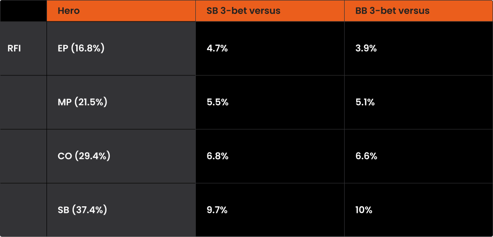
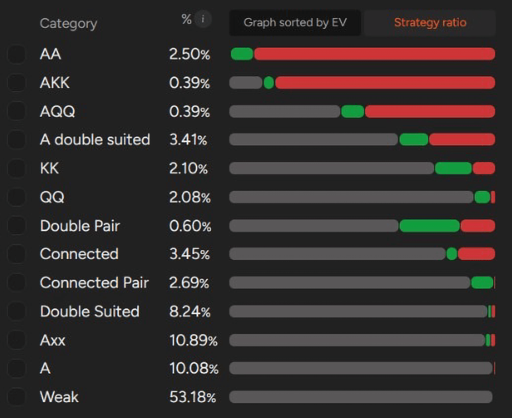
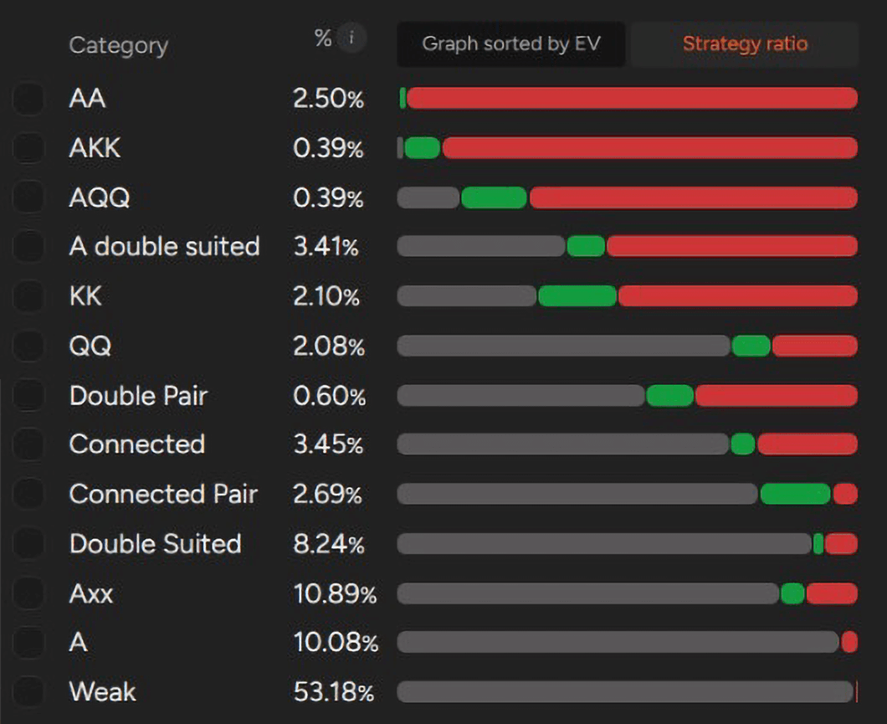

如何在 PLO 中，从 SB 构建纪律严明、有解算器支持的 3-bet 范围？

在 PLO 中构建正确的 3-bet 范围是一个复杂且常被忽视的话题 - 尤其是在不利位置的情况下。大多数玩家倾向于过度简化这些情况（例如只用 [“A-A”](pg04.md) 进行 3-bet），或者干脆完全避开它们。原因在于：不利位置时的 3-bet 比有利位置时的 3-bet 需要更高的精准度和更深刻的理解。

以下几种情况通常会导致玩家在不利位置时进行 3-bet：

- 在 SB 对抗单次加注
- 在 BB 对抗单次加注
- 在 SB 或 BB 对抗单次加注以及一次或多次跟注（通常称为挤压）。

本文将重点探讨在不利位置时对抗单次加注进行 3-bet 的情况，并使用解算器来演示如何构建稳健高效的范围。我们的目标并非涵盖所有细节，而是提供一个清晰的起点，并鼓励玩家通过解算器进行更深入的探索。

为了更全面地了解情况，请务必阅读我们对 [“有利位置的 3-bet：范围、逻辑、调整”](pg27.md)。

## 在 PLO 中，不利位置时应该多久进行一次 3-bet？

3-bet 是策略中最强大的工具之一，但当你处于不利位置时，则需要更加谨慎和纪律。

如今 [“大多数 PLO 玩家的开池范围”](pg20.md) 都过宽，他们的牌型范围也比理想情况更弱、更缺乏协调性。与此同时，这些玩家在面对 3-bet 时往往弃牌不足，经常用边缘牌或被压制的牌继续跟注。结果呢？你最终会在不利位置参与比理想情况下更多的翻牌后底池 - 这需要你重新审视并调整翻牌前的范围构建方式。

这种组合 - 开池范围过宽和糟糕的 3-bet 防守 - 正是 PLO 如此盈利的原因。但要想充分利用这一点，你需要一个清晰的策略。

在 NLHE 中，解决方法很简单：增加你的 3-bet 尺寸，迫使对手用更弱的牌投入更多筹码。在 PLO 中，[“底池限注结构”](pg02.md) 限制了你的杠杆，因此你不能仅仅依赖弃牌权益。相反，你的 3-bet 牌型需要结构良好 - 具备强连接性、同花、阻挡牌，以及翻牌后实现权益的能力。

在不利位置进行 3-bet 时，许多在有利位置策略中常见的漏洞依然存在 - 但由于不利位置策略的复杂性，这些漏洞往往更加极端。关键问题包括：

- 范围过窄
    
    大多数玩家不知道如何将不利位置的 3-bet 范围扩展到 A-A-x-x 和绝对顶级牌之外。
    
- 害怕 4-bet
    
    玩家通常没有明确的应对 4-bet 的计划，导致反应过于被动或失衡。
    
- 翻牌后打法薄弱
    
    玩家经常难以在不利位置处理 3-bet 底池，尤其是在翻牌圈没有击中强牌或明显的可玩性时。
    

## 如何改进你的不利位置 3-bet 策略？

改进的第一步是了解在 SB 和 BB 针对单次加注，最佳 3-bet 频率的实际情况。

这就是解算器在不利位置如何进行 3-bet

解算器分析显示，两个位置的 3-bet 频率相当接近 - 而且，当你分析涉及的牌型时，会发现它们的范围结构也十分相似：优质 A-A-x-x、双同花连牌、高牌连接牌以及带有关键阻挡牌的牌型。

也就是说，SB 通常从 3-bet 中获益更多。由于 SB 不会结束行动，因此 3-bet：

- 有助于隔离开池者
- 防止 BB 以低成本入池
- 让 SB 掌握牌局主动权，而不是被动地跟注并参与一个没有位置优势的多人底池

因此，我们将在下一节重点分析 SB 的 3-bet 策略。

一个强大的 SB 3-bet 策略可以分为两个主要部分：

**面对 EP / MP 和 CO**

在这种情况下，你的范围应该紧缩且精挑细选，通常占所有范围的 4.7-6.8%。你专注于结构强的组合 - 优质的 A-A-x-x、高质量的双同花连牌，以及带有可靠阻挡牌和坚果牌潜力的牌。

**面对 BTN 开池**

由于 BTN 的开池范围更广，你可以更激进地应对。解算器输出显示，3-bet 的频率约为 10%，其中包括更多投机性但可玩的牌 - 尤其是那些翻牌后表现良好或能阻挡优质牌型的牌。

为了保持讨论的重点，我们将分别考察 SB 3-bet 的范围，分别针对 EP 开池和 BTN 开池 - 这两种情况常见且策略截然不同。

## SB 3-bet vs EP：紧缩且 A-A 较多的范围

当你在 SB 面对 EP 的加注时，别无选择 - 你的 3-bet 策略必须紧缩且纪律严明。

SB 对抗 EP 3-bet 范围分析

你应该用几乎所有 A-A-x-x 组合进行 3-bet - 大约 90% 的 A-A-x-x 组合都可以，包括几乎所有 A 单同花或更好的牌型的牌。这些牌型压制对手的范围，翻牌后也能保持良好的权益，并且能够承受 4-bet。

然而，对于 [”K-K-x-x 或 Q-Q-x-x“](pg05.md) 组合，你牌型的其他部分就显得尤为重要。如果没有 A，这些组合中只有极少数可以作为 3-bet 的牌型，尤其是在 EP 开池的情况下。但如果你的 K-K 或 Q-Q 搭配了 A，它们通常会成为可行的 3-bet 候选 - 特别是当它们是同花或有良好的连接时。

::: info 关键原则：

在不利位置的 3-bet 底池中，手牌中有一张 A 是你能拥有的最重要的结构优势之一。

:::

事实上，所有非 A 牌型中，只有大约 1% 适合对 EP 开池进行 3-bet。这凸显了此类情况的核心要点之一：

当你在不利位置面对紧缩范围时，你必须选择很少被压制的牌型 - 而拥有一张 A 同花牌是确保这一点的最可靠方法之一。

除了 A-A-x-x 之外，SB vs EP 时，只有以下几种牌型能够稳定进入 3-bet 范围：

- 最强的双同花连牌，通常牌面缺口不超过一个，且连接性高（例如 8-6-5-4-ds）
- 可玩性高的两对，能够组成坚果顺子，并且在多种牌型结构下都能发挥出色。

## SB vs BTN 3-bet：何时可以（并且应该）扩大你的范围

乍一看， SB vs MP 3-bet 频率（4.7%）和 SB vs BTN 3-bet 频率（9.7%）的差异似乎并不显著。但就牌型组合而言，这相当于 12,689 种组合和 26,280种 组合之间的差别 - 这是一个显著的变化，能够带来真正的策略灵活性。

SB 对抗 BTN 3-bet 范围分析

实际上，只有对抗 BTN，才能显著扩大 SB 在不利位置 3-bet 的范围。

**那么应该怎么做呢？**

- 几乎所有 A-A-x-x 牌型默认都是 3-bet。
- A-K-K-x 和大多数 A-Q-Q-x 牌型也是不错的选择。
- 甚至一些 J-J-x-x 和 T-T-x-x 牌型，如果搭配 A，也能成为有利可图的 3-bet 选择，因为阻挡牌的价值和权益会显著提高。

**关键的结构性升级：A-A 和同花**

3-bet 频率提升最显著的牌型是包含 A 的双同花牌型。这些牌型兼具高权益、坚果牌潜力和可玩性，是绝佳的 3-bet 选择 - 尤其是在面对 BTN 较宽的开局范围时。

在这种情况下，你应该对大约 55% 的双同花 A 高牌型进行 3-bet。

大多数这类牌都应该通过跟注或 3-bet 来防守，除非它们的结构很弱（例如，同时包含 2 和 3）。

第二类值得关注的牌型是两对。你应该对其中大约 35% 的牌进行 3-bet - 尤其推荐双同花的两对。这些牌在翻牌后权益和可玩性都会提高，尤其是在 BTN 牌型范围较广且缺乏配合的情况下。

## 尊重不利位置的挑战

在 PLO 中，当你处于不利位置时，需要牢记以下几个关键原则。

位置是 PLO 中最大的优势之一 - 它能帮助你更有效地实现底池权益，控制底池大小，并让对手陷入更艰难的境地。同时，尤其是在低级别游戏中，许多玩家在面对 3-bet 时跟注范围过宽 - 而且由于他们拥有位置优势，短期内往往能侥幸过关。

因此，保持纪律并控制好不利位置 3-bet 的频率至关重要。基于 GTO 的跟注频率通常对大多数对手都有不错的表现，包括那些防守过于松散的对手。你可以考虑的一个调整是，在面对较弱、防守松散的玩家时，稍微扩大你的 SB 范围 - 但要避免在没有明显理由的情况下做出过大的调整。

过度扩大不利位置的范围可能会付出代价。它会让你在翻牌后陷入困境，并加剧首先行动的劣势。因此，清楚地了解你的范围在理论上和实践中应该是什么样子至关重要。