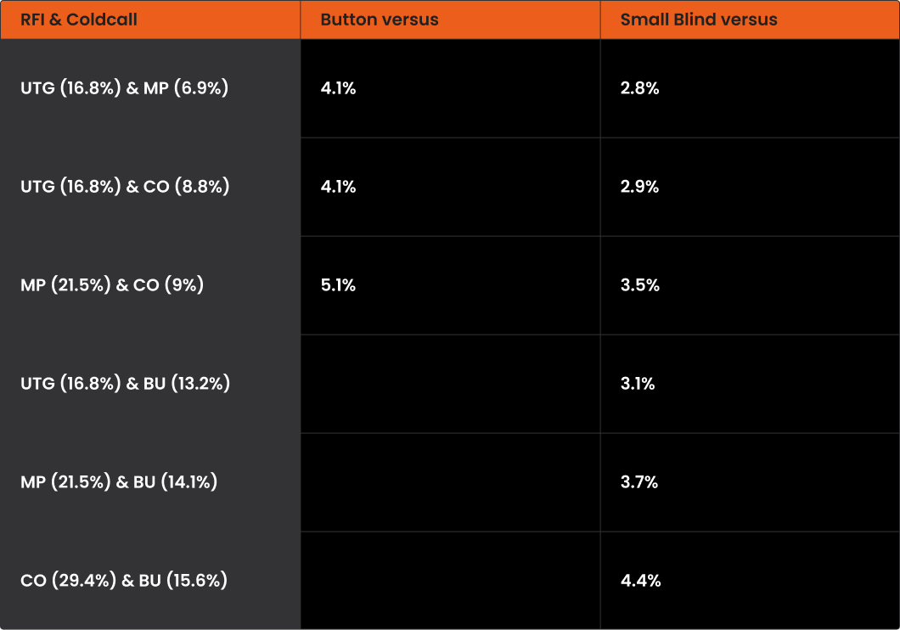
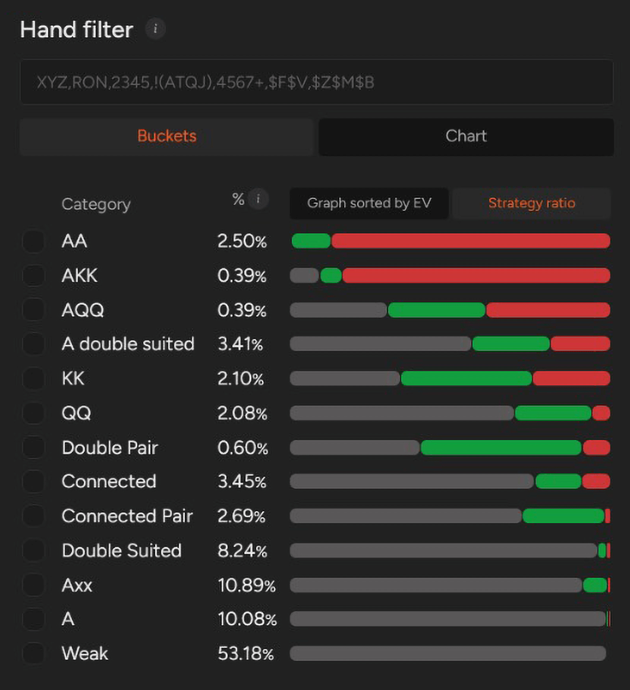
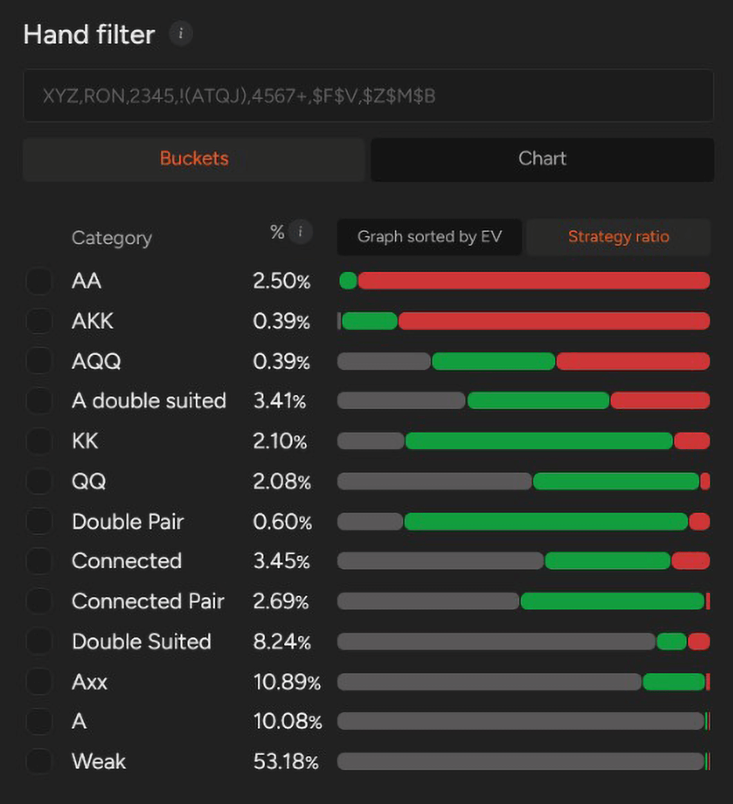

# PLO 中的挤压

如何在 PLO 中有利位置和不利位置盈利地挤压？

在最近的文章中，我们已经介绍了 PLO 中 3-bet 的基本原理 - 包括 [“有利位置”](pg27.md) 和 [“不利位置”](pg28.md) 的情况。但在大多数低到中等级别的 PLO 游戏中，你经常会遇到另一种情况：有人开池加注，之后至少会有一个人跟注，然后轮到你行动。在这种情况下，如果你选择再次加注，你的打法被称为 “挤压”，而不是标准的 3-bet。

那么，哪些牌应该属于你的挤压范围？你又应该多久使用一次这种打法呢？

这正是我们今天要详细讲解的内容。

## 挤压背后的逻辑是什么？

PLO 中挤压背后的逻辑与 3-bet 类似 - 但更强调施压。对多个对手展现激进性是牌力强的明确信号，如果运用得当，挤压将显著提高你的胜率。话虽如此，你仍需谨慎 - 尤其是在位置不利的情况下 - 因为挤压底池往往最终会很大，而此时任何失误都代价高昂。

挤压为何如此有效？挤压主要有以下几个优势：

**通过挤压，你可以迫使其他玩家要么：**

- 弃牌（这在你位置不利时尤为重要，因为在多人底池中，如果还有多名玩家待行动，情况往往很棘手），要么
- 用更差的牌投入更多筹码。在这种情况下，你就能在拥有大三条对小三条或高同花对低同花的情况下，爆冷对手。

**此外：**

- 挤压能提高翻牌后单挑的概率；单挑底池更容易掌控，尤其是在翻牌前就占据主动优势的情况下。
- 挤压能让你用最好的牌建立更大的底池 - 这再简单不过了：你当然想用最强的牌去打最大的底池。

而且，你偶尔还能在翻牌前就赢下底池 - 这当然是好事。

要想盈利地挤压，你必须使用精心构建的范围。如果你只用最好的 A-A-x-x 牌挤压，那就等于白白浪费了筹码。另一方面，如果你挤压下注太频繁，就会陷入不利的局面，降低你的胜率。

下一节，我们将根据解算器输出，探讨两个最适合挤压下注的位置 - BTN 和 SB - 的最佳挤压频率。

低级别 6 人桌游戏的最佳挤牌频率

正如你所见，你必须谨慎选择用来进行挤压的牌 - 尤其是在不利位置，因为此时（面对 GTO 范围）你能挤压的最大范围只有 4.4%。这是为什么呢？这源于两个因素。第一个因素是 [“抽水”](pg10.md)，它极大地限制了你能盈利地玩的牌的数量（仅供参考；在低抽水的线上环境中，在 SB 面对 CO 的加注和 BTN 的跟注，你可以挤压高达 6.9% 的牌）。

第二个因素是复杂性；在 PLO 中不利位置游戏难度很高，因此你必须谨慎选择牌，并训练你的翻牌后意识。理论上，在 SB 挤压大多数 [“A-A”](pg04.md) 组合效果很好，只要你不会不考虑翻牌结构就盲目全押。

## PLO 不利位置的挤压

哪些牌型最适合不利位置挤压？在这种情况下，你的范围应该以价值为主。大部分筹码应该来自 A-A-x-x 组合（除非这手牌没有坚果同花，在这种情况下，跟注通常效果更好），以及最容易玩的 A-K-K-x 和 A-Q-Q-x 组合。

除此之外，你应该只考虑以下几种组合：

- 最强的双同花 A 高牌
- 优质连牌，例如 J-T-9-8（最好是双同花）。

基本上就是这样 - 从 SB 开始，你应该保持纪律，避免冒险。**不要考虑那些翻牌后无法组成坚果同花的牌。**

请记住，随着筹码量的增加，不利位置挤压频率会进一步下降 - 从 SB 到 UTG 开池和 MP 跟注，不利位置挤压频率甚至会降至 2.5%。

SB 挤压范围预览

## PLO 有利位置的挤压

当你占据有利位置时，游戏动态会发生显著变化。从 BTN 开始，你可以将挤压范围扩大到大约 5% 的牌型。当我们按牌型类别进行分析时，会发现几乎每一种牌型中，都有一些特定的牌型，在你占据位置时进行挤压会有利可图。

核心策略保持不变 - 你应该优先选择那些你在 SB 时会挤压的牌型。只要你熟悉 SB 的挤压范围，你就可以在几乎所有牌型中将挤压范围扩大几个点。

你的对手通常会倾向于在位置优势下进行过度跟注和 4-bet 过少。这种倾向允许你比严格的 GTO 策略建议的范围略微扩大一些 - 即使你在选择牌型时稍微过度，仍然可以保持盈利。

BTN 挤压范围预览

## 最重要的是：根据情况调整

挤压是每位扑克玩家策略中不可或缺的一部分。“最佳” 挤压频率始终取决于对手的倾向，并且会因牌桌而异。关键在于，在位置不利时保持纪律 - 你必须尊重对手在翻牌后拥有位置优势的事实。

同时，当你在 BTN 时，要充分利用你的位置优势。

如果你不确定挤压范围可以推到多远，可以使用解算器来识别最高 EV 的牌型，并据此调整策略。定期学习将使挤压更加直观，并帮助你找到价值和压力之间的最佳平衡点。