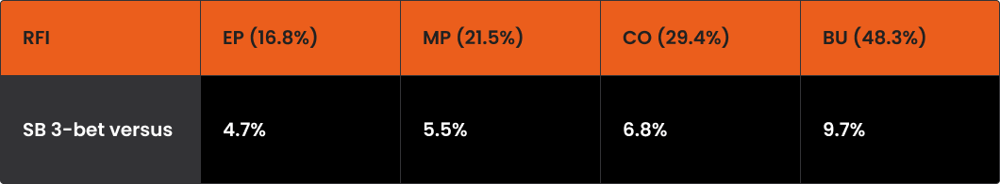
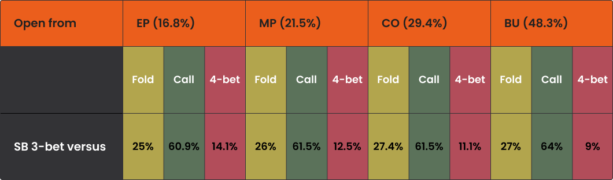

成功策略的关键在于：选择性地进行 4-Bet，有纪律地弃牌，以及利用位置优势。

大多数 PLO 玩家除非持有优质牌（例如 ["A-A"](pg04.md) 组合），否则通常不会在不利位置进行 3-bet。这可以理解 - 制定一套连贯的策略需要准备，而不利位置打大底池总是充满挑战。

因此，你遇到来自 SB 和 BB 的 3-bet 的频率会比理论预测的要低。尽管如此，它们仍然是游戏的重要组成部分 - 了解如何应对它们也同样重要。

由于位置优势，在 3-bet 底池中作为翻牌前跟注者进行游戏相对简单，而不利位置的情况则不然。即便如此，这种情况仍然值得详细研究。

## 不利位置玩家的理论 3-bet 频率与预期 3-bet 频率

正如我们在关于 [“不利位置 3-bet”](pg28.md) 的文章中所讨论的，盲注位置的 3-bet 频率总体上比较接近。然而，由于 SB 从 3-bet 中获益更多，我们将重点讨论如何应对 SB 位置。

我们先来看理论,下面是解算器针对不同开池位置的 SB 3-bet 范围的建议：

理论上的 SB 3-bet 范围

正如我们之前提到的，你的对手平均而言不太可能像理论预测的那样频繁地进行 3-bet。这是个好消息 - 它能让你从边缘牌型中获得更多预期收益。

不过，为了构建一个坚实的理论基础，我们不妨假设你的对手的打法接近 GTO 或者假设你正在使用解算器进行训练。

那么，面对位置不利的 3-bet，最优频率究竟如何呢？

针对 SB 3-bet 的最佳应对策略

正如你所见，面对一个适当的 3-bet 范围，弃牌率相对较低，而 4-bet 的出现率则相当高（我们将在另一篇文章中深入探讨具体的 4-bet 构建方法）。

需要澄清一点：跟注频率始终与开池范围相关。

- 例如，如果你在 UTG 开池，然后跟注 SB 的 3-bet，那么 60.9% 的跟注频率大约相当于 27K 种组合。
- 另一方面，如果你在 BTN 开池，类似的 64% 的跟注频率则相当于近 83K 种组合 - 在实战中，这代表着更大且截然不同的牌型组合。

这种差异源于你的初始开池范围因位置而异：

- UTG：约 45K 种组合
- BTN：约 130K 种组合

尽管百分比看起来可能相近，但其背后的实际范围却大相径庭。

## 有利位置应对 3-bet：何时跟注、弃牌或 4-bet

你可能已经注意到，PLO 玩家在有利位置面对 3-bet 时很少弃牌，通常默认选择跟注。PLO 中位置优势的威力使得许多玩家能够 “侥幸过关”，但如果你采取更严谨的策略来应对不利位置的 3-bet，将会取得更好的结果。

请记住，大多数对手的牌型范围比理论建议的宽度要更偏重于 A-A。这意味着理论上的 GTO 跟注范围比你在实际游戏中应该采取的范围要宽。

让我们来看看在面对 SB 3-bet 时，你的策略应该如何构建。

## 在 EP 应对 SB 3-bet

在 EP 时，你的牌型范围应该保持紧致且结构良好。

- 4-bet：几乎所有的 4-bet 都来自 A-A-x-x 牌型。
- K-K 和 Q-Q：A-K-K-x 和 A-Q-Q-x 牌型如果是同花，通常可以继续跟注，尤其是 A 高同花。没有 A 的 K-K 牌型主要在双同花或两对时可以继续跟注。
- 两对和双同花牌型是极佳的继续跟注选择。如果它们强到可以在前位开池，通常也强到可以跟注 3-bet。
- 一些较弱但仍然可以继续跟注的牌型包括：A 高同花加上一些其他可玩组件，例如一对，或者像 K-J-T-8 这样最好的单同花连牌。

记住，当你持有对边缘牌时拿不定主意，宁可弃牌 - 因为大多数现实对手都会在 SB 3-bet 不足，你的自律从长远来看会帮你省钱。

## 在 BTN 对抗 SB 3-bet

与 EP 玩法最大的区别在于 4-bet 的频率。

- 理论上，BTN 的 4-bet 频率约为 9%，而 EP 则约为 14.1%。具体来说，BTN 的 4-bet 组合数约为 11.7K，而 EP 约为 6.4K。
    
    这种增长主要来自像 A-Q-Q-x 这样的牌（这类牌不阻挡 K-K-x-x 的 3-bet / 弃牌，并且在面对跟注 4-bet 的牌时表现相对较好），以及带有 A 的双同花连接牌。
    

除了继续加注之外，你还可以扩大跟注范围：

- 百老汇连接牌：用各种连接性良好的百老汇牌继续跟注，例如 Q-Q-J-9-ss、K-Q-Q-5-ss，甚至是连接性较好的中对，例如 9-7-6-6-ss 和 8-7-7-5-ss。
- A 高非坚果同花：即使你手中的花色不是坚果同花，也可以继续跟注 A-J-T-7、A-Q-J-9 或 A-5-4-3 等牌型。

正如我们之前提到的，要时刻注意对手的倾向。如果没有坚果牌型就扩大跟注范围，可能会让你在面对以 A-A 为主的范围时陷入困境 - 这些范围通常会击中坚果同花听牌，从而削弱你自己的听牌。

## 保持警惕

一如既往，你在有利位置应对 3-bet 的策略应该经过深思熟虑且灵活调整。面对大多数对手，你可以（也应该）比 GTO 建议的弃牌更多，因为你通常会遇到比理论范围更强的牌型。同时，当你预期对手在翻牌后会犯重大错误时，不要犹豫利用你的位置优势。