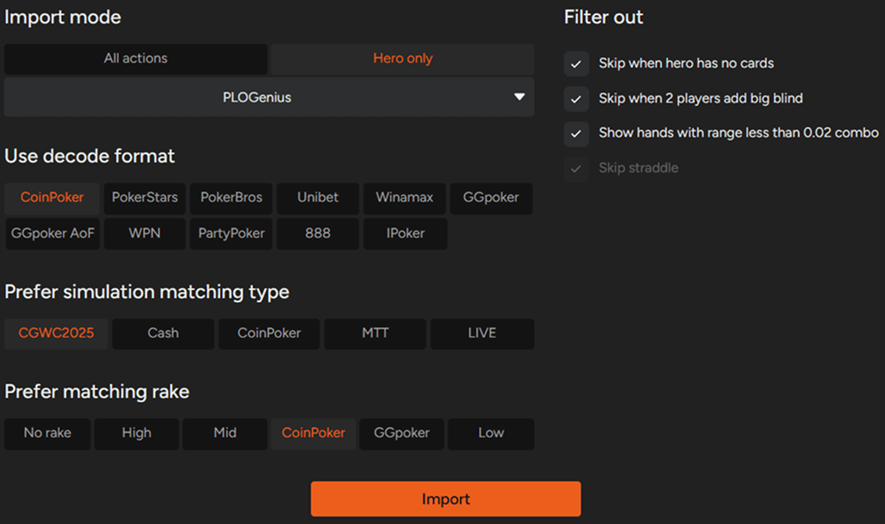
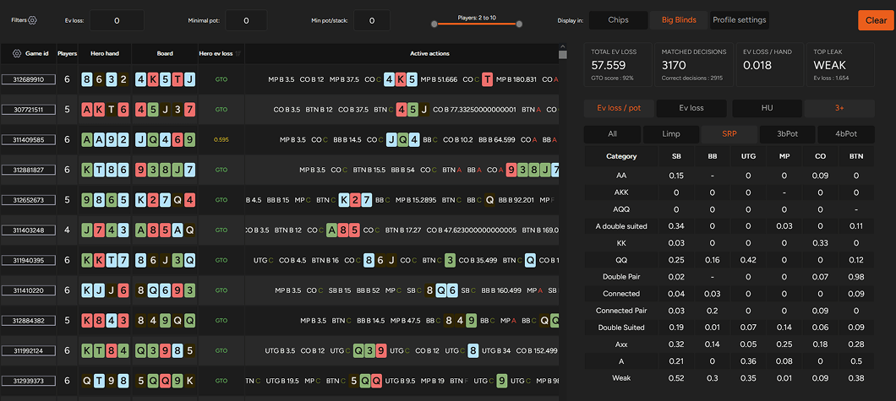
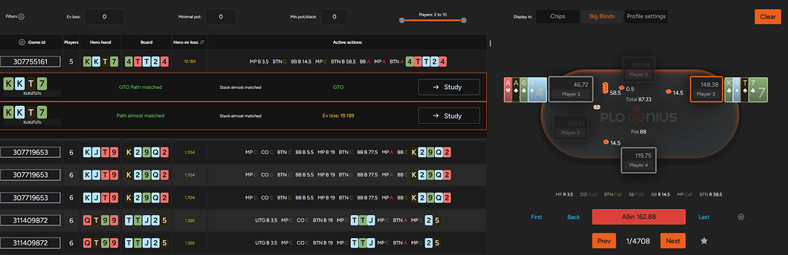
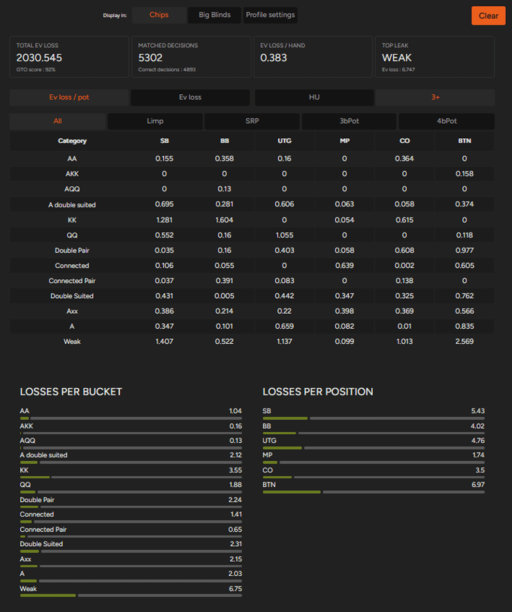

# 从你的 PLO 手牌中学习！

将真实的 PLO 手牌转化为可操作的 GTO 反馈，并精准定位你的决策与最优策略之间的偏差。

每种扑克游戏形式都在不断发展演变，PLO 也不例外。随着玩家水平的提高和策略的不断完善，用于研究游戏的工具也必须随之进化。GOT 求解器从一开始就秉持着这一理念进行开发，这也是平台最新功能之一 - 手牌导入功能 - 背后的原因。

手牌导入工具目前处于测试阶段，但即使在早期阶段，它也能显著提升你的学习效率。

手牌导入的核心功能旨在做好一件事：让你能够将真实手牌中的决策与基于 GTO 的解决方案进行比较，并找出你的打法与最优策略的偏差之处和程度。

## 如何导入你的手牌

使用此功能非常简单。你只需上传自己的手牌历史记录（以纯文本、.txt 或 .xml 文件格式），配置一些设置，系统就会将你的手牌与相应的模拟牌池进行匹配。

在上传过程中，你目前可以调整以下选项：

- 导入模式（即将移除的旧版内部选项）
- 解码格式，指定牌局历史记录格式
- 首选模拟类型，决定用于匹配的模拟池
- 匹配抽水，使分析能够反映你所玩游戏的抽水结构

你可以一次性上传任意数量的牌局记录，包括多个文件 - 系统会自动将它们合并成一个数据集。

上传完成后（小批量上传通常只需几秒钟），你将看到一个类似于下图的结果页面。

## 如何从你打过的手牌中学习？

乍一看，信息量可能很大，让人眼花缭乱，所以最好分部分来看。

屏幕左侧列出了所有已上传的牌局。每手牌，你都可以看到你的底牌、公共牌、完整的行动顺序，以及因玩家决策造成的期望值损失。

EV 损失是关键指标，因为它能让你快速识别出哪些牌局你的打法与GTO（通用最优策略）建议的偏差最大。

我们来看一个示例牌局：

在这个例子中，Hero 持有 K-K-T-7，在 UTG 加注和CO 跟注后选择挤压。UTG 弃牌，CO 再次加注，轮到 Hero 行动，英雄选择全下。

Hero 的两个决策分别用牌面下方的横条表示：

- 上方的横条代表初始挤压，这符合 GTO 策略。
- 下方的横条代表全下决策，这偏离了 GTO 策略，导致 EV 损失。在这种情况下，跟注才是更高的 EV 选择。

对于每个决策点，你可以点击 “研究” 按钮，直接跳转到模拟中的相应节点，在那里你可以：

- 比较你当前牌型不同行动的 EV
- 查看其他牌型在相同情况下的打法

牌型导入工具的第二部分显示在右侧。

屏幕右侧包含一个汇总表，涵盖所有导入手牌的决策。此部分显示：

- 与 GTO 相比的总期望值损失
- 符合 GTO 建议的决策数量
- 每手牌的平均 EV 损失
- 与最优打法偏差最大的牌局类别
- 你可以根据手牌是单挑还是多人对局，以及底池类型（溜入、单次加注、3-bet 或 4-bet）进一步筛选和分组手牌。

此部分的最后一部分提供汇总数据，显示按手牌类别划分的 EV 损失，以及不同位置与 GTO 的偏差。

## 我们正在改进手牌导入功能和界面！

虽然手牌导入工具仍处于测试阶段，但它已经能够提供关于常见决策漏洞的实用见解。

我们目前的首要任务是进一步改进其功能并优化界面，使手牌导入体验更加清晰易懂、用户友好，这也是我们 2026 年第一季度的主要工作重点。