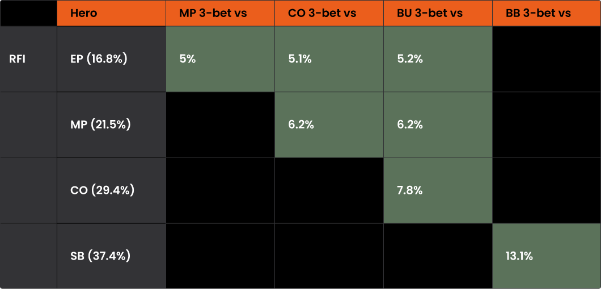
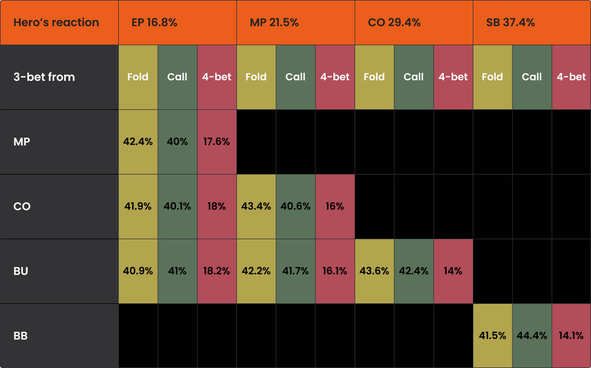
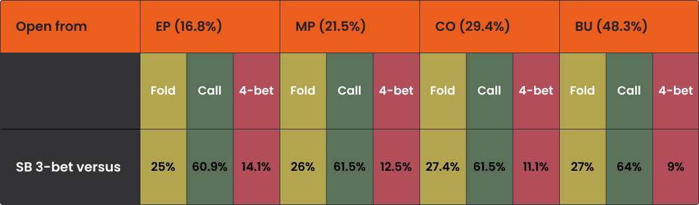

让我们来看看求解器是如何在 PLO 中位置不利时防守 3-bet的。

俗话说：“省一分钱等于赚一分钱。” 这条原则不仅适用于日常生活，也同样适用于扑克。

许多扑克玩家自然而然地会关注最大的底池 - 通常是那些全下，最终在艰难抉择或爆冷后以摊牌告终的底池。虽然这些底池对你的胜率影响显著，但要成为一名真正稳健的玩家，还需要识别那些可能反复损失少量 EV 的情况。

在 PLO 中，这些损失最常见的来源之一是在不利位置面对 3-bet 底池时的糟糕打法。更准确地说，是对 3-bet 反应的低效。在 PLO 中，位置劣势是出了名的难以克服，即使面对经验相对不足的对手，在不利位置用糟糕的牌型范围打 3-bet 底池也会充满挑战。

在本文中，我们将重点讨论在不利位置面对 3-bet 时最重要的注意事项。

## 理论上的 3-bet 频率

为了建立 3-bet 底池中不利位置（OOP）策略的基准，我们将考察两种常见场景：

- 在 EP 开池，面对 CO 的 3-bet
- 在 CO 开池，面对 BTN 的3-bet

我们假设牌局环境为高抽水，相当于 PLO 50。值得注意的是，虽然最优 3-bet 频率在高注额（例如 PLO 5000）下不会显著增加，但跟注频率会显著增加。

PLO50 中最佳 3-bet 频率

正如我们在关于 [“有利位置 3-bet”](pg27.md) 的文章中所讨论的，这些由求解器推导出的频率应该被视为理论基准。在实战中，真实对手的打法与最优策略存在显著差异 - 最常见的表现是 3-bet 频率较低，且牌型范围更偏向 [“A-A”](pg04.md)，尤其是在 PLO50 及以下级别。

不过，目前我们仍将采用 GTO 框架，并探讨求解器建议在不利位置时如何应对 3-bet。

对抗 3-bet的最佳弃牌、跟注和 4-bet 频率

现在，让我们将这些频率与我们处于有利位置并面对 SB 的 3-bet 的情况进行比较。

面对 SB 的 3-bet 的最佳下注频率

几个直观的结论值得注意：

- 位置不利时，我们应该减少跟注的频率。
- 位置不利迫使我们更频繁地弃牌，以避免翻牌后陷入不利局面，导致权益难以实现。
- 同时，我们有动力更频繁地进行 4-bet，既可以压制对手的权益，也可以在被跟注时简化翻牌后的打法。

一如既往，[“抽水”](pg10.md) 是一个重要因素，尤其是在跟注频率方面，因为它对位置不利的跟注惩罚过高。

## 位置不利时如何应对 3-bet？

现在，让我们仔细看看，当你开池加注并面对位置有利玩家的 3-bet 时，针对主要手牌类型，一个可靠的基础策略应该是什么样的。

我们将从 100 BB 的前位对抗 CO 的场景开始，此时求解器会继续计算 40% 的跟注范围和 17.6% 的4-bet范围，总共大约有 26,000 种组合。

以下是主要牌型分类概述：

**A-A**

不利位置面对 3-bet，A-A 的策略非常简单直接 - 所有 A-A 组合都进行 4-bet。

**K-K**

此类别不包含任何纯粹的 4-bet 组合。

- 所有包含与 A 同花的 A-K-K-x 组合都应该继续跟注。
- 所有双同花 K-K 都应该继续跟注，除非是极弱的组合。
- 单同花 K 时，只考虑 K-K 的两对或最佳单花色牌型（例如 K-K-Q-T）。

**Q-Q**

此类别的策略更为复杂。

- 所有双同花 A-Q-Q-x 组合都应该继续跟注。
- 单同花 Q-Q 需要是 A 同花，并且需要一张可以与 A 或 Q-Q 组成顺子的牌。
- 没有 A 的 Q-Q 必须要么是双同花，要么是两对，要么有强力的边牌（例如 Q-Q-J-T）才能继续。

**两对牌型**

如果一手两对牌足够强，可以在前位开池加注，那么在面对 3-bet 时，它会继续跟注。

**双同花牌型**

这无疑是最具挑战性的牌型。

- 面对 A-A 较多的 3-bet 范围，A 通常会成为劣势，因为它降低了组成强两对牌的概率。因此，A-x-x-x 双同花组合通常需要一对或强连牌才能继续跟注。
- 与高对牌型不同，这类牌型包含相当数量的 4-bet（约占 13.7%），主要由最佳连牌组合构成。
- 不含 A 的双同花牌型几乎都选择跟注，因为这些牌足够强，即使在 3-bet 底池中也能表现出色。

现在，让我们看看在 CO 防守 BTN 的 3-bet时，策略会如何变化。

在这种情况下，求解器建议继续玩你 56.4% 的范围，其中 42.4% 用于跟注，14% 用于 4-bet。绝对值上，这大约相当于 33,000 种跟注组合和 11,000 种 4-bet 组合。需要注意的是，CO 的开局范围要宽得多，因此尽管百分比相似，但实际上你需要防守的组合数量要多得多。

让我们按牌型概览一下 CO 对抗 BTN 的策略：

**A-A**

与 EP 对抗 CO 的情况类似，所有 A-A 的组合都是纯粹的 4-bet。

**K-K**

这里的策略与前位略有不同。

- 在 CO，使用 K-K 开池的范围更广，最终大约会弃掉 50% 的 K-K。
- 与 EP 策略不同，一些 A-K-K-x 组合会变成 4-bet，而几乎所有单同花 K-K（及更好的花色）都会在 3-bet 时选择跟注。

**Q-Q**

在这个位置，Q-Q 的表现与 K-K 类似。

- 一小部分 A-Q-Q-x 组合（约 3.2%）倾向于 4-bet。这些牌的目标是让对手 K-K 较多的牌型弃牌；它们本身牌力很强，但在很多翻牌圈都比较脆弱。
- 除此之外，几乎所有双同花 Q-Q 以及带有较好连牌的 Q-Q 都会选择跟注。

**两对牌型**

与之前的情况类似，所有强到可以开池的两对牌型也强到可以跟注。

**双同花牌型**

这又是最复杂也最有趣的一类牌型。

- 当你的牌中包含一张 A 时，所有三种选择都可行。
- 大约 20% 的含 A 组合会被弃牌 - 主要是那些连接性差、悬牌能力低的牌型，例如 A-K-8-3 或 A-9-8-2。
- 大约 50.1% 的牌型会选择跟注，这些牌型包括对子或连接性较好的牌型，例如 A-J-4-4 或 A-K-T-3。
- 剩余的 29.9% 的牌型会选择 4-bet，主要是那些连接性最好的牌型，例如 A-T-8-7 或 A-T-9-8。
- 不含 A 的双同花牌型继续游戏的频率非常高：85.7% 会选择跟注，11.7% 会选择 4-bet，只有 2.7% 的组合会弃牌。

## 实际考量

虽然求解器的输出结果提供了宝贵的理论基础，但务必记住，你是在与人类对手对战，他们的打法往往与 [“GTO 存在显著差异”](pg15.md)。

大多数玩家的 3-bet 频率低于最优频率，而且他们的 3-bet 范围严重偏向 A-A。这降低了诸如 A 高双同花牌等牌型的盈利能力和可玩性。

因此，当你对边缘牌型犹豫不决时，弃牌通常是正确的策略调整 - 尤其是在你预期对手 3-bet 很紧并采取直接打法的情况下。

最后，请记住，许多求解器推荐的 4-bet 策略都基于一个假设：对手会弃掉部分 3-bet 范围的牌，特别是较弱的 K-K 组合。对于那些在有利位置从不弃牌的玩家来说，如果没有强牌，激进的 4-bet 策略就失去了大部分吸引力。

希望本文能帮助你更好地理解在 PLO 中，如何在不利位置应对 3-bet 的策略。如需更深入的探讨，请参阅我们关于 [“有利位置 3-bet”](pg25.md) 以及 [“如何应对有利位置 3-bet”](pg30.md) 的文章。
