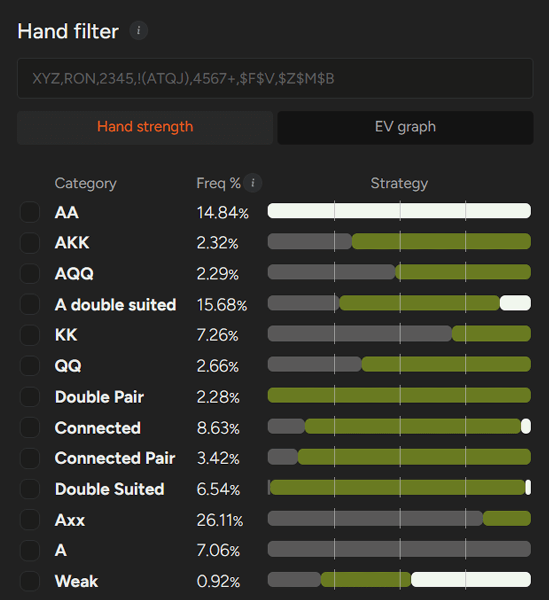
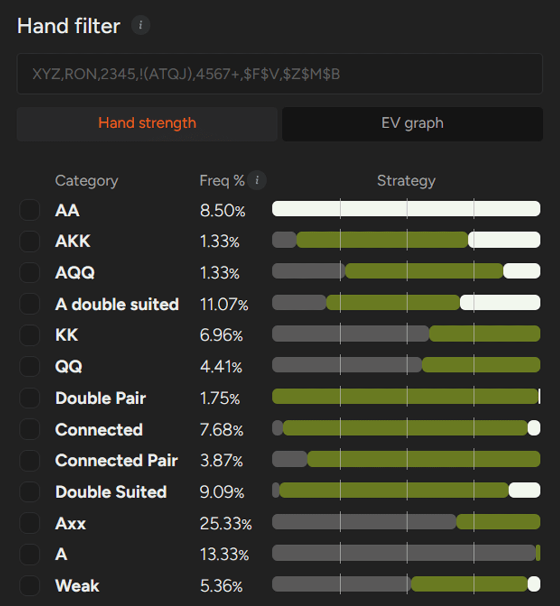

本文将对 PLO 中的 4-bet 策略进行实用性分析，涵盖 100 BB 时的最佳范围，以及低级别和中级别游戏的关键调整。

在 PLO 中，翻牌前的权益往往比其他扑克游戏更加接近。尽管这是 PLO 的一个显著特点，但玩家在构建翻牌前策略时常常低估了它的重要性。

为了更好地理解这一点，我们不妨简要地将 PLO 与 NLHE 进行比较。在 NLHE 的单挑底池中，口袋 A-A 相对于随机牌型拥有大约 85% ：15% 的胜率权益优势。而在 PLO 中，即使是从纯粹权益角度来看最强的牌型 - A-A-K-K-ds - 其优势也显著降低。相对于随机牌型，它的权益接近 70% ：30%。

结合底池限注的下注结构以及大量可行的翻牌前组合，这导致了翻牌前激进策略的根本不同 - 尤其是在 4-bet 方面。

在本文中，我们将重点讨论构建 PLO 4-bet 策略的关键要素：

- 何时应该进行4-bet？
- 哪些牌型应该包含在内？
- 只用 A-A 进行 4-bet 是否正确？

## 只用 A-A 进行 4-bet 就足够了吗？

许多玩家采用极其简化的方法，将 4-bet 范围限制在 A-A 组合上。乍一看，这似乎合情合理：即使是最弱的 A-A 牌型，在翻牌前也对大多数牌型保持着微弱的优势。

然而，仔细分析基于 [“GTO的解决方案”](pg15.md) 会发现，这种策略并不完善。虽然 A-A 是任何 4-bet 范围的核心，但最佳打法还应包含其他牌型 - 尤其是在位置更宽的情况下。

是否应该在实战中运用这些牌型取决于几个关键因素。

首先，评估你的对手是否能够使用 A-A 以外的牌进行 3-bet。虽然大多数常客玩家都能做到，但你仍然会遇到 3-bet 范围几乎全是 A-A 的玩家。

其次，考虑你的对手对 4-bet 的反应。他们会弃掉一部分牌，还是会几乎 100% 地继续使用他们的 3-bet？这种反应对非 A-A 4-bet 的盈利能力有着显著的影响。

考虑到这一点，让我们假设采用标准的 PLO50 [“抽水”](pg10.md) 结构，在 100 BB 筹码深度下，考察最佳 4-bet 范围，并看看它们如何转化为实战策略。

## UTG 对 MP 4-bet

这种场景下最重要的要点很简单：A-A 永远进行 4-bet。

UTG 对 MP 4-bet 范围的可视化图表

正如我们之前在 [“文章”](pg04.md) 中讨论过的，在 100 BB 位置不利时，一条严格的经验法则是对所有 A-A 组合进行 4-bet。这样做可以同时实现以下几个目标：

- 你既能建立底池，又能保持胜率优势。
- 你降低了 SPR，简化了翻牌后的决策。
- 你仍然有机会在翻牌前赢得底池。

当扩大底池范围，除了 A-A 之外，适合在 UTG 进行 4-bet 的牌型非常有限。核心候选牌型包括：

- 连牌良好的 A 高双同花牌（例如 A-T-9-8、A-7-6-5）
- 双同花带缺口的连牌，例如 T-9-7-6 或 9-8-6-5

完美连牌通常更倾向于跟注而不是 4-bet。

需要记住的一点是，要考虑阻挡牌的互动。当你在没有 A 的情况下进行 4-bet 时，通常最好避免使用带有 K 或 Q 的牌，因为它们会阻挡 A-K-K 和 A-Q-Q 而这正是你希望对手持有并弃牌的牌型。

总的来说，UTG 对抗 MP 是一个非常保守的局面。即使双方都遵循 GTO 范围，也没有太多发挥创意的空间。

面对 UTG 约 16.8% 的开池范围，MP 应该 3-bet 5% 左右，而 UTG 则继续在约 17.6% 的开池范围（约 45,500 种组合中的 8,000种）进行 4-bet，其中近 6,800 种是 A-A 组合。

## CO 对 BTN 的 4-bet

CO 对 BTN 位的配置更加动态。双方的范围都更宽，且玩家群体倾向于偏离纯粹的 A-A 3-bet 策略。

在均衡状态下，CO 大约会开池 29.4% 的牌（接近 80,000 种组合），而 BTN 大约会 3-bet 7.8% 的牌（约 21,000 种组合）。

与之前一样，所有 A-A 组合构成了 4-bet 范围的基础，原因与之前所述相同。

第一个显著的区别出现在 A-K-K 和 A-Q-Q 类别中。在这种牌型配置下，某些牌型 - 尤其是像 A-K-K-Q-ds 或 A-K-Q-Q-ds 这样的优质双同花牌型 - 更倾向于 4-bet 而不是跟注。少量较弱的 Q-Q 较多的变种牌型也包含在内，主要是因为它们会阻挡 A-A，并促使 K-K 持有者弃牌。

增长最快的类别是 A 高双同花牌型。这些牌型包括：

- 减少 BTN 可能有的 A-A 组合数量，
- 保持跟注时的稳固权益，
- 提供合理的翻牌后可玩性。

此外，CO 对 BTN 的动态使得更多非 A 的双同花牌型可以进入 4-bet 范围，例如 J-T-7-6 或 Q-T-8-6。

由于双方的基础范围都更宽，CO 的最佳 4-bet 策略也更加多样化，尤其是在 BTN 可以弃掉部分 3-bet 范围的情况下。

CO 对 BTN 4-bet 范围的可视化图表

## 低级别至中级别 PLO 的实用调整

虽然了解 GTO 基本策略很有用，但实战中真正重要的是你所面对的玩家群体的倾向。在低至中级别 PLO 中，有两种模式尤为常见：

- 玩家的 3-bet 比 GTO 建议的略微紧一些。
- 玩家对 4-bet 的弃牌率低于理论建议。

在 100 BB 级别，针对这种环境的有效调整相对简单：

- 面对 MP 的 3-bet，在 UTG 开池时保持非常紧的策略。你可以主要限制自己只用 A-A 进行 4-bet，只有极少数情况下才会用到最好的双同花牌。
- 无论位置如何，在不利位置时，始终对所有 A-A 组合进行 4-bet。
- 除了 CO 对 BTN 的情况外，避免用 K-K 或 Q-Q 来扩大你的 4-bet 范围。

随着筹码深度的增加，最佳翻牌前策略会发生显著变化 - 但这最好留待另行讨论。

在 100 BB的情况下，PLO 中有效的 4-bet 策略仍然相对简单：以 A-A 为主，选择性地加入强双同花牌，以及在极少数情况下加入带有 A 阻挡牌的高对子。