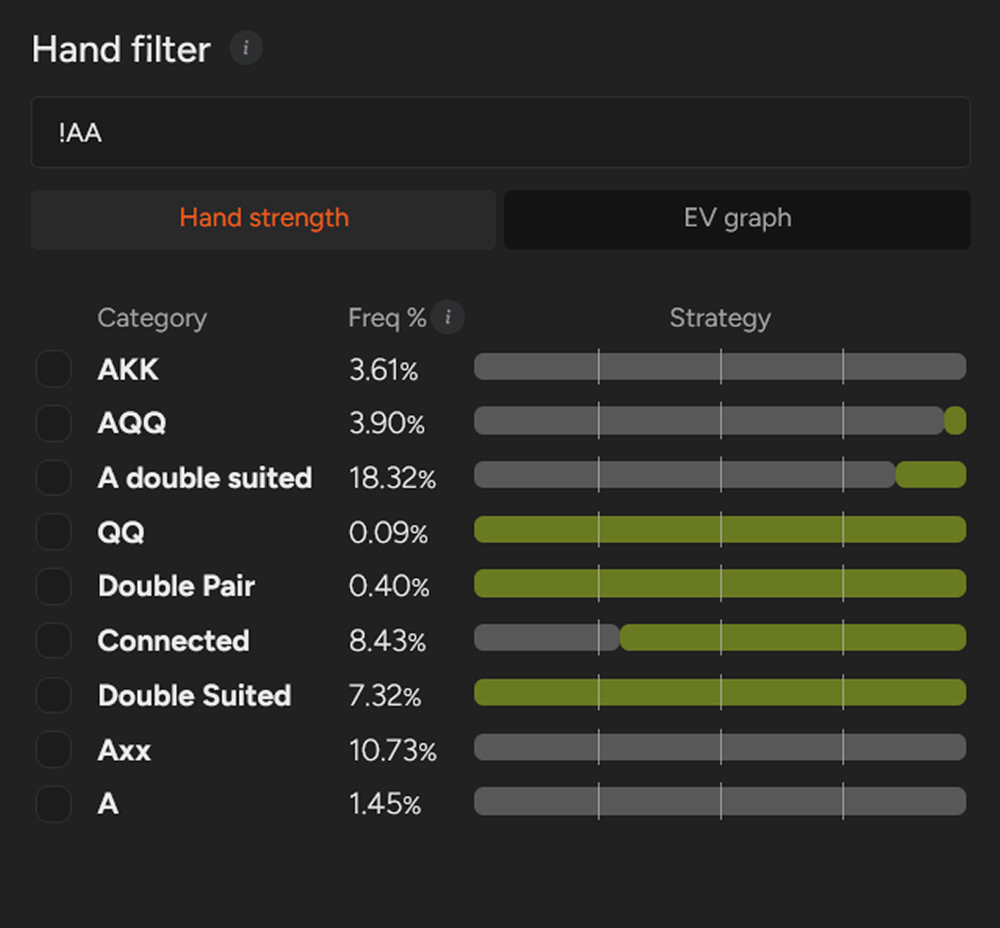
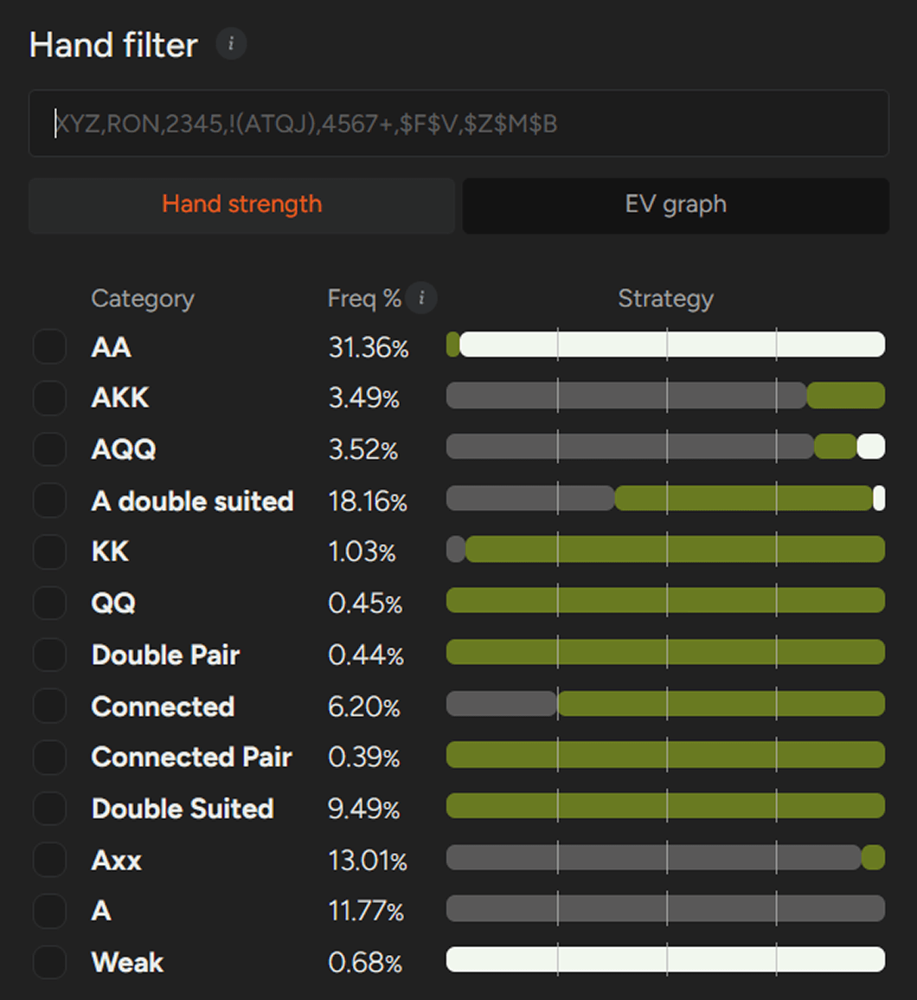

## PLO 中如何应对 4-bet？

如何应对以 A-A 为主的 4-bet 范围？

在最近的文章中，我们讨论了 3-bet 策略（包括有 [“利位置”](pg27.md) 和 [“不利位置”](pg28.md) 的情况）、对 3-bet 的最佳应对策略（同样包括 [“有利位置”](pg30.md) 和 [“不利位置”](pg32.md) 的情况），以及 4-bet 的一般指导原则。

本文将作为该系列文章的最后一篇，提供一份简明易懂的指南，指导你在 PLO 中如何应对 4-bet。

正如我们在之前的文章中所述，在低到中级别，你应该假设玩家群体的 3-bet 和 4-bet 范围比 GTO 解决方案在 100 BB 有效筹码量下所预测的范围要紧得多。

虽然许多玩家能够找到非 A-A 的 3-bet，但他们的 4-bet 范围通常严重偏向 [“A-A”](pg04.md)，并且在很多情况下几乎完全由 A-A 组合构成。

因此，每次面对 4-bet 时，你都应该考虑以下几个因素来指导你的决策过程。

首先，考虑一下你的 3-bet 范围是如何被其他玩家感知的。你被认为是一位紧手、价值导向的玩家，还是一位能够用更宽泛的范围施加压力的玩家？

其次，评估你的对手除了 A-A 之外是否还能用其他牌型进行 4-bet。这时，关注摊牌情况和牌局趋势就显得尤为重要。

最后，你应该有一个清晰的计划，以便在面对 A-A 占绝对优势的范围时进行调整。

与之前的文章一样，我们将探讨两种常见的局面。

## 当你在 MP 面对 UTG 的 4-bet 时

这种场景会产生最紧的范围。根据 GTO 频率（假设 PLO50 的 [“抽水结构”](pg10.md)），UTG 大约会在 16.8% 的牌局中开池（约 45k 种组合），MP 大约会在 5% 的牌局中以 3-bet（约 13.5k 种组合）回应，而 UTG 大约会在 17.6% 的牌局中继续 4-bet（约 8k 种组合）。

当我们仔细分析这 8k 种组合时，会发现其中近 7k 种组合包含一对 A-A 或三条 A-A-A。这就引出了一个问题：MP 应该如何应对如此狭窄且 A-A 占比极高的范围？

虽然 GTO 的建议是 MP 跟注一小部分 A-A 牌（约 4.1%），但我们推荐一个更简单、更实用的调整：对所有 A-A 组合进行 5-bet 并全下。除了 A-A 之外，在这个节点上没有其他牌型在翻牌前全押的动机，因此执行起来非常简单。在你 3-bet 范围内的剩余非 A-A 牌型中，约有 30.1% 的牌型会继续跟注 4-bet。

不含 A 的双同花牌型在面对 4-bet 范围时表现最佳。

值得注意的是，任何 K-K 牌型都不会在 UTG的 4-bet 下跟注。不含 A 的 K-K 首先不会在 UTG 的开池下注时进行 3-bet，而含 A 的 K-K 此时会弃牌。向下看，只有 A-Q-Q-J-ds 和 A-Q-Q-T-ds 这两组 Q-Q 牌型会选择跟注。

对于 A 高双同花牌型，跟注的前提是牌型之间有很强的连接性：通常 Q 和 6 之间最多只有一张边牌（例如 A-J-T-9-ds 或 A-T-8-7-ds）。

这种结构引出了一个重要的策略要点：在 A-A 占比很高的牌型范围内持有 A 通常是一种劣势。它会降低你组成强两对牌型的能力，并削弱整体连接性，从而严重影响哪些牌型能够在面对 4-bet 时盈利地跟注。

在这种情况下，你的跟注范围的核心是一些高度连接的双同花牌，例如 9-7-6-5-ds、T-8-7-6-ds 或 7-6-5-4-ds，这些牌足以对 UTG 进行 3-bet。这些牌在面对 A-A 较多的范围时仍保持着不错的权益，并且在翻牌圈的表现也使得翻牌后的打法更加可控。

## 当你在 BTN 面对 CO 的 4-Bet 时

在这种情况下，不利位置的玩家的范围会显著扩大 - CO 的玩家大约会进行 4-Bet 相当于其开池范围的 14% 左右，约有 11,000 种组合。与 3-Bet 的情况类似，这给了 BTN 玩家更大的灵活性。

在 BTN 面对 CO 4-bet 时，其牌型范围比在 MP 面对 UTG时更为广泛。

主要原则依然不变：所有 A-A 组合都应该 5-bet 全下。

在有效筹码量为 100 BB 的情况下，几乎没有策略理由慢玩 A-A。面对 CO 位的 4-bet，BTN 在翻牌前会全下 6700 种组合，其中约 99% 是 A-A。

同时，BTN 面对 CO 4-bet 的跟注范围显著扩大至约 6200 种组合，而 MP 面对 UTG 时只有 2500 种组合。

那么，在这种后位动态下，哪些牌型更有价值呢？

首先，K-K 和 Q-Q 的组合都大幅提升，几乎可以完全跟注。但值得注意的是，这些牌型中只有一小部分（大约 300 种组合）适合在面对 CO 时进行 3-bet。

一些包含 A 的双同花 K-K 牌型拥有足够的权益可以跟注，某些包含 A 的 Q-Q 组合也是如此。少数 A-Q-Q 牌型甚至可以作为 5-bet 全下诈唬，目标是 CO 的 K-K 弃牌。然而，如果你认为对手不会 4-bet / 弃牌，那么这些牌型可以改为跟注。

由于 CO 的 4-bet 范围包含相当一部分非 A-A 牌型，BTN 可以有利地跟注更多双同花 A 高牌型。在这种情况下，A-K-Q-T-ds 或 A-K-5-4-ds 等牌型的价值会大幅提升。

面对更宽泛的 4-bet 范围，所有强双同花和两对牌型都成为可行的跟注选择，因为它们在有利位置能够有效地实现权益。然而，之前提到的原则仍然适用：拥有 A 通常会削弱你的牌力，在许多临界情况下，它会成为决定跟注还是弃牌的关键因素。

总体而言，由于在 CO 的 4-bet 策略中非 A-A 牌的出现频率增加，BTN 与 CO 的动态使得 BTN 可以继续使用更广泛的范围。

## 处理 100 BB 的 4-bet 比你想象的要简单得多

总的来说，处理 100 BB 的 4-bet 比看起来要容易得多。你不需要花费太多时间去记忆具体的牌型频率就能有效地应对这种情况；最重要的是理解你所面对的牌型范围的性质。

实际上，大多数低级别和中级别的对手在 4-bet 节点时持有的 A-A 组合数量远超预期，这种普遍趋势应该始终体现在你的决策中。