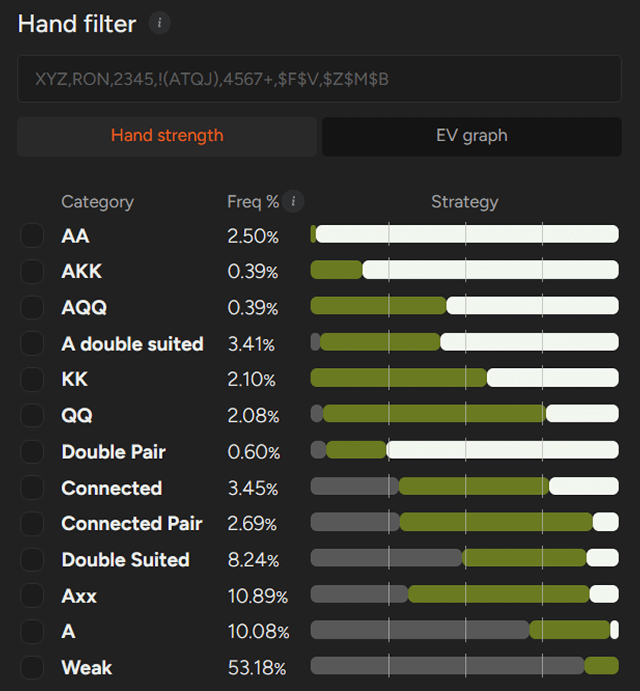
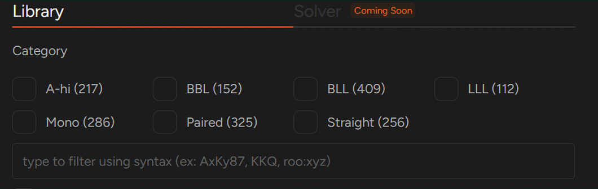
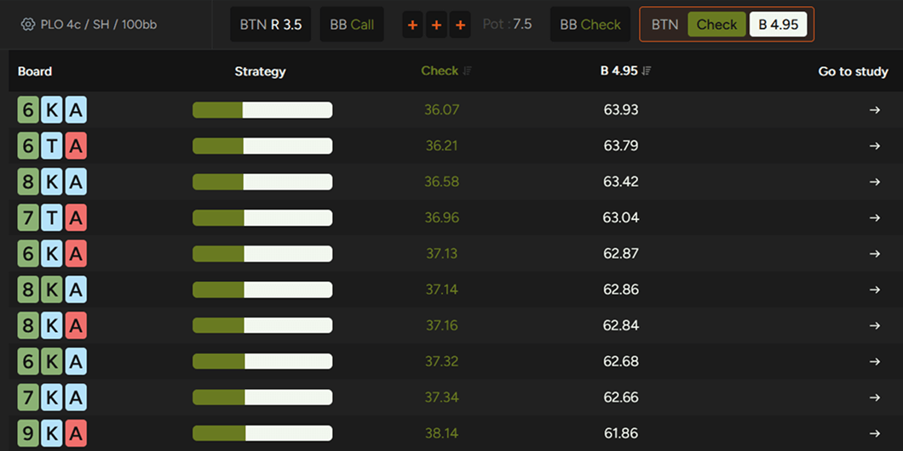
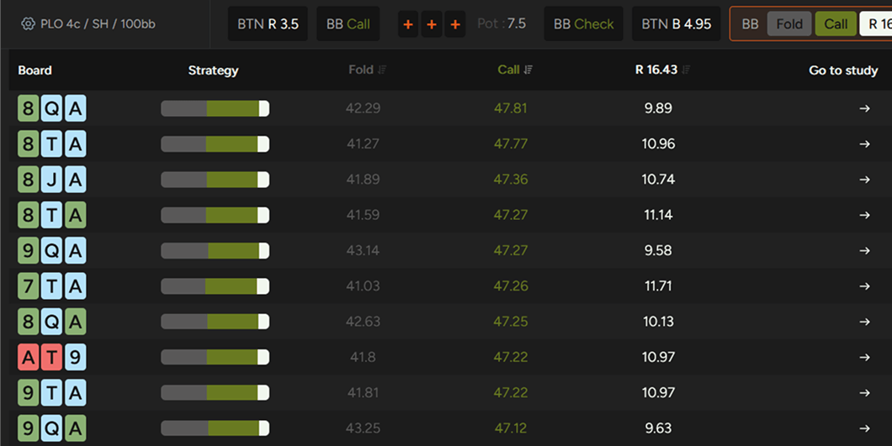
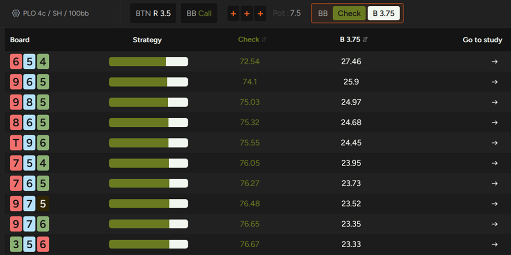
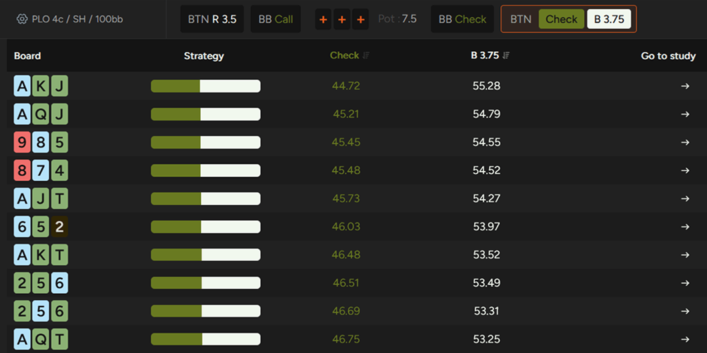

聚合报告是提升你 PLO 理解能力的强大工具！

PLO 本质上就十分复杂。由于有四张底牌，可能的起手牌数量（超过 27 万种）呈指数级增长。这使得理解翻牌前的范围和牌型成为一项真正的挑战 - 尤其是在你的目标是构建结构化的长期策略，而不是仅仅依靠直觉的情况下。

大量的翻牌前组合也意味着你会带着各种各样的牌型进入翻牌圈。例如，在一个标准的 100 BB 单加注底池中，BTN 开池大约有 12.6 万种组合。BB 跟注大约有 9 万种组合，而 3-bet 大约有 2.7 万种组合。

相比之下，在 100 BB 的无限注德州扑克中，BTN 开池大约有 580 种组合，而 BB 跟注大约有 530 种组合，3-bet 大约有 182 种组合。PLO 的规模要大得多。

因此，学习 PLO 需要结构化的方法。与其死记硬背单个牌型，不如按牌型类别来思考，并理解每种类别在特定情况下的表现。

在 PLO GTO 解算器中，每手牌都属于 13 个类别之一。这种分类有助于你发现规律。你可以快速查看特定类别的表现，并比较不同操作对各种牌型组合的预期价值（EV）。

BB 对抗 BTN 100 BB 加注的策略

一开始，掌握特定手牌类型的打法可能会让人感到不知所措。然而，只要反复练习，你就能培养出对可靠翻牌前策略的直觉。

翻牌圈则带来了另一层复杂性。你现在需要考虑牌面结构以及它如何与包含数万种组合的范围相互作用。

分析不同的翻牌圈结构并理解它们如何影响双方玩家的范围并非易事。因此，本文将介绍聚合报告 - PLO GTO 求解器的一项功能，旨在使翻牌后研究更加清晰和结构化。通过定期练习，它可以帮助你将大量的求解器数据转化为实用的策略。

## 什么是聚合报告？

使用求解器进行研究最常见的方法是直接的。你设置一个翻牌前行动，选择一个特定的翻牌圈，然后分析双方玩家应该怎么做。

例如，BTN 开池，SB 弃牌，BB 跟注。底池为 7.5 BB，有效筹码深度约为 100 BB。

大多数情况下，不利位置的玩家会选择过牌。接下来，你需要观察有利位置的玩家 [“持续下注”](pg13.md) 的频率，以及 BB 应该如何应对。

这种方法效果不错，但一次只能显示一个牌面。

GOT 求解器的聚合报告功能让你能够更全面地了解情况。你无需分析单个翻牌，而是可以一次性查看一组牌面。你可以查看整体下注频率、下注额偏好以及策略在不同牌面结构中的变化。

这些数据有助于你理解模式，而不仅仅是孤立的解决方案。

在 PLO 中，共有 22,100 种可能的翻牌组合。从策略角度来看，许多翻牌组合的处理方式非常相似。即使只略微改变一张牌，通常也不会对最优策略产生太大影响。

为了使研究更具实用性，我们将可能的翻牌总数减少到 1,755 种具有代表性的牌面结构。这些结构涵盖了所有策略情境，同时又保持了数据的可控性。

因此，你可以专注于学习不同范围之间的相互作用，而不是迷失在成千上万个几乎相同的牌面中。

你需要的所有翻牌面类型，助你高效学习

为了使翻牌后的研究更有条理，我们将翻牌面分为七大类：

- A 高牌面 – 非对子、非单调的 A 高牌面，无法组成顺子
- BBL – 两张高牌（T-K）和一张低牌（8 或更小）的非对子牌面，无法组成顺子
- BLL – 一张高牌（T-K）和两张低牌（9 或更小）的非对子牌面，无法组成顺子
- LLL – 三张低牌（9 或更小）的非对子牌面，无法组成顺子
- 单调牌面 – 三张牌花色相同的非对子牌面
- 对子 – 任何对子牌面，包括三条
- 顺子 – 可以组成顺子的牌面

## 一个实际的例子

让我们回到之前的例子，并使用汇总报告来回顾 BTN 在 100 BB（PLO50 抽水）下对 BB 的持续下注策略。我们将比较两组牌面：A 高牌面和顺子牌面。

在 A 高牌面中，我们的求解器假设位置不利的玩家 100% 会过牌（这在实战中也是一个合理的基准）。在这种情况下，BTN 可以比较自由地持续下注。在所有 217 个 A 高牌面中，求解器在每张牌面上都会下注，下注频率在 45% 到 64% 之间，每次下注 4.95 BB，底池为 7.5 BB（底池的 66%）。

::: info 备注：

为了简化研究过程，我们的解决方案采用了一种简化的策略，并显示最常见的下注额。

:::

翻牌圈出现 A 高牌时，翻牌前加注者占优。

我们再来看看对手应该如何应对解题者的策略：

根据 GTO 算法，在这种情况下应该会有相当多的过牌 - 加注。

即使面对 2/3 底池的下注，算法预测 BB 过牌 - 加注的概率约为 9% 到 15%。实际上，很多玩家达不到这个频率，这意味着作为翻牌前激进玩家，你通常能获得比基准预测更高的 EV。

因此，虽然 A 高牌面并非 “自动下注” 的情况，但仍然给了翻牌前加注者充足的持续下注空间。大多数对手在这里防守过于被动，这也意味着比算法预测的频率略高一些的持续下注可能是一个有利可图的策略。

现在让我们来看一个截然不同的情况：顺子牌面。

当有可能组成顺子时，由于 BB 的防守范围结构，他们通常能更有效地组成顺子。这种结构改变了双方范围的权益，也改变了最优策略。因此，求解器通常更喜欢位置不利的玩家在翻牌圈领打，频率相对较高，因为他们持有的强成牌（包括顺子）比他们在 A 高牌面上更多。

在顺子较多的牌面上，BB 应该主动出击。

这里情况就变得复杂了。

在低级别和中级别游戏中，很多对手在顺子牌面上领打不够频繁，甚至有些对手根本不领打。这是选择持续下注策略时需要考虑的重要因素。

如果我们单独来看顺子牌面 - 假设对手应该有领打范围但却选择过牌 - 持续下注的频率并不会大幅下降。在这些牌面上，持续下注的频率仍然大致在 41% 到 55% 之间。

然而，如果你假设对手在这些牌面上从不主动下注，情况就不同了。他们的过牌范围会更强，因为其中包含了更多本应主动下注却没有下的成顺。

在这种情况下，你的持续下注频率应该降低几个百分点。

具体降低多少？这取决于完整的模型，需要额外的计算。但具体的数字并非关键所在。真正重要的是培养直觉 - 理解求解器在理论上的建议，并知道如何根据实际对手偏离最优策略的情况进行调整。

## 总结

我们能从这个例子中学到什么？

**A 高牌面**

这类牌面显然对翻牌前加注者有利。BTN 通常持有更多 [“A-A”](pg04.md) 组合，这使他们在范围上占据优势。

因此，大额且频繁下注应该是默认策略。由于许多对手过牌 - 加注的频率不够高，因此在实战中略微提高你的持续下注频率可能是一个有利可图的策略。

**顺子牌面**

顺子牌面更具动态性。如果你的对手拥有合理的领打策略，你的持续下注频率应该会低于 A 高牌面 - 尽管仍然相对较高。

然而，面对从不先手的玩家，你应该更加谨慎。他们的过牌范围会更强，这会增加过牌 - 加注或下注到更强范围的风险。

最后，GTO 求解器的汇总报告功能允许你在几秒钟内从大类视图切换到特定牌面。你可以快速验证任何牌型的确切策略，并在需要时进行更详细的研究。

## 为什么汇总报告至关重要

汇总报告是强大的分析工具。

忽视它们意味着错失提升牌技的良机。起初，海量数据可能会让人感到不知所措，但通过持续练习，你将学会如何将成千上万种组合和牌面结构转化为清晰的模式。这才是培养真正直觉的方法 - 并让你在与那些学习方法不够系统化的对手的较量中脱颖而出。

GTO 求解器已经涵盖了各种常见场景。由于 PLO 中可能出现的情况数量庞大，我们首先专注于最相关、最常出现的情况，然后逐步扩展。