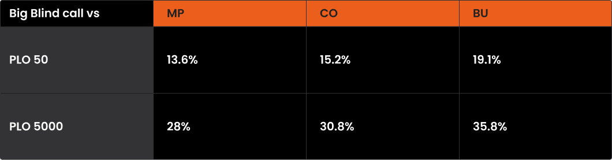
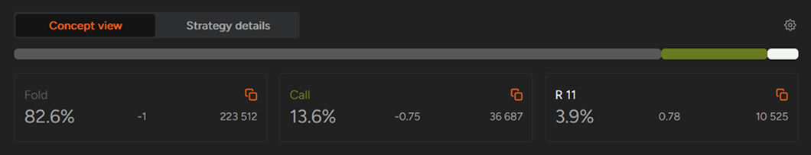
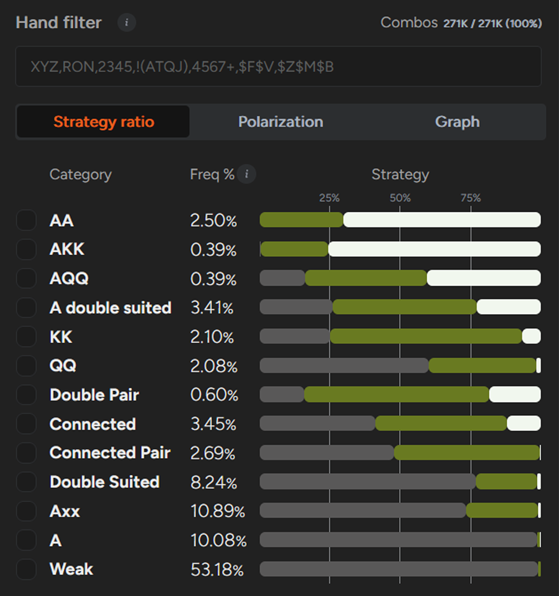
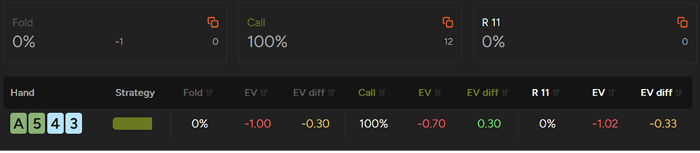
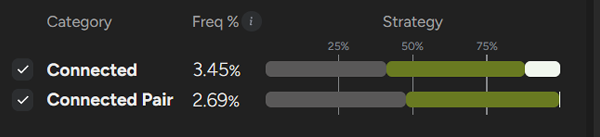
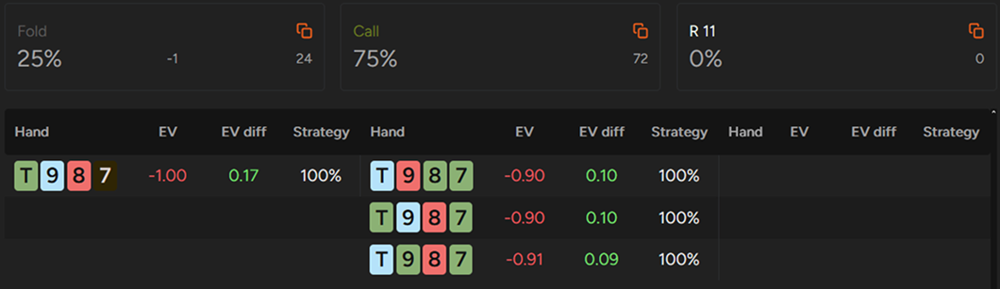

在 PLO 中，防守 BB 面对 UTG 加注时，你的策略应该有多紧？比你想象的要紧。

一个稳健的翻牌前计划是所有有效扑克策略的基础。

因此，我们的博客上有很多关于翻牌前策略的文章。我们已经讲解了如何开池加注以及如何防守开池加注，也概述了在 3-bet 和 4-bet 情况下如何应对。在本文中，我们将通过重点讨论一个基础但至关重要的位置（该位置对翻牌后的影响非常大），来完善翻牌前策略（至少在单挑情况下是如此）：BB 在不利位置防守的开池加注。

由于这是一个涵盖面很广的话题，我们将把它分成两部分。

当你在 BB 时，你的胜率几乎肯定会是负的（除非只面对小盲注，这种情况在大多数 PLO 中相对少见）。因此，你的目标不是盈利，而是尽可能减少损失，避免每手牌都弃牌，因为弃牌的胜率会是 -100 BB/100 手。

## BB 策略概述

与 SB 不同，在 BB 面对单次加注时，最佳策略通常是跟注而非 3-bet。这是为什么呢？

在 BB，你结束了翻牌前的行动。这意味着你掌握了所有信息 - 在你之后没有其他玩家行动，所以你无需担心被挤压。此外，你肯定会进入单挑阶段，这简化了翻牌后的策略。

与所有 PLO 现金游戏一样，抽水结构对你的决策有着至关重要的影响。本文余下部分将使用 GTO 求解器中最高的抽水结构，即 PLO50。在深入探讨之前，我们先来了解一下最优策略如何随位置和抽水而变化。

更高的级别意味着更多的翻牌前跟注

正如你所见，不同级别牌局的反应差异显著。低级别牌局较高的抽水使得在 PLO50 级别牌局中原本会在 PLO5000 等高级别牌局中出现的大量跟注变成了弃牌。这是一个重要的结论：抽水越高，翻牌前策略就需要越紧。

你可以使用 GTO 求解器的比较工具直接探索抽水的影响，该工具可以让你看到在不同的抽水假设下，牌型范围是如何变化的。

既然我们已经确定了翻牌前选牌需要更紧，接下来让我们看看如何在低级别单次加注的牌局中防守 BB。和往常一样，我们将考察两种极端情况：防守 UTG 和防守 BTN。

在本部分，我们将重点讨论如何防守 100BB 的 UTG 加注。第二部分将介绍如何防守 BTN 的加注。

## 防守 BB 对抗 UTG

在低级别游戏中，防守 BB 对抗 UTG 开池时，你必须打得紧 - 别无选择。

你面临三大劣势：

- 高额抽水
- 对方开池范围很强（至少在证明并非如此之前）
- 位置劣势

这些因素加在一起，几乎没有发挥创意的空间。

在 PLO50 的 BB 对抗 UTG 场景中，你 VPIP 应该使用只有 17.5% 的手牌。

假设 UTG 开池的范围合理（理论上约为 16.8%），你将无法有效地防守很多牌。事实上，这个比例相当严格：你应该弃掉 82.6% 的范围，只跟注 13.6%，3-bet 仅占3.9%。

以下是你的策略概览。

BB 对抗 UTG 开池的行动图表

### A-A

让我们从大家最喜欢的牌型 - A-A 开始。

在BB 对抗 UTG 时，你应该谨慎玩你的 A-A 组合。理论上，所有A-A 牌型都进行 3-bet 并无不妥，因为即使是最弱的组合，3-bet 也比弃牌更有优势。然而，在实战中，许多连接较差的 A-A 牌型，跟注比 3-bet 更有优势。

以三同花 A-A-9-2 为例 - 这是最弱的 A-A 组合之一。

它作为 3-bet 的 EV 接近盈亏平衡（约 0.03 BB），而跟注的期望值则高得多（约 0.57 BB）。许多类似的牌型翻牌圈表现不佳，通常只剩下一裸的超对，难以在多轮下注或跟注。

此外，当你的对手跟注你的 3-bet 时，他们的牌型范围通常足够强，能够承受压力或主动施压。这会让你在底池膨胀的情况下陷入困境。

用你最弱的 A-A 牌跟注（正如 GTO 求解器建议的那样），可以控制底池大小，保持灵活性。在不利的牌面下，你可以更轻松地弃牌，而无需过度投入。

同时，对手的范围会更广，从而提高你的胜率。此外，你的牌力也会被低估，这可能会诱使对手在 A 高牌面上诈唬。

值得注意的是，实现 EV 本身就是一门技巧。你的牌越难玩，就越难发挥其全部价值。

总而言之，面对强开池范围，更被动地玩你最弱的 A-A 有助于避免陷入困境，并减少不必要的损失。

## K-K 和 Q-Q

对于包含 A 的 K-K 或 Q-Q 组合，面对 UTG 的加注，你的默认策略应该相对激进。所有 A-K-K 组合都足够强，至少应该跟注，其中 75.6% 适合 3-bet。对于 A-Q-Q 组合，只有大约 15% 的牌会在翻牌前弃牌，而 43.5% 的牌会跟注，40.6% 的牌会进行 3-bet。

然而，请记住，即使你偶尔错过了 3-bet，跟注的 EV 损失通常也小于错误地对一手边缘牌进行 3-bet 的损失。

对于不包含 A 的 K-K 和 Q-Q 组合，情况则大不相同 - 大约 42.5% 的组合应该弃牌。这可能感觉有些反直觉，因为弃掉 K-K 或 Q-Q 来应对单次加注通常看起来太紧了。

然而，在低级别的情况下，这才是正确的策略 - 尤其适用于像 K♠️K♦️Q♣️2♥️、K♦️K♣️8♣️2♥️ 或 Q♣️Q♦️7♦️4♥️ 这样的非连接、彩虹或三色牌型。

如果你在这种情况下防守太多 K-K 和 Q-Q 这样的牌型，长此以往你会损失惨重。

### 双同花 A-x-x 和两对牌型

对于许多双同花 A 高牌和两对牌型，也适用更为被动的策略。

首先，大约 26% 的双同花 A 高牌型对抗 UTG 时弃牌，考虑到它们通常被认为的强度，这个比例可能令人惊讶。

其次，这些牌型通常具有足够的连牌能力，容易诱使玩家过于频繁地进行 3-bet。例如，A♣️5♣️4♠️3♠️ 跟注的 EV 约为 -0.7 BB（仍然优于弃牌），但 3-bet 的 EV 约为 -1.02 BB。换句话说，3-bet 的表现不如弃牌。

即使是这么漂亮的组合，进行 3-bet 也是很大的撒钱。

同样，对于两对牌，你应该避免过度玩弱牌型。像 T-T-3-3、9-9-5-5 或 J-J-2-2 这样的低牌、不连接的彩虹牌型应该弃牌。

话虽如此，较强的两对牌通常在翻牌后表现良好，值得跟注。

### 连牌和连接对子

接下来的两类牌 - 连牌和连接对子 - 情况就更加复杂了。

乍一看，这些牌型似乎很有吸引力。它们通常结构良好，连接性不错，在单挑底池中看起来也不错。然而，面对 UTG 的加注，它们的实际表现远比表面看起来要弱。总的来说，你应该弃掉这类牌型中大约 44% 的牌。

这些类别中包含许多棘手的决定

那么在实战中应该如何处理这些牌型呢？

你应该对单同花和三张同花的牌型格外谨慎 - 尽管它们看起来可玩，但面对强大的 UTG 范围时，它们的表现往往差强人意，几乎总是被弃牌。

即使是看起来不错的连牌，如果牌面较小（低于 J），也会大幅降低其价值，因为它们难以对抗更强、高牌较多的范围。除非有其他优势，否则彩虹牌型的表现通常也很差。

例如，像 T-9-8-7 这样的彩虹牌型可能看起来很诱人，但面对稳健的 UTG 开池范围时应该弃牌。同样的道理也适用于三同花结构的 J-T-8-7 或 三同花的 9-8-8-7。然而，在实战中，许多低级别玩家仍然会跟注所有这些牌型 - 这是玩家群体中常见的现象，你应该对此有所了解。

同样的道理也适用于低连接牌型：尽管它们的牌型结构不错，但面对紧的 UTG 范围，它们的权益通常不足。

这类牌型可能最具提升空间，因为许多看似可玩的牌型实际上应该弃牌。

### 双同花和 A 高牌型

在双同花和 A 高牌型中，你需要格外谨慎 - 这类牌型中约有 83.2% 应该弃牌。

弃牌的例子包括：

- 连接性差的双同花牌，例如 K♣️Q♣️8♦️3♦️、J♣️9♣️4♦️2♦️ 或 K♣️T♣️7♦️2♦️
- 连贯性差的 A 高牌（即使有对子或同花），例如 A♦️T♦️6♣️6♥️、A♣️K♣️Q♣️9♦️ 或 A♣️J♦️5♣️3♥️
- 大多数三同花或非坚果 A 高牌

### 弱牌

最后，还有一大类弱牌不属于上述任何类别。

这些弱牌占所有起手牌的 53% 以上（约 144,000 种组合），其中超过 99% 的弱牌在面对 UTG 位置的开池加注时应该弃牌。

## 正确防守 BB 值得付出努力

防守 BB 对抗 UTG 的加注比看起来要复杂得多。

很多牌看起来很诱人，但跟注的 EV 却不支持这样做。如果你防守的范围太宽，就会输钱 - 就这么简单。

好消息是，这是一个很多玩家仍然会犯错的基本领域，这为提升自身水平提供了机会。

GTO 求解器正是为此而生，它能帮助你培养对这类情况的直觉，并识别出那些让你输钱的牌。

第一部分到此结束。在下一篇文章中，我们将探讨另一个极端：如何防守 BTN 更宽（也更弱）的范围。