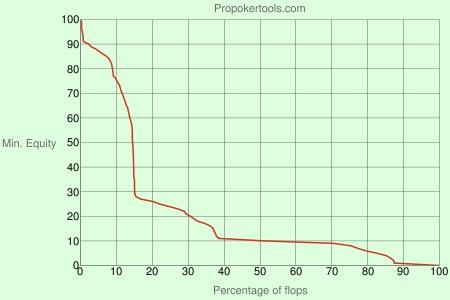
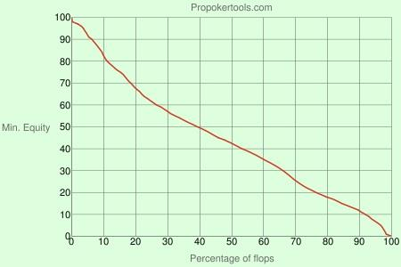

在我的培训课程开始时，我会给学生们提供三份资料。首先，我会给他们发一份 50 页的文档，里面包含了我在所有培训网站上看过的所有 PLO 视频的笔记。其次，我会给他们发一份《PLO 快速权益统计》，里面有各种权益模拟，将所有常见的权益匹配放在一起，这样他们就可以在奥马哈经理（HEM）中查看之前熟悉全下范围。

最后，我会给他们发送汤姆·钱伯斯（Tom Chambers）的《高级 PLO 理论》一书中名为 “PLO 核心概念” 的章节。

这六个概念都会在快速职业手册的整个课程中提到，所以集中注意力并做好笔记非常重要。因为如果你误解了本章涵盖的基本知识，那么在我们深入学习更高级的策略时，你很可能会遇到困难。

### PLO 核心概念 #1：强牌

第一个 PLO 核心概念围绕强牌展开。在 NLHE 中，口袋 A-A 在翻牌前之所以如此强势，主要原因是多数情况下一对 A-A 若能坚持到摊牌阶段依然能保持牌力优势。但在 PLO 中，情况并非如此，大多数时候，如果你发现自己在摊牌时只用一对 A-A 就赢得一个大底池，那么你应该庆幸自己很幸运。

几乎所有现有的 PLO 书籍和培训视频都合理地解释了 PLO 的核心在于如何听牌到坚果牌。在任何形式的大注扑克中，赢得对手的全部筹码都是首要目标。在 PLO 中，你经常会发现自己陷入单次加注的多人底池。在这种情况下，要想赢得筹码，你必须压制对手的全下范围，而这可以通过玩强牌来实现。

例如，如果你查看一个成功玩家的数据库，你会发现能带来最多利润的牌是 A-A-x-x、K-K-x-x 和百老汇连牌。这些牌型构成了强牌：顶暗三条和坚果葫芦、坚果顺子、坚果同花和近坚果同花，以及非常强的听牌。在多人底池中，用 5 高顺子或 9 高同花很难赢得大底池。

我们将在第二章中详细讨论如何创造有利可图的翻牌后局面，但现在只需意识到，我们的利润很大一部分将来自于正确玩好强牌，并在翻牌后压制对手。

### PLO 核心概念 #2：并非总有人拿着坚果牌，但坚果牌总是很重要

我见过很多新手（包括我自己）采取的一个常见策略是只在翻牌前玩强牌，然后在翻牌击中强成手牌或听牌时往底池里投入尽可能多的资金。毕竟，他们听说每个玩这种愚蠢的四张牌游戏的人都玩得很糟糕。所以在他们看来，他们只需要好好打牌，投入一百万手牌，然后拿到钱，一两年后搬到巴哈马就行了。

在 PLO 满人桌的游戏中，由于多数底池为多人混战且筹码常在 “绝对坚果” 与 “第二坚果” 对决中易主，采取紧弱策略很可能是正确的。即使在微级别游戏中，尽管多数玩家极度松且轻易全下，你只需坚持用能压制对手的强牌入局就必定能实现盈利。在微级别赢取筹码更为容易，因为多数玩家要么缺乏读牌能力（即便你连续十圈未入池他们也毫无察觉），要么他们投入的金额根本不足以让他们放弃任何成手牌。

一旦你晋级到更具攻击性的中高级别短人桌游戏，那些 “坚果贩子（只玩好牌）” 很容易被碾压。正如我已经暗示过的，坚果牌在定义 PLO 的范围中起着关键作用，在分析给定的公共牌结构时，可以养成问自己的几个好问题：

- 什么是坚果牌？
- 坚果牌的可能性有多大？
- 我们对抗坚果牌的权益是多少？

例如，让我们用一个像 J♦️T♥️9♦️ 这样的大量行动的牌面来说明我们的观点。在 NLHE 中，这也是一个行动性很强的牌面。尽管 K-Q 肯定在大多数对手的范围中，但还有许多其他成手牌和半诈唬牌愿意在翻牌全下，而这些牌并非坚果牌。在 PLO 中，如果有人在这个牌面采取激进的行动线，比如在翻牌加注或在转牌发出空白牌时下注底池，最常见的问题是：他拿着 K-Q 的可能性有多大？

在单次加注多人底池中，坚果牌是愿意全下筹码的范围中很大一部分，因此务必考虑你对抗坚果牌的权益。在 PLO 中，在各种湿润的牌面，对抗坚果牌的权益高达 35-50% 的牌型更多。事实上，J♦️T♥️9♦️ 牌面上的裸坚果顺子，对于像 K-Q-J-T、A-K-Q 和 K-Q:dd（或带方块的 K-Q-x-x）这样的牌来说，是一个巨大的劣势。带同花听牌的暗三条的权益是 65/35，三条 + 同花听牌的权益是 61/39，两对 + 同花听牌的权益是 57/43。特定的边牌会影响这些权益，我们将在 PLO 核心概念 #5 中进一步讨论。

### PLO 核心概念 #3：牌值接近

核心 PLO 概念 #3 可能是你听得最多的，即 PLO 中的牌值接近。鉴于牌值如此接近，这意味着我们或许应该……

“玩每一手牌。你不能错过所有牌。”

山姆·法哈（Sammy Farha）

这句话是否出自山姆之口尚有争议，因为我是从某个随机网站上摘录的。无论如何，我想引用我最喜欢的黎巴嫩 PLO 狂热玩家的一句话，帮助你记住，即使法哈先生玩每一手牌可能效果很好，但这绝对不意味着你也可以做到。许多新手玩家认为翻牌前打得很松是合理的，因为他们听说 PLO 中的权益更接近，但正如我们稍后会讨论的那样，这并不意味着你可以疯狂发力。

与德州扑克相比，PLO 中的权益更接近，但它们到底接近多少呢？如果你拿着一手最强的起手牌 A♣️A♠️J♣️T♠️，并将其与任何其他随机牌对战，它在翻牌前的权益只有 71%，而德州扑克中 A-A 拥有高达 85% 的压倒性优势。此外，这些 A-A 是可以拿到的最强 A-A 牌之一。随机 A-A 的权益约为 65%，而像 A♣️A♠️9♥️3♦️ 这样的彩虹非连接 A-A 的权益则接近 61%。此外，几乎所有好牌在翻牌前的对战都更接近 55/45 的范围或类似范围，从长远来看，这会带来巨大的差异。所以现在你可能会想：“好吧，我想知道这一点很好，但这有什么关系呢？”

你看，尽管 PLO 中的起手牌在单挑时理论上都很接近，但在多人底池中，赢得大底池的牌型和让你陷入困境的牌型之间还是有很大区别的。由于你很少会在翻牌前用 100BB 筹码全下，所以一手牌的可玩性比翻牌前的权益更重要。尤其当筹码越来越深时，这种情况尤其明显，这会导致后续回合的下注比翻牌前的下注大得多。简而言之，**翻牌前只是前戏，最终会引出真正的行动。**

### PLO 核心概念 #4：起手牌最重要的是它在翻牌的权益分布

我认为这个概念是六个概念中最重要的，所以我会额外花几页来解释，确保你理解其中的原因，以及它如何影响我们的翻牌前决策。

我们已经明确，翻牌前的原始权益与如何玩牌关系不大，这与 NLHE 略有不同。并不是说权益分布在德州扑克中毫无意义，而是区别在于，如果你在德州扑克中翻牌前压制对手，那么你在翻牌后很可能仍然拥有巨大的权益优势。例如，如果对手在翻牌前拿到了更大的对子或更好的踢脚牌，那么你通常会在翻牌后处于非常糟糕的境地，除非你运气好，反超。

需要明确的是，在 PLO 中，压制和领先的时候下注起着关键作用。虽然翻牌前和翻牌后的权益通常很接近，但这并不意味着每次筹码下在底池时，权益都会像抛硬币一样波动。你仍然可以领先的时候投入资金，但**大部分利润并非来自于翻牌前 55/45 的领先的一方。相反，利润来自于识别每手起手牌的理想翻牌后局面，然后让自己处于有利位置，以便在翻牌后获得盈利。**

有两种不同的方式可以描述一手牌的翻牌后权益分布。第一种是当一手牌的权益**极化**时，这意味着**它翻牌后表现很好，但只出现在一小部分翻牌上**。例如，K♣️K♠️7♥️2♦️ 有 12% 的几率翻牌击中非常强的暗三条或更好的牌，偶尔会击出三条 7、三条 2 或底两对，而其余时候，它只有一手平庸且（最重要的是）不太可能提升的超对。

判断一手牌是否极化的一个简单方法是记住，它们通常只在一件事上做得非常好。PLO 的作者 Jeff Hwang 在其著作《PLO 扑克》中称之为 “单向牌”。我们将在第三章中详细讨论这一点，但现在只需理解，我们将用三个特质来定义任何特定牌型的特征：同花性、连接性和高牌值。所以，当我说具有很多极化特征的牌型是那些在一件事上做得非常好的牌型时，我指的是连接性、同花性和高牌值。

例如，K♣️K♠️7♥️2♦️ 的能力主要局限于翻牌击中三条。T♣️9♠️8♥️7♦️ 则属于极化牌型，因为它具有极强的连接性。它在有限的公共牌面中能很好地击中翻牌；通常是在彩虹翻牌上，形成包牌或对子 + 组合听牌。像 A♥️9♣️6♦️4♥️ 这样的牌型被归类为极化牌型，因为它在一件事上非常擅长：翻牌击中坚果同花听牌和坚果同花。

**极化牌型的理想情况是深筹码多人底池。** 极化牌型在这种情况下表现良好，因为在它们翻牌前 15% 的概率下，它们能击中大量的权益；而且它们还有爆冷对手的潜力，比如翻牌击中大暗三条对小暗三条，或者击中坚果同花对第二坚果同花。我稍后会展示一些图表来帮助你理解这一点，但在德州扑克中，用像 5-5 这样的小对子也可以进行类似的类比。在 NLHE 中，小口袋对子喜欢多人底池，因为它们很少翻牌击中暗三条，但一旦击中，它们几乎在任何牌面结构上都拥有很高的权益。

描述牌型权益分布的另一种方式是**平滑权益分布**。具有平滑分布的牌型与极化牌型的玩法截然不同。在上一节中，我们说过，那些在同花、连接性和高牌价值方面只擅长一项的牌型通常是极化的，所以现在我们需要定义哪些特征使一手牌变得平滑。

**平滑手牌通常拥有良好的同花和连接性，这意味着在翻牌有更多机会击中对子、顺子听牌或同花听牌，以及各种其他组合听牌。** 例如，像 J♥️T♦️9♥️8♦️ 这样的平滑手牌在任何翻牌后场景中都表现出色，因为它在很多翻牌都能获得不错的权益。事实上，任何非对子牌型在翻牌击中对子的概率为 40%，而任何双同花牌型在翻牌击中同花听牌的概率为 23.5%。正如我们稍后将讨论的那样，**这使得它们非常适合单挑和 3-bet 底池。**

为了让你更好地了解权益分配的运作方式，以及我们最初为何关注这一点，我将向你展示两张不同的图表。

图 1.1（见下文）描述了特定牌型在特定翻牌百分比下的最低权益。例如，如果我们将 X 轴移至 15，然后将其追踪到 Y = 30 处的曲线，你会发现 K♣️K♠️7♥️2♦️ 在 15% 的翻牌上拥有 30% 或更高的权益。

图 1.1 K♣️K♠️7♥️2♦️ vs A-A

刚才我提到，K♣️K♠️7♥️2♦️ 是极化牌型的典型代表，因为它要么在翻牌权益很高，要么几乎很少权益。查看图 1.1 后，我们发现，面对所有 A-A 组合，K♣️K♠️7♥️2♦️ 在 10% 的翻牌上权益超过 70%。这些翻牌，K-K 会翻牌击中顶暗三条或更好的牌。

在这个百分位之后，权益会显著下降，这代表着我们翻牌击中较弱的牌，例如两对或类似的容易被击败的牌，和很小机会改进增强的裸的超对。让我们看看下图，看看我们的示例与权益分布更平滑的牌型相比如何。

图 1.2 J♥️T♦️9♥️8♦️ vs A-A

观察图 1.2 中的线条，它几乎是一条笔直的对角线，这与 K♣️K♠️7♥️2♦️ 例子中的陡峭曲线变化截然不同。J♥️T♦️9♥️8♦️ 从翻牌前 10% 到前 30% 的过渡比极化牌型要平滑得多。此外，当比较翻牌前 50% 时，K♣️K♠️7♥️2♦️ 的最低权益仅为 10% 左右，而 J♥️T♦️9♥️8♦️ 在一半的翻牌上对抗 A-A 的平均权益超过 40%。

现在，你可能会对自己说：“好吧，这些图表很酷。极化牌型意味着翻牌后要么领先很多要么落后很多，而平滑牌型则始终能带来更多的翻牌权益。但我仍然不明白这会如何让我赚钱，以及这与整体情况如何相关。”

我想补充一点，并不是每手牌要么完全极化，要么非常平滑。远非如此。这里有一个更简单的思考方式。想象一下，所有牌都位于一个极性图谱上，像 K♣️K♠️7♥️2♦️ 这样的极化程度最高的牌位于图谱的最左边，而像 J♥️T♦️9♥️8♦️ 这样的平滑牌则位于图谱的最右边。现在，每手 PLO 牌都有不同程度的极性，例如，像 9♠️9♥️8♠️7♣️ 这样的牌，其极化程度远不及 K♣️K♠️7♥️2♦️，但也不像 J♥️T♦️9♥️8♦️ 那样平滑。因此，就其权益分布而言，它更接近图谱的中间位置。

要想清楚了解这些工具的工作原理，最好的方法是访问 propokertools.com，并输入各种牌局，感受每手牌的特点如何决定其翻牌赢取一定权益的频率。在快速职业手册的后续部分，我们会多次讨论权益分布，但现在只需理解**所有翻牌前的决策都必须基于其所创造的翻牌局面，并且大多数起手牌都有一套特定的理想翻牌局面，这些局面都基于其翻牌权益分布**。

### PLO 核心概念 #5：累积权益：再听牌、阻挡牌、对子、弱牌和后门听牌

在以抛硬币来决定筹码输赢为常态的游戏中，大量的利润来自于在 60/40 的对抗中处于有利一方。因此，关注累积权益尤为重要。对抗一个范围时，权益 55% 还是 45% 的差异取决于一些你可能不仔细观察就会忽略的因素。**每当我们拥有少量权益时，我们不仅增加了自己获胜的牌，还夺走了对手的补牌。**

例如，当我们拿着一对带听牌时，我们可以通过夺走对手再听牌的补牌来获得对抗暗三条的权益。而我们拿着对子的摊牌价值，则可以获得对抗其他听牌的权益。当我们拿着后门同花听牌的 A-A 时，我们完成同花就能确保获胜，阻止对手用被压制的后门同花获胜，并偷走他的一些两对或顺子补牌。

为了帮助你理解累积权益的重要性，我们来比较一下用 A♣️A♠️8♥️3♦️ 和 A♥️A♦️J♥️T♦️ 下注 10% 筹码进行 3-bet 的情况。显然，后者比那些破烂的 A-A 强，所以你可能不会对快速职业手册建议不要用彩虹 A-A 这样的牌进行 3-bet 感到惊讶。现在，我们假设我们确实决定在这种情况下两手牌都 3-bet。这两手牌之间的区别比 A♣️A♦️J♣️T♦️ 翻牌击中大牌概率更高的显而易见的事实更为微妙。它在翻牌的表现方式多种多样，比如 20% 的时候击中超对 + 坚果同花听牌，5% 的时候击中坚果顺子或坚果同花，等等。所有这些都很容易识别，但关键在于注意 9♣️7♦️2♥️ 这样的翻牌上这两手牌之间的区别。

综合考虑，9♣️7♦️2♥️ 翻牌对于 A-A 来说相当不错，如果我们翻牌前能投入 25% 的筹码，我们很乐意在这样的翻牌投入剩余的资金。翻牌前只下注 10% 的筹码，用裸 A-A 全下对抗普通对手是失败的玩法，因为他的全下范围碾压了我们。

另一方面，当我们持有 J-T 卡顺和两张后门同花听牌时，我们的整体权益足以让我们有利可图地全下，这让我们有机会实现在只有裸 A-A 的情况下被迫弃牌的那一部分权益。简而言之，我们的超对、卡顺听牌和两个后门同花听牌各自都有价值。**单个听牌都不足以强到全下，但当我们三个后门听牌都持有时，我们就能实现每一部分较小的权益。** 如果你想知道，在标准的手牌对局中，一张后门同花听牌能增加的权益在 1-3% 之间，具体取决于实际持牌情况。

### PLO 核心概念 #6：与德州扑克相比，我们更希望对手弃牌。

每位扑克玩家都应该具备一定的下注逻辑或推理能力。下注的理由是什么？毕竟，了解这一点或许很有益处，因为你很快就会在牌桌上进行大量的下注。

由于与我们之前讨论的话题相关，我想探讨一下 “保护性下注” 背后的理论。大多数 NLHE 玩家都认为，保护性下注并非下注的主要原因。其他原因，例如为了价值下注或诈唬，通常更为重要。鉴于我们目前所了解的一切，你认为在 PLO 中，主要为了保护性下注是否值得考虑？

**在 PLO 中，出于多种原因而进行保护性下注是合理的。** 首先，PLO 中牌的价值比其他游戏中的牌的价值分布更接近，这意味着玩家在特定牌局中的权益通常比他们意识到的要高。因此，**为了保护而下注可能会导致对手犯错，错误地弃牌损失手中的权益。** 对于 NLHE 玩家来说，这是需要做出的最大调整之一。德州扑克中遥遥领先 / 遥遥落后的情况比 PLO 多得多，这就是为什么你在 NLHE 中比在 PLO 中更容易在不利位置过牌 - 跟注而侥幸逃脱惩罚。

此外，为了保护而下注是合理的，因为当你开始在牌桌上大量下注时，你很快就会意识到在 PLO 中让对手免费看牌是大忌。你不仅给了对手在转牌免费兑现权益的机会，而且在很多转牌，你的对手也会获得足够的权益，继续在河牌获利。

以下是一些来自 NLHE 和 PLO 的牌例，有助于解释两种游戏之间权益的差异如何影响你应该采取的策略。

**NLHE 示例：** K♦️K♣️ 有利位置单挑，翻牌 A♦️7♥️2♣️

翻牌前开池加注后，我们在有利位置持有 K♦️K♣️，翻牌 A♦️7♥️2♣️。我之所以举这个例子，因为它是 “价值过牌” （或大多数人所说的 “底池控制” ）的经典例子。这里的意思是，即使我们很可能拿到最好的牌，最好还是在早期过牌，以最大化我们从差牌中赚到的钱，并最小化我们输给好牌的钱。

在这个例子中，过牌作为默认选项很有效，原因有四。首先，如果我们下注，我们不太可能从差牌中得到行动，或者更确切地说，不太可能让任何比我们更好的牌弃牌，所以下注既不是价值下注，也不是诈唬。其次，如果我们领先，对手可能没有太多补牌（在这种情况下，如果我们领先，他的补牌不会超过五张）。第三，如果你过牌，这会增加你在后续回合从较弱的牌（包括像 Q-J 这样可以在转牌或河牌与更差的牌配对的牌）获得价值的可能性。第四，通过随后过牌，我们可以诱使对手诈唬，这样我们在转牌或河牌也可以有利可图地跟注。

在 PLO 中，很多情况下第一个条件成立，但其他三个条件不成立。所以，让我们看看下一个示例，我会向你展示我的意思。

**PLO 示例：** K-K-x-x 有利位置单挑，翻牌 A♦️7♥️2♣️

在这个例子中，我们仍然持有 K-K，行动和牌面结构相同，但这次我们玩的是 PLO 而不是德州扑克。回到我们刚才讨论的内容，在 A♦️7♥️2♣️ 上，我们用 K-K-x-x 对抗普通对手，如果持续下注，几乎肯定会被持有 A 的牌跟注，而他们通常会弃掉其他所有牌。乍一看，这似乎是一个像我们上一手牌那样控制底池的好机会。这是德州扑克玩家在 PLO 中最容易犯的错误之一。运用同样的推理，让我们来分析一下为什么下注比过牌更好的三个原因。

首先，虽然我们拿到最佳牌时仍然领先，但任何持有随机 7 或 2 的对手都有 30-40% 的权益，因此对我们的持续下注弃牌通常都是错误的。持有后门听牌的对手也可能拥有不错的权益，而比这个更湿润的公共牌面则包含许多边缘牌，例如底对和卡顺听牌，这些牌会在下注时弃牌，但对抗我们的裸 K-K 有 35% 或更高的权益。

其次，过牌并不能增加我们从较弱的牌或升级到第二好的牌中获得价值的机会。这些牌仍然太弱，无法在后续回合支付下注。最后，在德州扑克的例子中，过牌会诱使对手进行我们可以有利可图的跟注的诈唬，而在 PLO 的例子中，过牌会诱使对手进行我们无法跟注的诈唬。转牌有更多牌会让对手获得有利可图的半诈唬局面，而且面对激进的对手，河牌通常不容易打。因此，我们最好的策略是在翻牌下注，如果这样做可以立即获利。

现在你可能会想：“好吧，这些话很有道理。但这是否意味着在 PLO 中根本就没有价值过牌或底池控制？” 嗯，有些场合价值过牌绝对是最佳选择，这些场合基本上可以分为两类。

第一种情况是，对手不太可能弃牌，而我们有一手权益不错的牌，但不足以跟注加注或全下。第二种情况类似于几页之前的德州扑克示例，我们在 A♦️7♥️2♣️ 牌面上拿着 K-K，但在后面的街我们有明显的可玩性优势。让我们来看两个同时出现这两种情况的例子。

**示例：**

我们持有 A♦️5♥️6♦️6♥️，在翻牌 J♦️T♥️8♦️ 上对手过牌给我们。

这与进行价值过牌的第一个原因相同，即对手不太可能弃牌，而我们持有权益不错的牌，但权益不足以跟注加注或全下。

在这个例子中，在湿润的公共牌面，面对一群喜欢过牌 - 加注的激进玩家，尝试下注是愚蠢的。在接近牌面下注的理由是，我们不想让那些权益达到 30% 或更高的玩家拿到免费牌。而在这里，对手让我们以大约 30% 的权益拿到免费牌。此外，考虑我们的隐含赔率也很重要，因为如果对手的筹码量很大，那么在实现权益的同时，最好在底池中留下对手被压制的同花听牌。

**示例：**

我们持有 A♦️K♥️8♦️6♥️，在翻牌 A♥️7♣️4♦️ 上对手过牌给我们。

这是第二种价值过牌是明智之举的情况。在如此干燥的牌面，我们持有顶对顶踢脚、一个卡顺和两个后门同花听牌，在某些动态下，我们可能很乐意全下，但通常情况下，这手牌不足以对抗加注。

价值过牌的理由是，有很多转牌和河牌我们可以有利可图地玩。与之前的例子不同，当时我们在 A♦️7♥️2♣️ 牌面拿着裸的 K-K，这次我们诱骗对手诈唬可以进行有利可图的跟注，同时准备在转牌或河牌上半诈唬或价值下注。有时在翻牌下注仍然更好，但过牌是可行的，而用 K-K 过牌则不好。

### 第一章 概念小结

1. 强牌包括大三条、大顺子、大同花、强听牌和组合听牌。在多人底池中，专注于坚果听牌，因为很多轻松的利润来自于翻牌后在这些类别中占据主导地位。
2. 并非总有人拿着坚果牌，但坚果牌总是很重要。你应该始终思考：当前的坚果牌是什么，它出现的可能性有多大，以及我们面对它的权益是多少？
3. 很多时候，尤其是在深筹码多人底池中，翻牌后的可玩性和赢得主导地位比翻牌前的权益优势更重要。
4. 翻牌前手牌可以根据不同的权益分布进行分类。在极端情况下，你会发现权益分布极化的牌，例如 K♣️K♠️7♥️2♦️、T♣️9♠️8♥️7♦️ 和 A♥️9♣️6♦️4♥️。这些牌型非常适合多人深筹码底池，而极化牌型的目标是 “坚果压制” 对手。K-K 在彩虹翻牌击中强暗三条或更好的牌的概率只有 12% 左右。像 J♥️T♦️9♥️8♦️、A♠️A♥️K♠️T♥️ 这样权益分布平滑的牌型非常适合任何翻牌后场景，并且在 3-bet 和单挑底池中表现出色。任何非对子牌型在翻牌击中对子的概率为 40%。双同花牌型在翻牌击中同花听牌的概率为 23.5%。
5. 在 PLO 中，下注保护是可行的，因为手牌价值相近，所以弃牌通常比跟注错误更严重。事实上，很多牌型在底池中拥有 30% 的权益，这使得给对手免费牌成为一个大错误。PLO 中遥遥领先 / 遥遥落后的情况比 NLHE 中少得多。