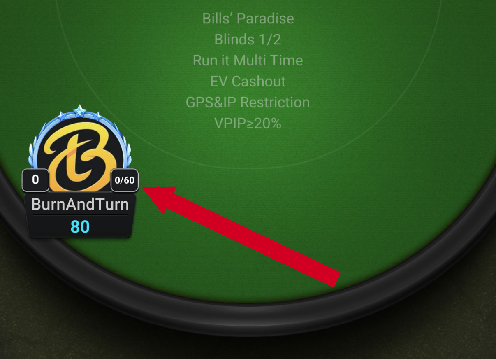

# ClubGG VPIP 要求：如何在扑克强制游戏中保持盈利

在网络扑克的世界里，各种应用程序和平台都致力于保持游戏的快节奏和刺激性。ClubGG 使用的一种方法是引入 VPIP 要求，这实际上强制玩家必须参与最低手数。虽然这可以增加游戏的刺激感，但如果处理不当，也可能导致糟糕的决策。关键在于学习如何在遵守这些要求的同时保持策略性，尤其是在进行长期游戏时。一旦你掌握了如何选择合适的牌桌，接下来就该了解牌桌的策略了。

本文将探讨如何掌握强制性 VPIP 要求，同时避免其对你的牌技产生负面影响。通过了解何时应该利用这一规则，何时应该适时退出，你可以将看似限制性的规则转化为提升牌技的契机。

## 了解 VPIP 及其重要性

在深入探讨强制性 VPIP 要求的影响之前，首先需要了解 VPIP 的含义。VPIP 是 “自愿投入底池” 的缩写，它衡量的是玩家通过跟注或加注（而非弃牌）进入底池的频率。VPIP 是扑克中最关键的统计数据之一，尤其是在线上游戏中，因为它能够反映玩家的风格和倾向。

例如：

- VPIP 低（低于 15%）表明玩家只玩优质牌，打法紧而谨慎。
- VPIP 值较高（高于 40%）意味着玩家经常进入底池，而且通常会使用范围很广的牌。

VPIP 高的玩家通常更激进，承担更多风险，而 VPIP 低的玩家则更保守，更谨慎地选择手牌。

为什么 VPIP 很重要？因为了解对手的 VPIP，你就能更准确地预测他们的行为。高 VPIP 玩家更倾向于诈唬、追逐听牌和过度玩弱牌，而低 VPIP 玩家则往往只在持有强牌时才会参与。因此，了解牌桌上其他玩家的 VPIP 倾向有助于你调整自己的策略。

无限注德州扑克牌桌的玩家 VPIP 通常在 20-25% 之间，而 PLO 的 VPIP 则超过 30%。尽量保持在最低 VPIP 附近，避免被踢出牌桌，但如果真的被踢出牌桌，也许反而是件好事。我们将在下文探讨这一点。

 
## 在线扑克应用程序中的强制性 VPIP 要求

许多在线扑克应用程序现在都强制执行 VPIP 要求。这项规则迫使玩家必须玩一定数量的牌局，否则就会被淘汰出局。这项规则的目的是为了保持游戏的动态性，避免玩家消极怠工、不断弃牌，从而拖慢游戏节奏。对一些玩家来说，这增加了游戏的刺激性；但对另一些玩家来说，这会迫使他们采取比在标准扑克环境中更激进的策略。

强制 VPIP 的问题在于，它可能诱使玩家为了避免被淘汰出局而去玩一些他们通常不会考虑的牌。如果玩家害怕弃牌太频繁，他们可能会玩一些次优牌，从而导致损失。这种紧张感会蒙蔽玩家的判断力，使他们偏离合理的扑克策略。

在 ClubGG 中，下面就是一个要求 VPIP 为 +20% 的牌桌示例。这意味着你必须至少玩 20% 的手牌才能留在牌桌上。

你头像旁边显示的数字是你当前的 VPIP。如果该框中显示 0/60，则表示你还有 60 手牌的时间达到所需的 VPIP。达到 60 手牌后，如果你仍未达到牌桌所需的 VPIP，你将被强制退出该牌桌，并且在 VPIP 重置之前无法再次加入。每个俱乐部可以为每张牌桌设置不同的 VPIP 重置时间限制。 

ClubGG 俱乐部牌桌上的 VPIP 示例。

## 适应强制性 VPIP：心态转变

那么，如何应对这些强制性的 VPIP 规则呢？关键在于转变思维方式，让你能够不受应用程序限制的影响，自由地进行游戏。以下是一些需要考虑的关键点：

### 不要让 VPIP 要求左右你的游戏策略。

仅仅因为你需要达到 VPIP 要求，并不意味着你应该开始玩弱牌。坚持你的整体策略至关重要，即使这意味着冒着被淘汰的风险。你玩的牌越不符合你的标准范围，你输掉筹码的可能性就越大。不要让达到 VPIP 最低要求的压力左右你的决策过程。

### 波动是游戏的一部分

波动指的是扑克游戏中不可避免的短期涨跌，无论你的牌技多么精湛。有时候，牌运不佳，但这很正常。适应波动意味着明白你不可能每局都赢，也不可能每次下注都能盈利。这一点在强制 VPIP 机制下尤为重要。如果你没拿到好牌，或者牌桌局势对你不利，与其强行采取明知并非最优的打法，不如坚持自己的策略，接受波动。

### 被踢出局？那就把它当成一场胜利吧。

虽然这听起来可能有点反直觉，但因为未达到 VPIP 要求而被踢出局实际上可能是一种胜利。如果你面对的是一桌激进的玩家，而且你手气很差（也就是说你一直没拿到好牌），那么离开牌桌或许是更好的选择。当你手牌不好，而且局势对你不利时，仅仅为了达到 VPIP 而继续留在牌桌上可能会让你损失惨重。在这种情况下，被淘汰反而能让你避免更大的损失。

::: info 注意

记住，波动是真实存在的。许多职业扑克选手都会经历状态不佳的日子、几周甚至几年。重要的是尽量减少损失，并且要知道什么时候就是你赢不了。有勇气离开牌桌，才能提高你的盈利能力。 

:::
 
## 剥削高 VPIP 玩家

利用强制 VPIP 规则的最佳方法之一就是剥削那些遵守该规则的玩家。以下是具体方法：

### 找出高 VPIP 玩家

为了达到 VPIP 要求，一些玩家会玩太多手牌，而且牌力较弱。这些玩家很容易识别，因为他们几乎参与每个底池，用在大多数情况下都不合理的牌加注或跟注。密切关注他们的参与频率，并据此调整策略。

### 利用松散局面

一旦你识别出那些正在追逐 VPIP 要求的玩家，下一步就是利用他们松散的打法。这些玩家经常会过度玩一些边缘牌，追逐一些无利可图的听牌，并且更频繁地诈唬。通过收紧自己的策略，专注于优质牌，你就可以利用他们的失误。务必在有利位置（例如 BTN 或 CO）玩牌，这样你就能掌控局面。

### 耐心终有回报

在一桌高 VPIP 玩家云集的牌桌上，你可能会忍不住加入他们的行列，放松自己的打法。务必克制住这种冲动。虽然看起来整桌玩家都在不停地加注和跟注，但耐心终会带来回报。坚持你稳健自律的打法，只玩强牌。你会发现，对手往往会用较弱的牌跟注，从而让你有机会赢得更大的底池。

### 如何保持较低的 VPIP 值并确保安全

另一方面，也有办法在满足应用程序要求的同时，保持较低的 VPIP 值。以下是一些策略：

**关注位置**

位置是扑克中最关键的因素之一。当你处于后位（靠近 BTN）时，你就能掌握更多关于对手行动的信息。利用这一优势，你可以略微扩大你的牌型范围，在满足 VPIP 要求的同时，避免承担过高的风险。

**玩优质手牌**

确保满足 VPIP 要求而不玩烂牌的最简单方法就是坚持玩优质起手牌。像口袋对子、A-K、A-​​Q 和同花连牌这样的牌既能让你保持稳健盈利的打法，又能帮助你遵守应用程序的规则。

**经常弃牌**

记住，弃牌是扑克高手必备的技巧。即使你感到压力，想要继续玩牌，也要经常弃牌，等待合适的时机。弃牌有助于保护你的资金，让你有时间等待优质牌。

## 着眼长远

归根结底，扑克是一项考验耐心和长远眼光的游戏。虽然强制性的 VPIP 要求可能会促使玩家比平时玩更多手牌，但切记不要让这些规则破坏你的策略。坚持你一贯的策略，专注于优质牌，并利用对手为了满足自身 VPIP 要求而过度投入的弱点。

保持专注，不让游戏要求迫使你做出错误的决定，你就能将这种潜在的劣势转化为牌桌上的优势。记住，如果你因为 VPIP 过低而被淘汰出局，那就说明那天这张牌桌并不适合你。总会有下一场游戏，总会有另一次机会让你在长期游戏中保持盈利。