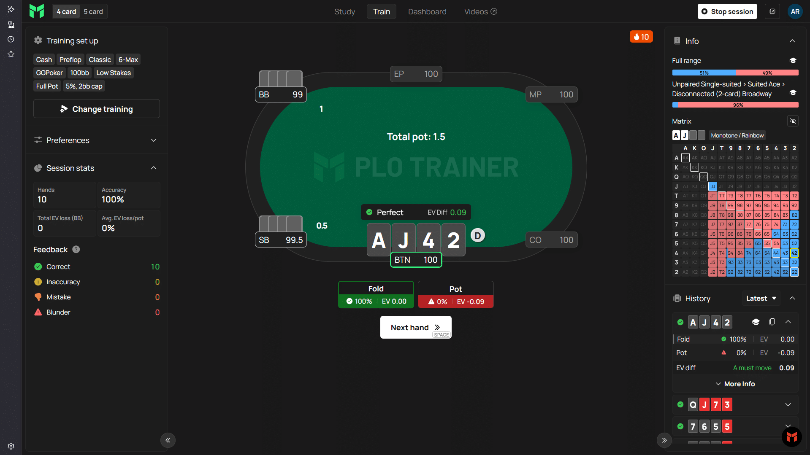
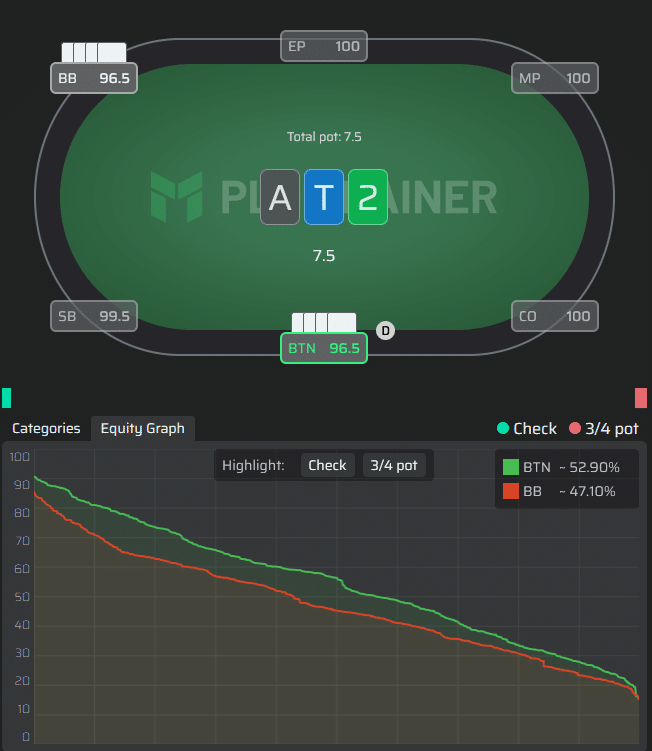
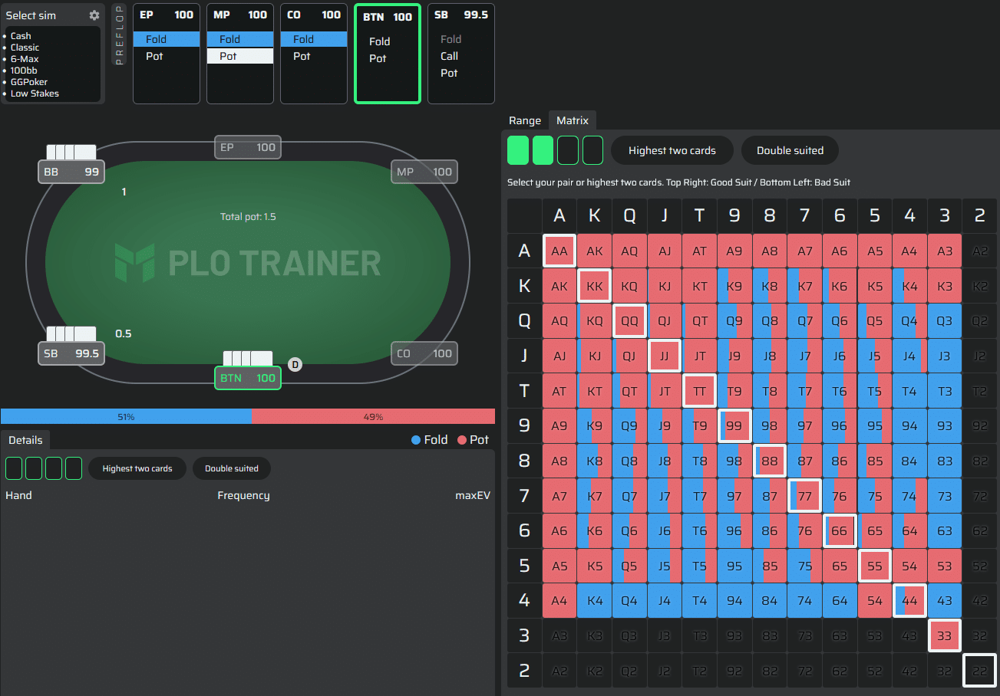
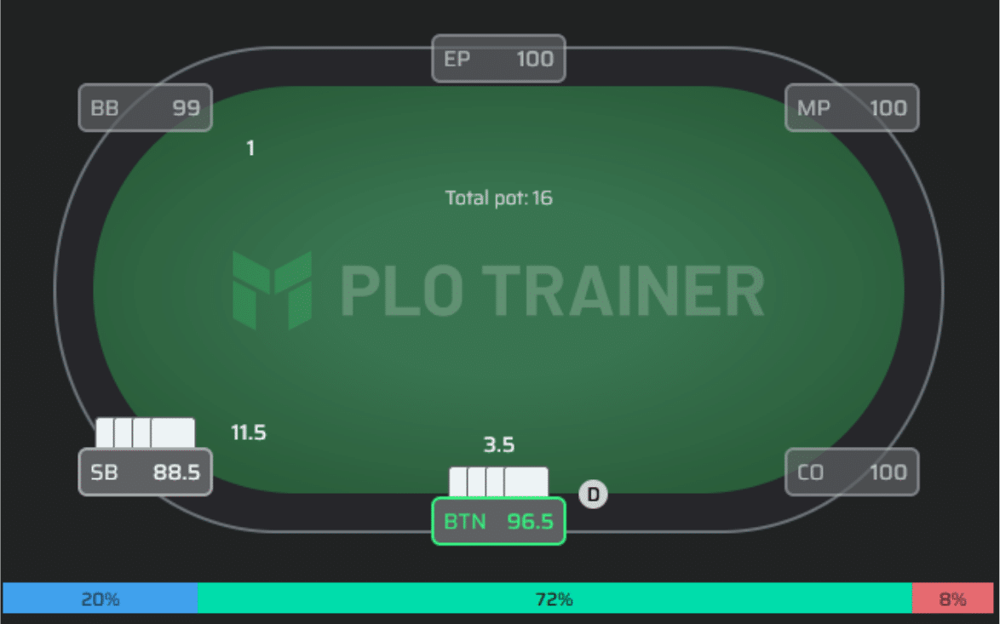
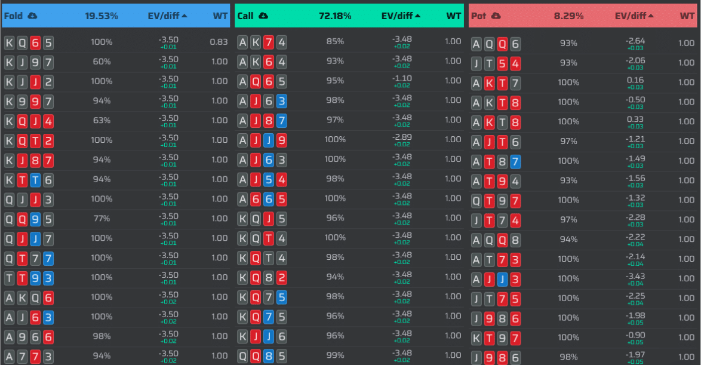
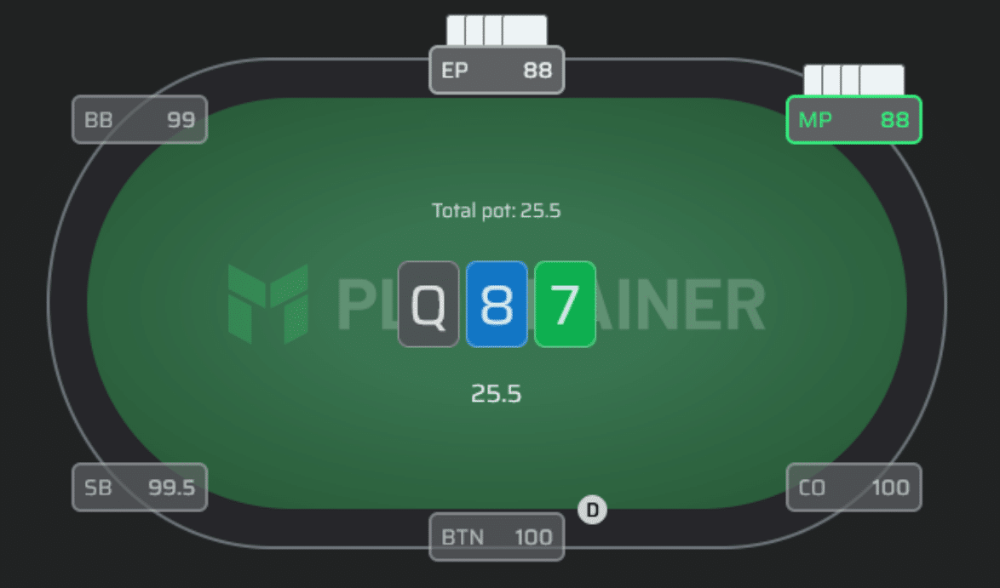
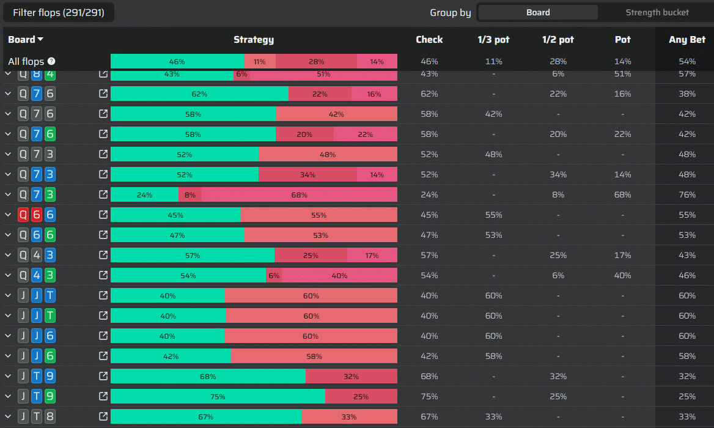

将你的无限注德州扑克（NLHE）优势转化为 PLO 的胜利

你或许也曾有过这样的时刻 - 你开始思考变革是否即将到来，以及下一步该如何走。

这种感觉可能源于多年稳步盈利后突然感到胜算不再稳固，也可能仅仅是出于对德州扑克之外新领域的好奇。

你可能在牌局结束后、观看直播时，甚至在闲聊中都曾有过这样的想法：尝试一下 PLO 会是什么感觉？

在本指南中，我们将带你了解你将面临的各种情况、游戏的独特体验，以及玩家用来精通它的策略工具。你会发现一些熟悉的原则，同时也会发现奥马哈扑克如何挑战并提升你的策略思维。

欢迎来到这场伟大的游戏。

### 不同的节奏

好消息是：你在 NLHE 中投入的时间、所做的研究以及做出的调整仍然至关重要。事实上，在 PLO 中取得成功的最快途径就是学习如何有效地运用你已有的经验。

>“我刚开始打牌的时候，做过的最明智的决定就是聘请一位教练，对我来说，我的教练就是 JNandez。这真的对我的学习产生了巨大的影响。他那套翻牌前手牌分类体系彻底改变了我的游戏方式。它为我打下了坚实的基础，并构建了一个清晰的框架，而在此之前，我根本没有这样的框架。”
>
> \- Luuk

**各游戏起始牌型组合**

|NLHE|PLO|PLO5|
|---|---|---|
|169|16,432|134,459|

但真正的区别不仅仅在于数字，更在于节奏。

某种程度上，从 NLHE 转战 PLO，就像古典钢琴家精通爵士乐。

德州扑克节奏较慢，更注重策略，牌局的胜负往往清晰分明，决策也至关重要，因此胜负难分。一手牌就像一场决斗，一方占据绝对优势。

相比之下，奥马哈的节奏更快，牌局更激烈，牌面更接近。它更像是一场赛跑，多手牌争夺领先地位。牌面的分配更加均衡，牌局之间的碰撞也更加激烈。翻牌圈很少能决定胜负，公共牌的发展对牌局走向的影响也更大。

这会增加波动性，的确，涨跌幅度会更大，但波动性也是任何健康的扑克生态系统的命脉。

对于休闲玩家来说，正是波动性让游戏体验保持刺激和活力。赢牌掩盖了他们的弱点，驱使他们继续游戏。从长远来看，这最终会为那些训练有素、牌技扎实的玩家带来更大的优势。

从这个意义上讲，波动性不仅仅是噪音或下风。它使职业扑克成为可能，并带来利润。

### 我们将走向何方

在接下来的章节中，我们将从多个层面探讨这一转变：

- 战术层面：步入生态系统
    宏观层面的环境是怎样的？人们如何进行宏观层面的博弈？

- 战略层面：发现规律
    PLO 在感觉和策略上有何不同？

- 职业层面：长远展望
    如何构建长期优势，以及如何将 PLO 作为一项职业？

- 总结反思

我们将分享教练们在经历同样旅程时的真实故事和心得体会，并邀请你在接下来的几章中检验自己的直觉。

我们还将探讨范围矩阵、聚合报告和权益图等工具 - 这些框架可以将复杂的问题简化为启发式方法。你将了解为什么权益价格走势更为接近，以及 EV 差异如何突出显示哪些方面可以灵活运用，哪些方面需要精准操作。

那么，如今奥马哈的生态系统究竟是怎样的呢？我们就从这里开始。

## 战术层面：步入生态系统

任何扑克生态系统都可以用两个因素来衡量：休闲玩家输钱的速度，以及抽水从牌池中抽走的金额。这两个因素决定了职业玩家实际收入的上限。为了更清晰地了解奥马哈扑克，我们需要分析相关数据。

### 游戏环境

PLO 的竞争环境是否更胜一筹？答案是肯定的。

答案在于职业扑克玩家都深谙的道理：你的优势不仅来自你拿到的牌，也来自你所处的游戏环境。

如果你能正确选择网站和座位，就能轻松找到最佳的投资回报率。将 PLO 加入你的游戏组合，可以拓展你的游戏版图。你无需再苦苦等待合适的德州扑克阵容，而是可以接触到更多不同的游戏。

以 PLO200 牌桌为例。在我们的研究中，我们绘制了三个特定扑克网站上休闲玩家的密度图，以及职业玩家的胜率如何随牌桌上休闲玩家数量的变化而变化。

结果显而易见：职业玩家的平均胜率随着休闲玩家数量的增加而显著提升，而且在不同网站上，你需要多少 “鱼”（水平较差的玩家）才能赢钱，这种差异非常明显。

**每张常规牌桌平均休闲玩家人数**

|网站|0 名休闲玩家|1 名休闲玩家|2 名休闲玩家|3 名休闲玩家|4 名休闲玩家|平均值|
|---|---|---|---|---|---|---|
|Pokerstars|0.19%|21.3%|44%|26.6%|7%|2.2%|
|ACR|16.7%|33.3%|30.4%|13.3%|2.7%|1.5%|
|GGPoker|4.2%|19.4%|33.8%|28.8%|11.9%|2.3%|

**根据休闲玩家人数计算的常规玩家平均胜率**

|网站|0 名休闲玩家|1 名休闲玩家|2 名休闲玩家|3 名休闲玩家|4 名休闲玩家|平均|
|---|---|---|---|---|---|---|
|Pokerstars|-3.3|6.2|9.6|10.8|12.5|9.1|
|ACR|-3.6|1.6|5.4|7.6|10.3|3.4|
|GGPoker|-10.11|-3.31|0|3.19|5.19|0.6|

PLO 中确实存在优势 - 但就像任何游戏一样，优势很大程度上取决于具体情况。战术上的挑战不在于 PLO 在理论上是否 “可战胜”，而在于如何选择合适的牌桌和环境，从而在实践中实现取胜。

### 玩家池

目前的奥马哈玩家池与德州扑克玩家池有所不同。投入大量资源进行深入研究的玩家较少。错误发生的频率更高，而且往往代价更大。以下是一些最常见的错误：

- 对加注和 3-bet 跟注过于松散，导致太多不该进入底池的牌进入底池。我们当然可以比在德州扑克中跟注更多的 3-bet，但尤其是在位置不利和高抽水环境下，我们需要更加谨慎地选择跟注。
- 过度玩非坚果牌，例如底顺、弱同花和难以提升牌力的两对。
- 下注过于注重价值，导致过牌范围暴露，容易被对手利用。

对于进入奥马哈扑克圈的职业玩家来说，这意味着机会，因为玩家群体的集体智慧仍在不断积累。你无需做到完美 - 只需做好准备。即使是策略上的微小改进，也能迅速累积成显著优势。

### 游戏进程

从宏观层面来看，奥马哈的玩法有所不同。更多玩家会看到翻牌，更多底池会变成多人底池，更多公共牌会引发激烈的争夺。由于双方的权益更加接近，底池规模增长迅速，这意味着你往往在转牌圈就在玩相当可观的筹码量。

>“你经常会参与牌局，而且牌面走势往往更加接近，这意味着你会比在 NLHE 中更频繁地遇到势均力敌的抉择。我发现这一点非常吸引人，我在牌桌上总是会认真思考。”
>
> \- Mike

这并不意味着盲注阶段就无关紧要 - 在牌桌较紧的情况下，前位牌型范围的压力以及盲注对盲注的优势仍然至关重要。但在大多数游戏中，真正的胜负取决于能否组成最强牌型：你的牌或范围在河牌圈达到最强牌型的可能性有多大。

在德州扑克中，一对牌往往能让你轻松取胜。但在奥马哈中，这种情况很少发生。你需要的是不仅当下能够立于不败之地，而且能够经受住多次公共牌面考验的牌。

### 牌桌氛围

此外，还有能量。更多的牌，更多的翻牌，更多的决策。

> “这更有趣，这是一款非常有趣、复杂且充满刺激的游戏。我尤其喜欢现场 PLO 游戏。它真的太好玩了，直到今天我仍然期待着每一场现场游戏。”
>
> \- Alex

这是一个微妙却意义重大的区别。你不会像玩其他游戏那样长时间弃牌，而是会持续不断地参与牌局。这款游戏鼓励思考、解决问题和集中注意力。对于那些擅长做决策的职业玩家来说，这并非缺陷，而是一项优势。

## 策略层面：发现模式

既然你已经观察过牌桌并感受过节奏，接下来让我们一起了解职业选手在奥马哈中的实际思维方式。哪些框架能帮助你更清晰地分析牌局，哪些工具能加快发现模式的速度，以及你现有的德州扑克技能在哪些方面能发挥意想不到的作用。

|可迁移的德州扑克技能|你应该练习的内容|
|---|---|
|位置意识|极化下注（IP）和更稳健的下注（OOP）|
|范围 / 极化优势|优势下注的频率|

如果说德州扑克讲究的是精准，那么奥马哈讲究的是识别。你不可能记住所有的牌型组合 - 组合实在太多了。相反，你需要学会发现模式并理解牌面价值的变化。这正是奥马哈开始展现其独特语言之处。

### 频率与模式

在德州扑克中，精准是优势的基石。了解精确的频率 - 持续下注的频率、过牌的频率、持续下注的频率 - 决定了现代扑克玩法的精髓。求解器进一步强化了这一重点。频率对齐方面的小错误会迅速累积，顶尖玩家会投入大量精力来改进这些错误。

在奥马哈中，精准度同样重要，但组合数量庞大，记忆并不现实。奥马哈有 16,432 种起始手牌，而不是 169 种，你不可能简单地记住每种手牌在特定位置的对应关系。因此，奥马哈奖励的是模式识别能力。

>“最让我震惊的是，我的强牌竟然这么快就变成了垃圾。在德州扑克里，如果你翻牌圈击中了顶对顶踢牌，你会感觉很棒。但在 PLO 里，同样的牌到了转牌圈往往就只能弃牌了。这彻底改变了我的思维模式，让我不再过分看重一对牌，而是开始考虑听牌和成牌的可能性。”
>
> \- Luuk

哪些范围与公共牌 X 更契合，是 EP 的开局范围还是 BB 的跟注范围？哪些组合能让你在多种公共牌局中都具备可玩性？顺子、对子和花色如何相互作用，从而改变权益动态？

>“PLO 最让我惊讶的是，翻牌前策略对你能否获得可观胜率的影响竟然如此之大。如果你的翻牌前策略出了问题，翻牌后几乎不可能持续赢钱。”
>
> \- Beni

学习 PLO 时，首先要学习的是手牌类型和结构：双同花百老汇牌、连牌连接性、组成坚果组合，以及影响牌型组合可行性的各种阻挡牌。一旦掌握了手牌类型，你就知道该运用哪些技巧；在牌桌上，细节也会迎刃而解。

训练设置是学习手牌类型的绝佳工具。在每一手牌中，你都可以立即确定你的手牌属于哪一类，以及在你的牌型范围内，需要采取哪些特定行动。

在这里我们可以看到，在 BTN，我们 96% 的牌型都是用 A 同花开池，这些牌型除了 A 之外还有其他高牌，但其他方面并不连贯。所以，即使我们这手牌本身是同花色且两张低牌，应该弃牌，但我们已经了解到，这类牌型几乎总是需要加注。

### 控制与自由

许多德州扑克玩家都会注意到一个实际的意外：即使你拥有范围或极化优势，PLO 的权益通常也很低。权益图 - 一个直观展示你的范围在特定牌面上与对手范围对比的图表 - 可以迅速说明这一点。

- 最强的牌在左边，较弱的牌在右边。
- 较高的线表示每个扇形区域内哪个牌型范围领先。
- 当一条线始终高于另一条线时 - 就像这里 BTN 的情况 - 该玩家拥有整体权益优势。
- 顶部较大的差距意味着强牌尤其占优势。

无需追踪具体数字 - 只需观察形状：线越高，牌型范围越强。

在实战中，这改变了你利用位置的方式。明显的范围优势不再总是意味着可以进行标准的持续下注；相反，你有时会利用位置来控制底池大小，并在之后利用优势加注。图表会告诉你安全在哪里，以及你需要保留弃牌率的地方。这不再是 “我稳操胜券”，而是 “我领先，我可以加注，也可以保持小额下注”。这是一个微妙但强大的战术转变，也是 PLO 吸引那些喜欢多轮决策的玩家的原因之一。

在德州扑克中，这样的公共牌通常足以支持全范围持续下注。但在奥马哈中，则不然。

这通常是 NLHE 玩家的关键 “顿悟” 时刻：即使拥有明显的范围优势，你也必须考虑对手与公共牌的关联性。

>“你能掌握的边牌和阻挡牌等信息量巨大。更多组合，更多思考，更多冒险，更多乐趣。越多越好。”
>
> \- Ville

原因在于：双方的权益仍然很接近。BB 仍然和公共牌有广泛的联系。过度下注会受到惩罚。相反，BTN 玩家会更多地依赖位置优势 - 更频繁地过牌，控制底池大小，并在后期才下注扩大优势。

这是 NLHE 玩家在 PLO 中遇到的第一个策略上的惊喜：即使图表显示优势明显，实际执行起来却截然不同。

在权益分配不那么两极分化的游戏中，你不再那么依赖特定的牌来获得强牌。优势来自于大多数玩家尚未掌握这种打法。游戏的策略尚未完全被破解，创造性的打法和有利可图的错误机会无处不在。

### 从高处俯瞰游戏

翻牌前矩阵的工作原理与德州扑克图表类似，但它考虑了花色组合，你首先选择的牌是你手中最大的两张牌。对角线是关键：右上角的组合是 “好花色”（与你最大的牌同花，例如：A♠️K♥️7♠️6♥️），而左下角的组合是 “坏花色”（与你最大的牌不同花，例如：A♠️K♠️7♥️6♥️）。

每个方格中的颜色代表当前的 GTO 策略：红色表示下注或加注，蓝色表示弃牌。

这个矩阵也适用于翻牌后游戏，可以快速得出一些结论，例如：我们多少频率会在公共牌 Q-J-T 上用 K-K 下注？热力图能让你迅速找到最佳下注牌，并有可能开辟一些出人意料的诈唬路径。

### 学习概念，而非组合

NLHE 玩家在接触奥马哈时容易陷入的一个陷阱是，试图用他们习惯的逐手牌的精确度来研究游戏。由于起始手牌数量众多，这种方法很快就会让人感到不知所措。

这时，求解器和工具就能派上用场 - 但前提是我们要正确使用它们。如果你搜索如何打好你手中的牌，你最终只会得到一些在特定情况下有用的微观结论，但这些结论过​​于狭隘，无法应用到其他情况下。

相反，真正的价值在于从宏观角度看待问题。通过将手牌分组 - 例如双同花百老汇对子 - 你就能开始了解整个牌型结构的运行规律。突然间，解题器不再教你如何打好一手牌，而是向你展示一类牌型通常的运作方式。

这才是 PLO 研究的精髓所在。你不可能记住某个特定的牌型组合，但你可以学习适用于各种情况的总体概念。而这些概念正是你在牌桌上能够运用的关键。

### EV 差值 - 了解犯错的代价

你将使用的最有用的工具之一是 EV 差值：它衡量的是最优解与次优解之间的差距。这个数值可以告诉你，偏离最优解是理论上的错误还是实际的选择。

在 PLO 中，你会发现很多优势非常小的牌局 - 比如，4-bet 的概率略高于跟注，或者持续下注的概率也只略高一些。这种接近性其实是一种诱惑：利用牌桌的氛围，在牌桌需要的时候调整策略，而将你的自律留给那些真正重要的、EV 差距较大的牌局。

较小的差距 - 比如 0.03bb - 表明存在一定的灵活性。

这种灵活性可以用来采取一些策略，例如，当对手 3-bet 过于紧缩时，你可以选择跟注而不是 4-bet；或者，如果你预判对手的策略过于激进，可以加入一些更具侵略性的打法。

相比之下，较大的差距则表明精准性至关重要。

> “ PLO 是一款以权益驱动的游戏，而 NLHE 则更注重牌型范围。在 PLO 中，阻挡牌的作用远大于 NLHE，这使得半诈唬成为一种高收益的打法。这也导致了更多的行动。总的来说，玩家的平均水平会下降，尤其是在手中牌的数量增加时。”
>
> \- Beni

### 平衡策略与剥削策略

人们普遍误解奥马哈，认为它完全依赖于各种激进的策略 - 平衡策略无关紧要。但事实并非如此简单，要理解这一点，我们首先需要了解平衡策略和剥削策略在两种游戏中的区别。

在两种游戏中，平衡的打法都是基础。如果过于偏离平衡，强大的对手会惩罚你。但剥削策略的运用方式却截然不同。

在德州扑克中，如今的玩家水平更高。剥削策略通常意味着根据个体玩家的特点调整策略 - 识别特定的倾向并有选择地进行惩罚。

在奥马哈中，剥削策略的普遍性错误仍然更为突出。许多玩家过度频繁地持续下注。还有一些玩家在权益较低的情况下错误地运用德州扑克的经验法则。

最可靠的剥削策略并非针对某个特定的对手 - 而是理解整个玩家群体的倾向，并构建能够利用这些漏洞的反制策略。

这使得 PLO 首先成为一款平衡游戏，其上叠加了一层强大的玩家群体剥削机制。它并非混乱无序，而是一种结构化的即兴发挥。真正的优势来自于掌握定义游戏的模式，而非记忆成千上万种不同的结果。

### 聚合报告：大规模模式识别

PLO 的挑战之一并非在于如何应对某一手牌，而在于理解你的策略在数百种不同的牌面结构中应该如何运作。这就是聚合报告的用武之地。它无需你逐个点击查看牌面，而是让你一目了然地了解策略在所有翻牌圈或特定子集中的表现。

在所示示例中，MP 在翻牌前对 EP 进行 3-bet，翻牌圈过牌。聚合报告显示：

- 模拟中的每个翻牌圈
- MP 在每张牌面上下注与过牌的频率
- 下注额度偏好
- 牌型分类（三条、两对、听牌、空气牌等）

你可以在此处应用筛选器，快速解答策略问题：

- 我们在对子牌面上持续下注的频率如何？
- 我们在 A 高牌面还是 8 高牌面下注更多？
- 双色牌面和彩虹牌面的情况有何不同？
- 动态顺子牌面和干燥牌面的处理方式是否不同？

聚合报告可以轻松发现宏观模式 - 例如，某些位置即使作为进攻方，也可能只有大约 50-60% 的翻牌圈会持续下注，或者在德州扑克中会 “自动下注” 的牌面在 PLO 中会遇到更多过牌的情况。

就像矩阵能提供构建范围的全局视角一样，聚合报告也能提供翻牌圈的全局视角。它将数百个牌面压缩成易于探索和理解的内容 - 让你能够逐个牌面，而是逐个类别地训练你的直觉。

### 巡回结束

PLO 的策略与其说是死记硬背完美的应对策略，不如说是培养思维习惯：识别牌局结构，参考矩阵，查看权益图，并判断期望值差距有多大。

反复练习，你就能发现那些能转化为可重复优势的模式。下一节，我们将从这些框架过渡到职业层面的考量 - 如何选择合适的牌局来发挥你的技能。

## 职业层面：长期展望

转型到 PLO 不仅仅是学习新的战术或调整你的策略。在职业层面，它还意味着融入一个不同的生态系统 - 一个拥有自身独特现实、风险和回报的生态系统。

本节将探讨如何在 PLO 中建立可持续的职业生涯：职业玩家如何看待职业生涯的长期性、结构和发展。

### 牌局选择与生态系统

PLO 的优势并非仅仅来自策略的改进。它首先取决于你的游戏处境。

正如本指南开头所述，牌桌上休闲玩家的数量对胜率有着显著的影响。如果有两名或两名以上休闲玩家，常客通常能获得不错的收益，具体收益取决于网站。但如果只有一名休闲玩家，即使是实力强劲的职业玩家也可能勉强收支平衡。

> “我现在可选择的游戏种类多了很多。以前我只能玩德州扑克，现在我可以选择 NLHE、PLO4、PLO5 或 PLO6。时不时换换口味让我觉得更有意思，而且我还能选择最好的游戏。”
>
> \- Ville

这意味着首要优势并非在于你的持续下注频率，而在于你对牌桌的敏锐洞察力。你需要有纪律地选择盈利的牌桌，并有耐心放弃那些抽水或牌桌阵容会侵蚀你投资回报率的牌局。

在现场牌桌上，这种洞察力通常还延伸到牌局形式（PLO4 或 PLO5 ）、抽水结构以及牌桌动态。 PLO 的职业生态系统会奖励那些像对待翻牌后决策一样认真对待选座的玩家。

### 职业生涯的持久性和发展

职业扑克生涯通常遵循这样的轨迹：从粉丝到学生再到新手，不断积累稳定性，最终成为职业选手。有些人会达到成熟职业选手的阶段，专注于高投资回报率的牌局，甚至成为专家，并涉足教练或投资领域。

转换牌局形式并不会完全重置这段旅程 - 它只是让你退后几步，让你重新体会到攀登的感觉。对一些人来说，回归粉丝 - 学生的心态正是他们职业生涯得以延续的关键。

曾经让你热血沸腾的游戏，未必能永远如此。有时，为了保持竞技的乐趣，职业扑克之路需要尝试不同的游戏形式。

对一些人来说，PLO 甚至 PLO5 就是其中之一。在很多方面，它都像是扑克的新领域：广阔的探索空间，尚未破解的模式，以及等待发掘的优势。

### 数量、波动与资金管理

每位职业玩家都知道：波动是游戏的一部分，在 PLO 中，波动的影响更为显著。四张底牌意味着更多的权益波动、更多势均力敌的局面以及更多全压对决。这意味着你的资金管理必须相应调整。

从长远来看，波动为玩家展现技巧提供了空间，并通过吸引休闲玩家参与游戏来提高胜率。那些合理规划资金结构并以耐心对待游戏的职业玩家会发现，最终的胜率会趋于平稳。

正如贾里德·滕德勒在《扑克的心理博弈》一书中写道：

“有些玩家会考虑自己的盈利率：如果他们在一个小时内输掉了一个买入，那么他们就相当于赚到了平均每小时收益 X 美元。……有些玩家认为使用每小时收益来为输钱找借口。在小样本的情况下，这或许没错，但你的盈利率所基于的样本量越大，它就越可靠。”

这种思维方式并不能消除波动 - 它只是赋予了波动以意义。而当与合理的资金管理相结合时，它就成为专业人士保持务实态度的视角。

### 倾向与自我认知

在回答这些实际问题时，你是否发现自己经常选择过牌，或者下注次数少于建议次数？

你是否更倾向于避免不必要的风险？更倾向于在激进和耐心之间谨慎权衡？还是更倾向于抓住一切机会施压？

这些并非一成不变的性格。它们是经验和思维模式塑造的偏好。了解它们就像一面镜子：你可以看清自己的自然倾向何时对你有利，何时又会阻碍你前进。

让我们来看看三种主要的倾向。思考一下你与每种倾向的关联，并注意每种倾向在 PLO 中带来的优势、陷阱和心理挑战。

**被动型**

具有被动倾向的玩家擅长避免不必要的风险。他们很少会被拖入底池过大且牌力较弱的局面，能够从对手的诈唬中榨取最大价值，并自然而然地保持过牌范围的平衡和安全。

然而，谨慎的陷阱在于它容易演变成可预测性。精明的对手会轻易地将你拖入摊牌，而当盈利机会被错失时，EV 就会损失。这里的关键在于，要能够分辨谨慎是源于良好的判断，还是出于恐惧。

通过提升价值识别能力，并允许自己偶尔大胆出击，你可以将坚实的基础转化为一套完整且富有韧性的策略。

**平衡型**

平衡型玩家善于灵活变通，并能灵活应对各种情况。他们能权衡利弊，在牌型有利时加注，在不利时则及时止损。这让对手难以捉摸 - 在 PLO 这种瞬息万变、波动性极高的环境中，这是至关重要的优势。

但适应性也存在陷阱：如果你过于依赖算法输出而忽略群体误差，可能会导致 EV 大幅下降。例如，当算法显示对手有 40% 的概率弃牌，而实际只有 10% 时，你可能需要调整你的 3-bet 范围。

这种策略的关键在于策略的运用 - 只要你对群体趋势有深刻的理解，并结合自身已有的知识储备，就能将两者优势完美结合。

**激进型**

激进型玩家总是全力以赴，抢占先机，迫使对手做出艰难的抉择。他们通过惩罚过度弃牌的玩家和剥夺对手的权益来获利，往往能在高压局面下榨取最大价值。

但持续的进攻可能是一把双刃剑。面对频繁跟注的对手，过度诈唬会迅速消耗筹码，而持续施压则可能使波动性飙升至令人精神疲惫的程度。关键不在于抑制进攻性，而在于引导它。通过将天生的驱动力与选择性 - 选择合适的牌面、合适的阻挡牌和合适的对手 - 相结合，激进型玩家可以将波动性转化为持续的优势。

从心理层面来说，这意味着要懂得何时放慢脚步，并非因为进攻性本身是错误的，而是因为只有在时机恰当时，进攻性的优势才能最大化。

## 总结

PLO 不仅仅是另一种扑克变体。它是一个拥有发展空间的生态系统，一款充满探索乐趣的策略游戏，以及一条能够比单纯的德州扑克更能延长职业生涯的职业道路。

你已经了解了波动性如何驱动这个生态系统，策略如何建立在模式和概念之上，以及职业玩家如何将结构转化为长久的成功。你也看到了自己的风格 - 耐心、平衡或激进 - 以及它如何在这里找到归宿。

无论你是全身心投入，还是将其作为德州扑克之外的第二语言，奥马哈都能提供一些难得的东西：让你有机会再次体验深度学习的乐趣，同时还能玩到一款依然能够奖励那些付出努力的人的游戏。

> “最终发现这并没有那么可怕。它仍然是扑克。如果你了解一种游戏的规则，你也能学会其他变体的规则。”
>
> \- Ville

牌已准备就绪。