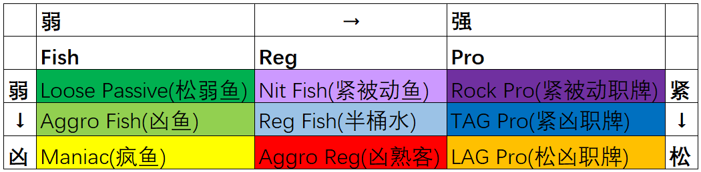

## 简介

在网络扑克的世界里，玩家风格千差万别。为了更好地理解对手、调整策略，我们可以将玩家按照两个维度进行分类：

* 实力维度（横向）： 从 Fish（鱼） → Reg（常客） → Pro（职业牌手），代表技术水平的提升。
* 风格维度（纵向）： 从紧（Tight） 到松（Loose），同时结合被动 / 激进的差异。

这两个维度交织后，形成一个 3×3 的矩阵，涵盖了绝大多数线上玩家的风格类型。

## Fish 区（休闲玩家）

Fish 通常是新手或以娱乐为目的的玩家，他们的打法特征比较明显：

* Loose Passive（松弱鱼）
  喜欢看很多牌，但很少主动下注或加注，典型的“跟注站”。
* Aggro Fish（凶鱼）
  出手范围过宽，而且过度激进，经常无谓地下注和加注。
* Maniac（疯鱼）
  极度松凶，不断加注、全下，打法完全失控。

## Reg 区（常客玩家）

Reg（常客）在平台上经常出现，他们具备一定的经验，但水平层次不齐：

* Nit Fish（紧被动鱼）
  起手牌选择很紧，但打法被动，缺乏创造性，容易被剥削。
* Reg Fish（半桶水）
  具备基础概念，会模仿标准打法，但缺乏深度理解，常在边缘牌局中出错。
* Aggro Reg（凶熟客）
  激进打法的常客玩家，懂一些理论，但容易过度偷鸡或在边缘牌上强打。

## Pro 区（职业玩家）

Pro（职业牌手）是线上环境中最难对付的群体，他们具备完整的理论体系和实战经验：

* Rock Pro（紧被动职牌）
  打得非常紧，风格保守，稳定盈利，但上限有限。
* TAG Pro（紧凶职牌）
  最常见的稳定赢家，打法紧凶而平衡，是标准的职业风格。
* LAG Pro（松凶职牌）
  顶级职业牌手常见的风格，打法松凶但高度平衡，具备极强的后手能力。

## 系统的优势

- 视觉直观：颜色一眼区分打法类型，减少思考成本。
- 牌桌快速决策：无需复杂数据解读，就能迅速判断对手倾向。
- 适配范围广：既可用于线上 HUD，也可用于现场笔记或教学。

## 常见玩家比例分布

不同平台和级别下，玩家类型的比例会有所差异。以下表格提供一个典型的网站（GG）微级别（PLO25）各个分类玩家的比例大致估算，仅供参考：

| 类别       | 类型                 | 占比（参考） |
| -------- | ------------------ | ------:|
| Fish | Loose Passive（松弱鱼） | 25-30% |
|          | Aggro Fish（凶鱼）     | 10-15% |
|          | Maniac（疯鱼）         | ~5%   |
| Reg  | Nit Fish（紧被动鱼）     | 5-8%   |
|          | Reg Fish（半桶水）      | 15-20% |
|          | Aggro Reg（凶熟客）     | 8-12%  |
| Pro  | Rock Pro（紧被动职牌）    | 2-3%   |
|          | TAG Pro（紧凶职牌）      | ~5%   |
|          | LAG Pro（松凶职牌）      | 1-2%   |