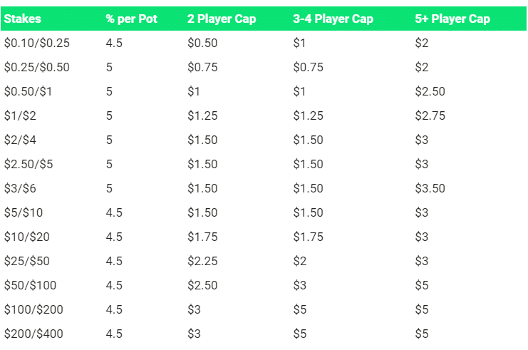
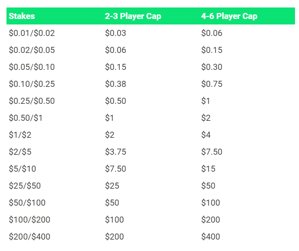

PLO5 的规则与 PLO 的规则相同。你必须使用两张底牌和五张公共牌中的三张来组成你的牌型。唯一的区别是你会额外获得一张底牌，总共五张。在本文中，我将分享一些我迄今为止总结的关键策略见解。

## 1. 将 PLO4 中的概念转化

在扑克中拥有更基础的教育路径之所以如此有价值，是因为当你过渡到新的游戏时，你可以借鉴相同的概念，并将这些概念运用到新的游戏中，从而得出结论。

在 PLO5 中，你可以运用与 PLO4 相同的概念，但你的优势在于理解这些概念如何转化。例如，要认识到第五张底牌的存在意味着 K-K 双同花牌价值大大降低，而边牌则变得至关重要。

就像 PLO 和 NLHE 的区别一样，在 PLO5 中多一张底牌会带来巨大的差异。PLO5 大约有 260 万种可能的起手牌组合，而 PLO4 只有 27 万种。

### 跟注

由于你持有中等强牌的权益更高，并且更有动力进入翻牌圈，因此冷跟注频率会增加。基于你会更频繁地防守盲注以及在有利位置进行更多跟注，你的整体 VPIP 应该会增加。

虽然考虑到人们玩的牌局太多，你的 VPIP 可能会略微降低一些。

就像在 PLO4 低级别游戏中一样，人们玩的牌太多，你必须收紧策略，因为你需要一手能够赢牌并且比在 GTO 游戏中更频繁地压制多个玩家的牌。

### 下注

在某些情况下，你可能需要下更大的注，因为你的对手平均而言会比你的价值范围更有优势。

你需要更多的额外权益才能证明用一手对对手范围权益很低的牌下注是合理的。你会更容易被跟注，但你也需要一些保护。

面对翻牌前加注者领先下注，可以避免对手有效诈唬我们的机会。如果你让对手免费拿到一张牌，他们在转牌或河牌圈更容易表明自己的牌型。

在 PLO5 中，你应该更频繁地主动领先下注。因为你有五张牌，这意味着更多的潜在阻挡牌，移除效果也更强。因此，无论是在单挑还是多人底池中，领先下注都更有优势。

### 同花

在 PLO4 中，一手单同花（两张同花牌）的原始权益与三张同花牌非常接近，但在可玩性方面却存在巨大差异。三张同花牌会降低玩家的价值，这一效应在 PLO5 中同样适用。这是一个重要的可玩性因素。

### 坚果性

在 PLO5 中，牌的质量坚果性至关重要。牌型优劣仍然非常重要。虽然拿到一手看起来不错的双同花牌很容易，但你必须抵制住诱惑，不要用那些双同花的垃圾牌入池。

在某些情况下，K 高同花的坚果性已经不够强了。人们经常会遇到多人底池，而在多人底池中，非 A 高同花非常危险，甚至可能比在 PLO4 中还要危险。

### 剥削

我经常看到有人高估自己在翻牌前和翻牌后的牌力。

在一款新游戏上市初期，玩家们往往打法比较松散，这是很正常的。由于玩家们都在尝试新的策略和想法，而且对游戏的研究时间也有限，所以你自然会遇到各种水平和类型的玩家。

慢玩和在手牌很强时选择过牌的原则依然存在，但 “手牌很强” 的标准发生了变化。你需要更多组合阻挡牌才能合理地选择慢玩，否则就等于白白送给对手几张牌。

总的来说，你会发现诈唬的次数会减少，英雄跟注的次数也会减少。

## 2. PLO5 中的最佳起手牌

提高翻牌前水平至关重要，你需要投入大量的时间和精力。这是五张牌扑克中最基础的部分。因为你多一张牌，所以翻牌前就显得尤为重要。糟糕的翻牌前表现会导致糟糕的翻牌，进而导致糟糕的转牌，如此循环往复。

在 PLO5 中，翻牌前有三个主要要素：坚果牌型和高牌强度、连牌性和同花性。这些要素越多（数值越高），我们的起手牌就越强。

### 坚果性和高牌强度

在奥马哈扑克中，你必须考虑的是，翻牌前的 “坚果牌” 潜力至关重要。翻牌后，你需要战胜很多对手，而做到这一点的关键在于增加你手中的 “坚果牌” 组件。当你的筹码量较少时，高牌的价值就更高了。

有了五张底牌，成牌就变得非常容易。如果我们的底牌较小，不仅容易被对手压制，而且相比四张底牌的情况，更容易被对手反超，因为双方的权益权益更加接近。拿到强牌，也就是坚果牌（所有牌型中有 25% 是 A 高同花），非常容易。所以，如果我们带着非坚果牌型的牌入池，对手很可能就持有坚果牌型。

### 连接性

与之前的规则一样，在 PLO5 中更容易组成顺子之类的牌型。我们的牌面连接性越差，就越容易被对手压制或被反超。

有些玩家可能低估了牌型连接性的重要性。在 PLO5 中，如果你的手牌连接性很强，意味着五张牌都相互关联，而不仅仅是四张，这会大大增强你的牌力。

翻牌前拿到的顺子听牌（姑且这么说）质量更高，权益更高，也更有潜力。反之，如果一手牌不太好，价值就会大打折扣。

### 同花性

拥有更多双同花牌型组合要容易得多。在 PLO5 中，大约一半的起手牌都是双同花。因此，了解自己手中的同花牌至关重要。如果你的牌型是低同花（即使是双同花），你的对手很可能凭借更高的同花听牌压制你。

当你只有单同花牌时，你必须格外关注你的边牌，在打牌时要尽可能地保持连接性。你需要专注于高连接性，以获得比对手更好的顺子听牌，从而在翻牌后占据优势。

### A-A

拥有一对口袋对子并不被视为主要组成部分，因为它不如其他牌型有价值。除了 A-A 之外，我们通常还需要其他好的牌型才能使我们的牌可以继续打下去。

以下是来自扑克工具的赔率预言机（Odds Oracle）的 3 个要点，可以帮助你更好地了解 PLO5 中 A-A 的强度。

- 与 PLO4 相比，PLO5 中 A-A（A-A-x-x-x）的数量大约多出 60%。这相当于 PLO5 中所有起手牌的 4.17%，而 PLO4 中这一比例为 2.57%。
- A-A-x-x-x 组合的排名在前 30%，这与 PLO4 中 A-A-x-x 的 5% 排名范围相比，这是一个很大的差距。
- 在 PLO5 中，47% 的 A-A-x-x-x 为双同花（至少持有一副 A 高的花色），而在 PLO4 中，只有 12.5% 的 A-A-x-x 为双同花。

### 3. PLO5 训练器

PLO5 Trainer 是一款基于云的 PLO 软件，只需点击几下鼠标，即可在几秒钟内访问预先解决的翻牌前和翻牌后 GTO 解决方案。

这是一种简单直观的学习 GTO 五张牌策略的方法。你可以在基于云的应用程序中切换位置和牌堆大​​小，加载预先求解的模拟题。

使用 PLO5 训练器无需下载，其简化的界面可直接在浏览器中运行。

### 翻牌后分析

在我们的 PLO5 训练器中，翻牌后分析是一项极其快速且直观的任务。

## 4. 在哪里玩 PLO5？

如果你想在线 PLO5，在众多常规网站中，GG 是最佳选择，你可以通过其旗舰网站 GGPoker 以及其他衍生网站（例如 Natural8）访问该平台。此外，还有一些其他选择，例如 Pokerstars 以及 Pokerbros、PPPoker 和 Upoker 等热门扑克应用程序。

### 流量

Pokerstars 上的游戏相对较少。只有几张 PLO25 和 PLO50 的牌桌在进行，仅此而已。GGPoker 则全天提供丰富的游戏选择，无论你身处哪个时区。

扑克应用程序的流量取决于俱乐部的地理位置。如果俱乐部主要由美国玩家组成，那么高峰时段通常是美国的晚上。

这些应用程序非常受欢迎，因为它们为来自受限市场的玩家提供了在线玩扑克的机会。PLO5 已经是近几年最受欢迎的扑克游戏形式之一了。

### 抽水结构

Pokerstars 提供 PLO5，级别从 PLO25（盲注 $0.25-$0.50）到 PLO40k（$200/$400）。

GGPoker 提供 PLO2 - PLO1k 级别的 PLO5 游戏，以及 PLO5k - PLO40k 级别的高额 VIP 游戏。所有级别的游戏均按底池收取 5% 的手续费。

这些应用程序提供 PLO5 游戏，基本上涵盖所有级别，但不同俱乐部的具体情况可能有所不同。

抽水结构为每底池收取 5% 的佣金，抽水上限为 3BB。这意味着在 PLO25 级别中，抽水上限为 $0.75，在 PLO100 级别中为 $3。对于 PLO600（$3/$6）及更高级别的游戏，抽水上限通常为 2BB。

### 返水

PokerStars 提供的宝箱奖励长期价值约为 5%。他们目前正在测试一项新的返水系统，20% 的玩家可以参与其中。

如果采用新的返水系统，玩家将获得至少 15% 至最高 65% 的返水。高额玩家可以通过每日奥马哈现金游戏排行榜获得额外返水。GGPoker 通过其 “鱼自助餐” 计划提供返水。玩家根据其玩家价值指数（PVI）获得至少 15% 至最高 60% 的返水。高额玩家还可以从每日 $25,000（PLO）排行榜中获得更多收益。

## 结论

PLO5 是一款非常受欢迎的游戏，至今仍然很受欢迎。它在扑克应用程序上很常见（PLO6 也是如此），并吸引了大量休闲玩家。

在 PLO5 中，你需要更强的牌才能赢得底池，而且边牌也更加重要。面对那些玩牌过多的玩家，你的打法要更紧一些，记住，花色的质量远比花色的数量重要。

扑克规则瞬息万变，这意味着休闲玩家所玩的游戏规则有时也会随之改变。因此，能够最快、最迅速地适应变化的玩家将拥有巨大的优势。

