掌握 PLO5 策略，在最刺激的扑克变体之一中占据优势。立即学习 PLO5 策略基础知识，在其他玩家赶上之前，横扫牌局。

## PLO5 基础策略：玩家必须掌握的 6 个技巧

如果你是 PLO5 的新手，那么首先学习基础知识至关重要。

以下 6 个 PLO5 策略技巧将帮助你避免最常见的错误，并堵住大多数在线扑克玩家在游戏中存在的重大漏洞。请始终牢记这些要点，并以此为基础构建你的 PLO5 策略。

### PLO5 和德州扑克的手牌力量不同

虽然两种游戏的牌型大小规则相同，但 PLO5 中的绝对牌力与德州扑克有所不同。顺子、同花和葫芦等牌型在 PLO5 中更为常见，因此你必须调整你的游戏策略以适应这一点。

无论何时考虑价值下注、诈唬或半诈唬，请记住你玩的是 PLO5。每位玩家有五张底牌，因此你和桌上其他所有人在河牌圈拿到更强牌的概率要高得多。

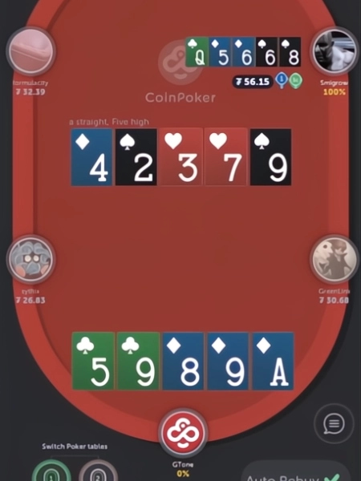

### PLO5 玩家之间的手牌权益更接近

在 PLO5 中，翻牌前各手牌的权益比在 NLHE 中要接近得多。在 NLHE 中，像 A-A 和 K-K 这样的手牌在翻牌前权益可能高达 80%，但在 PLO5 中这种情况并不常见。相反，大多数手牌即使面对像 A-A 和 K-K 双同花这样的强牌，通常也至少有 35% 的权益。

由于双方权益差距如此之小，位置、连接性和拿到坚果牌的可能性等其他因素就显得尤为重要。下次当你考虑用 A-A 或 K-K 这样的牌过度游戏时，请记住这一点。

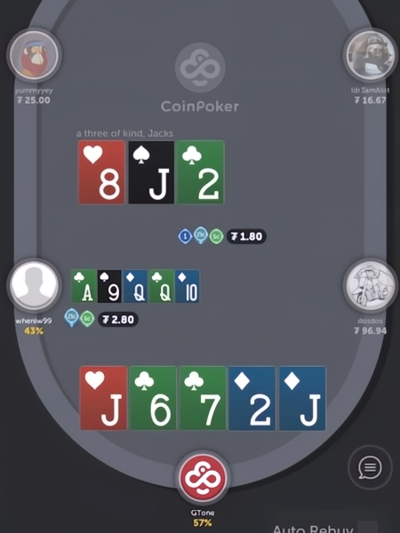

### 不要高估手牌强度

一手漂亮的起手牌固然诱人，但也可能导致麻烦。在 PLO5 中，小牌和小对子尤其棘手，因为它们通常无法在河牌圈组成最强牌。

你应该专注于玩那些有很高成牌潜力的牌，包括高顺子组合和 A 同花。翻牌发出后，不要在意翻牌前你的牌有多好，而只关注它与公共牌的配合。

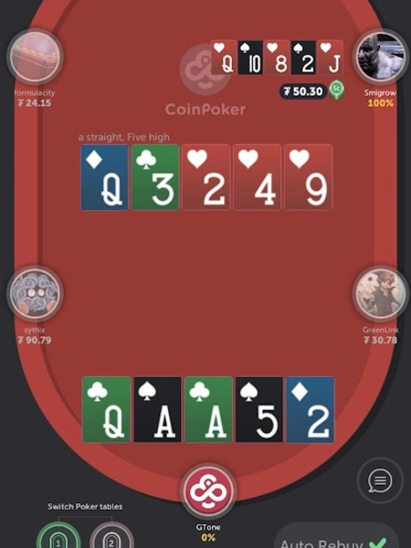

### 成对或同花的牌面带来危险

在 PLO5 中，对子牌面和同花牌面都很难打。在这样的牌面上，有人拿到同花或葫芦是很常见的。因此，对于非最强牌型的牌，务必谨慎。

在这样的牌面上，如果你手牌很强，当然应该争取赢钱，但你也可能从中找到不错的诈唬机会。同花牌面允许你用 A 阻挡牌进行诈唬，而对子牌面则允许你在持有三条时假装成葫芦或四条。

### PLO5 中的诈唬完全不同

诈唬是 PLO5 的重要组成部分，但它与 NLHE 有很大不同。在 NLHE 中，像顺子听牌和后门同花听牌这样的牌通常足以用来诈唬，但在 PLO5 中，则需要更强的牌型。

也就是说，你应该用那些至少有 12 张牌可以组成最大牌型的强力牌型来诈唬，但也要考虑阻挡牌。只有在你拥有组成最大牌型的阻挡牌时，才应该在权益不高的情况下进行诈唬，因为你有可能迫使对手弃掉所有牌型。

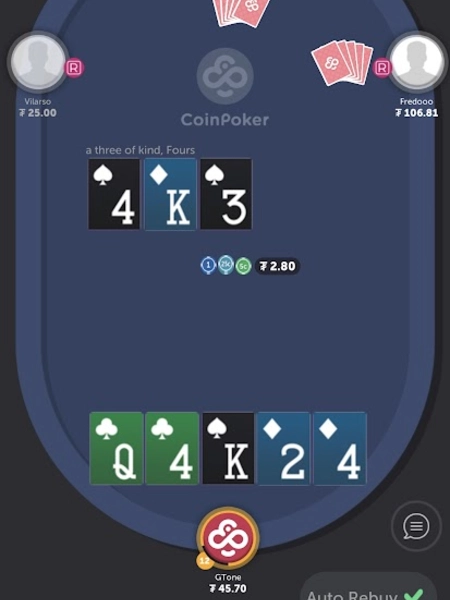

### 适应 PLO5 的赌注和对手风格

每个玩家玩 PLO5 的方式都不同，风格和策略也多种多样。在现场游戏中尤其如此，随着线上牌桌赌注的增加，情况更是如此。你会遇到各种各样的玩家，从只玩几手牌等待最佳牌型的 “紧手玩家”，到每局都全力以赴的 “疯子玩家”。

面对不同类型的对手，请记住调整你的 PLO5 策略并利用他们的习惯。这款游戏与其说是追求平衡，不如说是寻找对手策略中的漏洞并加以利用。

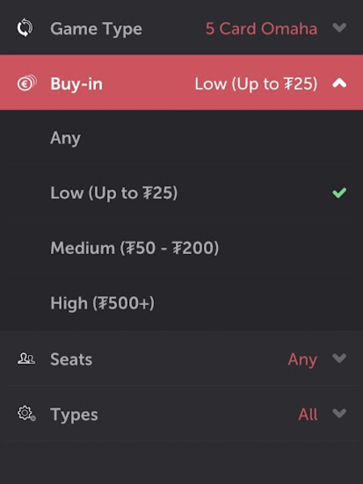

## PLO5 起手牌：翻牌前该玩和不该玩的牌

在 PLO5 中选择合适的起手牌比在 NLH 中要复杂得多。

拥有正确的 PLO5 翻牌前策略至关重要，因为翻牌前选择的起手牌决定了你的成败。以下是 PLO5 中你应该注意的最佳和最差起手牌。

### 在 PLO5 比赛中，翻牌前应该玩哪些起手牌？

PLO5 的最佳起手牌具备很强的连接性、双同花色和高对子。这意味着这些牌型最容易组成顺子、同花和葫芦。

不要试图记住这个游戏中的 “十大牌型”，而是要理解这些牌型为何是最佳选择。以下列举了在 PLO5 中，无论处于哪个位置，你都值得玩的十种牌型：

一些最佳的 PLO5 起手牌

- A♥️A♣️K♥️K♣️Q♠️
- A♠️A♥️Q♠️Q♥️K♦️️
- A♥️K♣️Q♥️J♣️T♠️
- A♣️K♦️️Q♣️J♦️9♥️
- A♣️Q♥️J♣️T♥️9♦️️
- K♠️K♦️️Q♠️Q♦️J♣️
- K♥️K♠️J♥️J♠️T♦️️
- K♦️️Q♥️J♦️T♥️9♠️
- Q♦️️J♠️T♦️9♠️8♥️
- J♠️T♥️9♠️8♥️7♦️️

### PLO5 翻牌前应该避免哪些起手牌？哪些起手牌在翻牌前应该避免？

PLO5 中最糟糕的起手牌有很多种，从完全无法玩到基本无法玩都有。

请记住，牌型连接性差、同花色牌过多或根本没有花色的牌型通常是 PLO5 中最差的起手牌之一。以下是一些非常糟糕的 PLO5 起手牌示例，排名不分先后：

PLO5 游戏中一些最糟糕的起手牌

- 7♠️2♠️2♥️2♣️2♦️️
- J♠️7♦️️3♣️3♦️3♥️
- Q♠️9♣️7♦️️5♥️2♦️
- Q♣️9♣️7♣️5♣️2♣️
- K♥️8♠️5♣️4♦️️4♠️
- 9♦️️7♣️5♥️3♠️2♣️

## 6 种高级 PLO5 策略：提升你的五张牌技巧

现在你已经掌握了基础知识，是时候学习更高级的 PLO5 策略了。这六个技巧将帮助你战胜经验丰富的对手，并将你的 PLO5 牌技提升到一个新的水平。

### 1. PLO5 的再抽至关重要

在 PLO5 中，拿到最强牌并不难，因为五张底牌足以让你与多种牌型组合。关键在于，你不仅要有最强牌，还要有额外的补牌机会来进一步提升牌力，也就是所谓的重抽。

为了有机会通过再抽拿到最强牌，关键在于选择那些牌型紧密、有同花潜力的牌。你可能在翻牌圈就拿到最强牌，但在 PLO5 中，从翻牌圈到河牌圈的局势可能会发生很大变化。

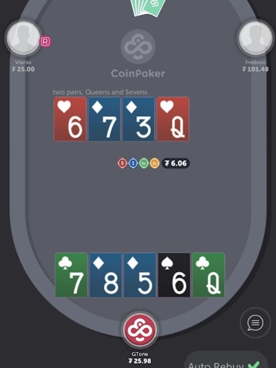

### 2. 在 PLO5 中避免有悬垂牌

连牌和同花是 PLO5 起手牌的重要组成部分。然而，许多玩家把太多牌都视为 “连牌”，而忽略了 “悬垂牌”。悬垂牌指的是那些不能直接与其他牌连成连牌的牌。

例如，如果你手持 A-K-Q-J-2，那么你的 2 就是悬垂牌。这张牌对你手牌的其他部分没有帮助，所以你实际上是在玩 PLO4。寻找机会来打出真正的顺子，也就是完全由相互关联的、可以很好地配合的牌组成的牌组。

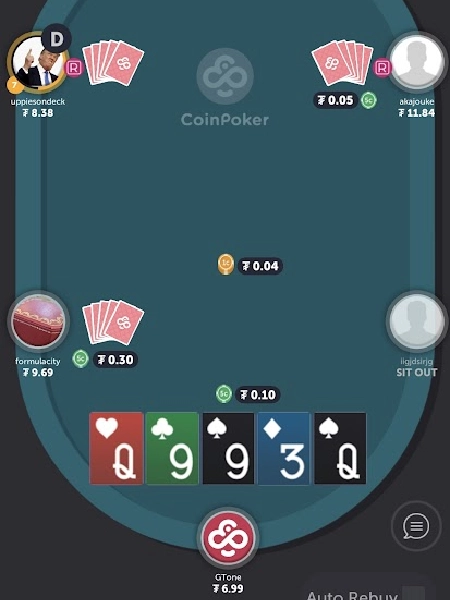

### 3. 优先玩高连接的连牌

由高牌组成的连牌是 PLO5 中最好的起手牌之一。这些牌能让你在翻牌圈就组成强力听牌，并在转牌和河牌圈继续提升牌力。这类牌在很多翻牌圈都能为你带来极高的权益，让你能够下大注，给其他玩家施加最大压力。

我们建议在底池注金额较大时，在 PLO5 中弃掉低连牌，因为它们往往很容易组成第二好的牌型。虽然在 NLHE 中，拿到低端顺子可能比较是爆冷，但在 PLO5 中，如果你玩低端顺子，这种情况非常常见。

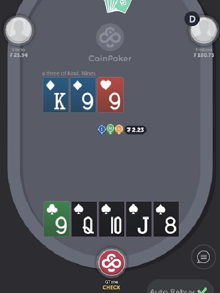

### 4. 在 PLO5 中保持投注额一致

和其他扑克游戏一样，在 PLO5 中，你的下注额也应该保持一致。最糟糕的做法就是根据牌力大小随意改变下注额，从而暴露你的牌力。

相反，诈唬和价值下注的下注额应该保持一致。当你进行价值下注时，想想如果你诈唬的话会使用多大的下注额。尽量使用相同的下注额，确保你的对手无法从你的下注额中看出太多端倪。

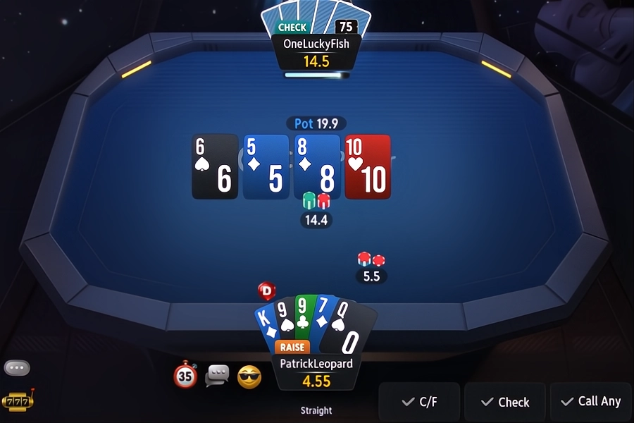

### 5. 利用你的位置优势

在任何扑克游戏中，牌桌位置都至关重要，在 PLO5 中更是如此。在 PLO5 中，位置不利的情况下打牌会非常困难，而有利位置可以让你充分利用其他玩家的失误和习惯。

在 PLO5 中，位置的重要性极高，因此在盲注位，即使是很强的起手牌，你也应该考虑弃牌，而在 BTN 位则玩一些更具投机性的牌。位置优势带来的额外权益，以及河牌圈可能获得的价值，都值得你做出这样的权衡。

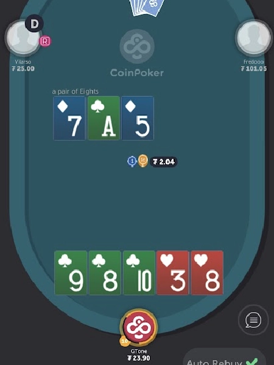

### 6. 永远不要追逐弱听牌

如果你在 PLO5 中听牌，尽量争取拿到坚果听牌。如果只是尝试顺子的低端牌型，或者非坚果同花，可能会让你损失惨重。对手拿到更好牌型，并且已经成牌的概率实在太高了。

相反，你应该寻找机会去争取坚果听牌，并完全避免非坚果听牌。即使你面对的是小额投注，并且获得的是直接赔率，但反向隐含赔率也高得不容忽视。

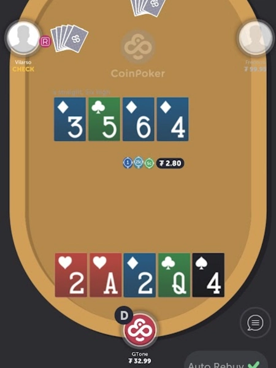

## PLO5 现金游戏策略技巧

如果你想专门玩 PLO5 现金游戏，我们可以提供一些技巧，让你的游戏更轻松。以下是最实用的 PLO5 现金游戏策略技巧，可以帮助你达到理想的胜率：

- 不要过度游戏 A-A：
    从 NLHE 转战 PLO 和 PLO5 的玩家往往会过度游戏 A-A。在 PLO5 现金游戏中，A-A 只有在组成三条或更好牌型时才真正有用。
- 小心被压制的听牌：
    无论你的翻牌前策略如何，你偶尔都会在翻牌圈拿到 “被压制的听牌”。在这种情况下，如果你的听牌最终变成非坚果牌，就要格外小心了。
- 用弱同花控制底池：
    如果你拿到一手不是最强同花的牌，不要为了追求价值而下注过重。这种牌型通常最多只能拿到一轮的价值。
- 利用坚果牌阻挡牌进行诈唬：
    使用坚果牌阻挡牌进行诈唬，并平衡你的价值下注。例如，如果你持有 A 阻挡同花，就能让你自由地给对手施加最大压力。
- 拥有充足的资金：
    资金管理在 PLO5 现金游戏中至关重要。由于波动性很高，平均每个级别的游戏至少需要 100 个买入的资金。

## PLO5 锦标赛（MTT）策略技巧

如果你想玩 PLO5 锦标赛，这里有一些实用的 PLO5 锦标赛策略技巧，你一定想了解。

- 在筹码较深时玩投机性手牌：
    当你的筹码较深（100 个大盲注或更多）时，你可以玩更多投机性手牌，例如强连牌，尤其是当你有 A 同花与之搭配时。
- 高牌在筹码量少时更有价值：
    随着筹码量变少，高牌牌的价值会增加，因为连牌组成顺子的隐含概率会降低。
- 利用位置优势控制底池大小：
    在 PLO5 锦标赛中，尽可能多地在有利位置参与牌局至关重要。这能让你用中等强度的牌控制底池大小，并有机会参与价格合理的摊牌。
- 在决赛桌施加最大压力：
    如果你打进了 PLO5 MTT 的决赛桌，记住要保持进攻节奏。利用阻挡牌给筹码较少的玩家施加最大压力，迫使他们弃牌。
- 保持冷静：
    PLO5 有时会非常残酷，因为波动性很高。即使遭遇惨败，也要记住保持冷静，并尽一切可能避免心态失衡。

## PLO5 玩家最常犯的 3 个策略错误

每个人都会犯错，新手 PLO5 玩家往往比经验丰富的玩家犯更多错误。以下是 PLO5 中最常见的三个错误，为了跟上 PLO5 高手的步伐，你应该避免这些错误：

### 1. 高估中等强度的手牌

PLO5 新手往往会高估一些牌，比如翻牌前弱 A-A 或者翻牌圈的两对和底三条。虽然这些牌在 PLO5 中算是比较强的牌，但在大量筹码全下的情况下，它们往往并不占优势。务必了解 PLO5 中牌型价值的变化规律，并据此调整你的策略。

### 2. 玩太多手牌，尤其是不利位置。

在 PLO5 中，翻牌前应避免玩太多手牌，尤其是在不利位置的情况下。职业玩家建议在 BTN 位玩的手牌比例不要超过 45%，在 SB 位玩的手牌比例不要超过 12%，平均约为 8%。

### 3. 用弱听牌全下

在 PLO5 中翻牌圈拿到听牌比在 NLHE 中容易得多，所以你不应该轻易下注任何听牌。相反，只有当你有超过 10 张补牌组成坚果牌时，才应该考虑冒险。不要对非坚果听牌抱有过高的期望，因为它们通常只会让你成为第二好的牌。