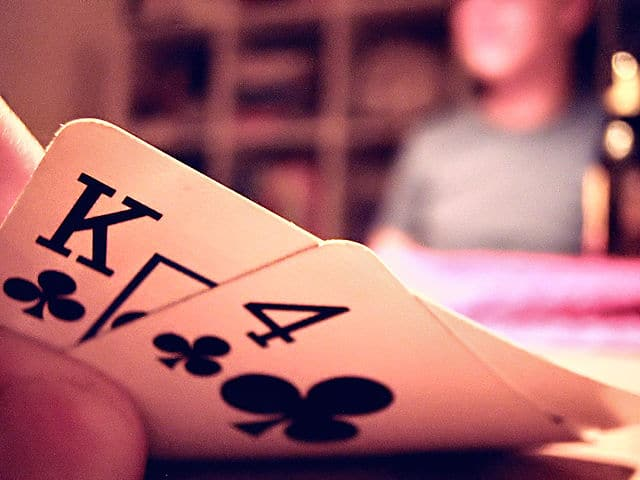
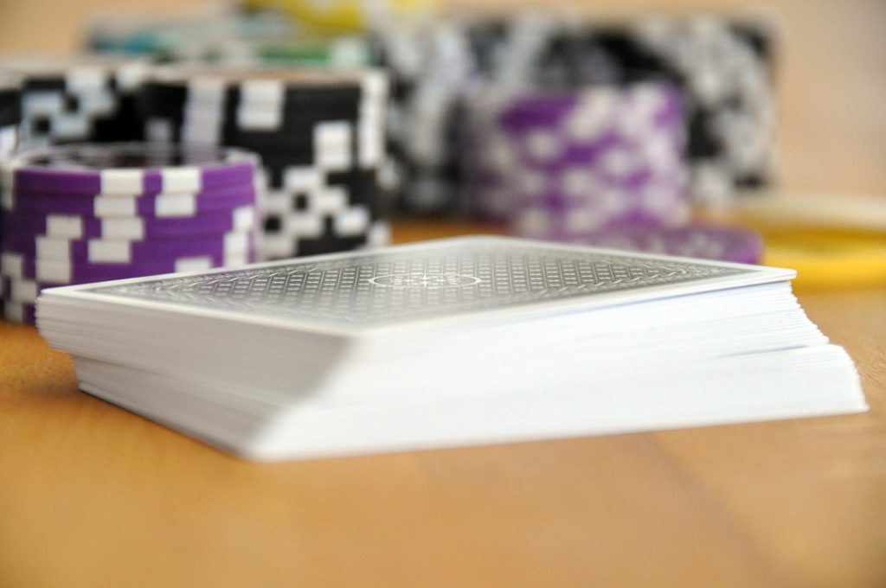
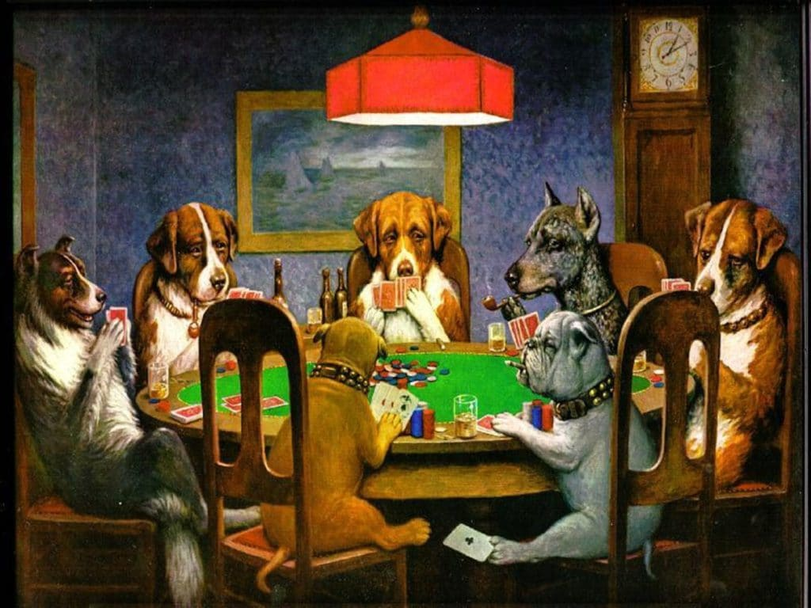
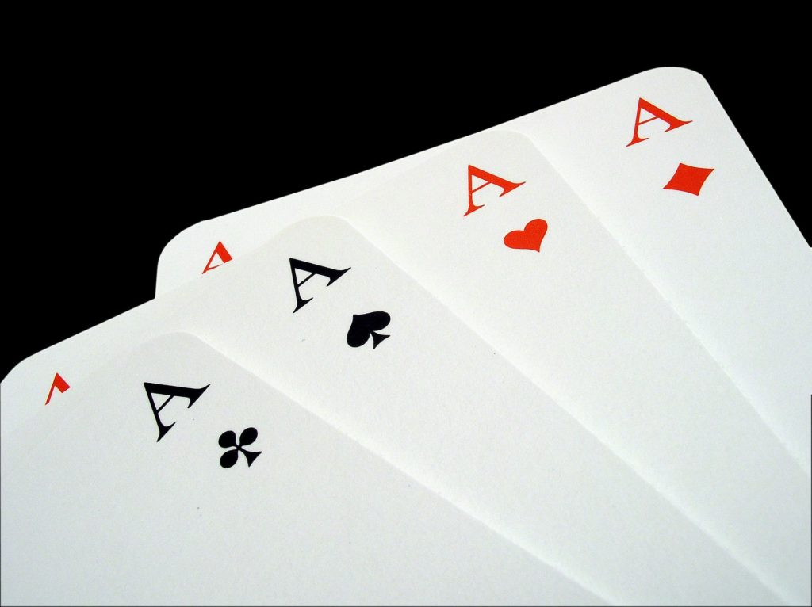
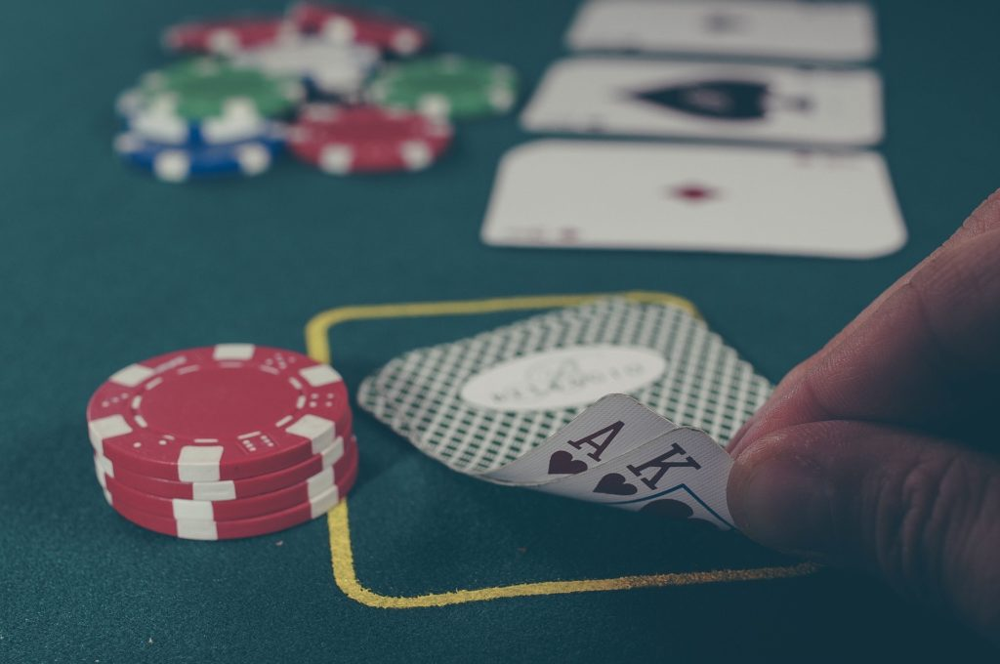

# 100 条最佳的扑克名言（转载）

每个人都有话要说。而且，显然很多人都对扑克有话要说。从励志到真实，从冷门到幽默的扑克名言，以及介于两者之间的一切，来看看这些关于扑克的最佳名言。

为了便于浏览，我将这些扑克名言分为以下几类：

目录

[[toc]]

请欣赏！

## 励志的扑克名言

1. “Fold and live to fold again.” ~ Stu Ungar  
  “弃牌，活下来，才能再次弃牌。” ~ 斯图·昂加尔  

2. “Life, like poker, has an element of risk. It shouldn’t be avoided. It should be faced.” ~ Edward Norton  
 “人生如扑克，总有风险。不应逃避，而应面对。” ~ 爱德华·诺顿  

3. “Poker is not a game in which the meek inherit the Earth.” ~ David Hayano  
  “扑克不是弱者能继承天下的游戏。” ~ 大卫·早野  

4. “You will show your poker greatness by the hands you fold, not the hands you play.” ~ Dan Reed  
  “真正的扑克高手，赢在弃掉的牌，而非打出的牌。” ~ 丹·里德  

5. “Poker is a skill game pretending to be a chance game.” ~ James Altucher  
  “扑克是伪装成运气游戏的技巧游戏。” ~ 詹姆斯·阿尔图切尔  

6. “Serious poker is no more about gambling than rock climbing is about taking risks.” ~ Al Alvarez  
  “严肃的扑克与赌博无关，正如攀岩与冒险无关。” ~ 阿尔·阿尔瓦雷斯  

7. “Poker may be a branch of psychological warfare, an art form or indeed a way of life, but it is also merely a game in which money is simply the means of keeping score.” ~ Anthony Holden  
  “扑克或许是心理战的分支、艺术形式或生活方式，但它终究只是一场用钱计分的游戏。” ~ 安东尼·霍顿  

8. “Just play every hand, you can’t miss them all.” ~ Sammy Farha  
  “尽管每手牌都玩，你不可能每次都输。” ~ 萨米·法哈  

9. “Poker is war. People pretend it is a game.” ~ Doyle Brunson  
  “扑克是战争，人们假装它是游戏。” ~ 道尔·布朗森  

10. “People would be surprised to know how much I learned about prayer from playing poker.” ~ Mary Austin  
  “人们会惊讶于我通过扑克学到了多少关于祈祷的事。” ~ 玛丽·奥斯汀  

11. “The commonest mistake in history is underestimating your opponent; happens at the poker table all the time.” ~ General David Shoup  
  “历史上最常见的错误是低估对手，扑克桌上天天发生。” ~ 戴维·肖普将军  

12. “In the long run there’s no luck in poker, but the short run is longer than most people know.” ~ Rick Bennet  
  “长期来看扑克没有运气，但短期比大多数人想象的更长。” ~ 里克·贝内特  

13. “What I know about poker you can fit into a thimble with room left over, but I’m learning.” ~ Wilford Brimley  
  “我对扑克的了解少得可怜，但我正在学习。” ~ 威尔福德·布利姆利  

14. “If you always start with the worse hand, you never have a bad beat story to tell.” ~ Chuck Thompson  
  “如果你总是玩烂牌，就永远不会有爆冷输掉故事可讲。” ~ 查克·汤普森  

15. “Forget about a chip and a chair; give me a hand and I’ll stand.” ~ Warren Karp  
  “别说 ‘一个筹码一把椅’，给我一手好牌，我就能站起来。” ~ 沃伦·卡普  

16. “Don’t get mad that you lost, get mad because you didn’t win.” ~ Michael Gersitz  
  “别为输牌生气，要为没赢生气。” ~ 迈克尔·格西茨

## 幽默的扑克名言

17. “Last night I stayed up late playing poker with Tarot cards. I got a full house and four people died.” ~ Steven Wright  
  “昨晚我熬夜用塔罗牌玩扑克，凑了个葫芦，然后四个人死了。” ~ 史蒂文·怀特  

18. “Avoid people with gold teeth who want to play cards.” ~ George Carlin  
  “离那些镶金牙还想打牌的人远点。” ~ 乔治·卡林  

19. “The next best thing about gambling and winning is gambling and losing.” ~ Nick “The Greek” Dandalos  
  “赌博最妙的不在于赢，而在于输得尽兴。” ~ “希腊佬” 尼克·丹达洛斯  

20. “Money isn’t everything unless you’re playing a rebuy tournament.” ~ Unknown  
  “钱不是万能的，除非你打的是重购锦标赛。” ~ 佚名  

21. “If there weren’t luck involved, I would win every time.” ~ Phil Hellmuth  
  “要是没有运气成分，我每次都能赢。” ~ 菲尔·赫尔穆特  

22. “Trust everyone but always cut the cards.” ~ Benny Binion  
  “可以相信任何人，但切牌不能少。” ~ 本尼·比尼恩  

23. “If you’re playing a poker game and you look around the table and can’t tell who the sucker is, it’s you.” ~ Paul Newman  
  “如果你在牌局里环顾四周都找不到鱼，那你就是那条鱼。” ~ 保罗·纽曼  

24. “Poker has the feeling of a sport, but you don’t have to do push-ups.” ~ Penn Gillette  
  “扑克有体育竞技的感觉，还不用做俯卧撑。” ~ 潘恩·吉列特  

25. “Bad beats will, from time to time, still rob you like a crack addict with an empty pipe.” ~ Rick Dacey  
  “爆冷输掉就像毒瘾发作的混混，时不时会抢光你。” ~ 里克·戴西  

26. “Going on tilt is not ‘mixing up your play.’” ~ Steve Badger  
  “上头和 ‘变换打法’ 是两回事。” ~ 史蒂夫·巴杰  

27. “Poker is hard.” ~ Lots of people  
  “扑克太难了。” ~ 广大人民群众  

28. “You played that hand like a vegan.” ~ Erick Lindgren (to Daniel Negreanu)  
  “你这手牌打得像个素食主义者。” ~ 埃里克·林德格伦（对丹尼尔·内格里诺说）  

29. “May the flop be with you.” ~ Doyle Brunson  
  “愿翻牌与你同在。” ~ 道尔·布朗森  

30. “Poker is 100% skill and 50% luck.” ~ Phil Hellmuth  
  “扑克是 100% 的技术加 50% 的运气。” ~ 菲尔·赫尔穆特  

31.  “It’s not whether you won or lost, but how many bad beat stories you were able to tell.” ~ Grantland Rice  
  “输赢不重要，关键是你编出多少爆冷输掉的故事。” ~ 格兰特兰·赖斯  

32. “I never saw a poker player’s money that I did not like.” ~ Oklahoma Johnny Hale  
  “我从没见过我不喜欢的扑克玩家的钱。” ~ 俄克拉荷马·约翰尼·黑尔  

33. “It doesn’t take a rocket scientist to be good at poker.” ~ Phil Gordon  
  “打好扑克不需要火箭科学家的脑子。” ~ 菲尔·戈登  

34. “They say poker is a zero-sum game. It must be, because every time I play my sum ends up zero.” ~ Max Shapiro  
  “他们说扑克是零和游戏，确实，因为我每次玩完总和都是零。” ~ 马克斯·夏皮罗  

35. “No river, no fish.” ~ Amarillo Slim  
  “没河牌就没鱼可钓。” ~ 阿马里洛·斯利姆  

36. “The beautiful thing about poker is that everybody thinks they can play.” ~ Chris Moneymaker  
  “扑克最妙的就是，每个人都觉得自己会玩。” ~ 克里斯·马尼梅克  

37. “The guy who invented poker was bright, but the guy who invented the chip was a genius.” ~ Julius “Big Julie” Weintraub  
  “发明扑克的人很聪明，但发明筹码的是天才。” ~ "大个子朱尔斯"·温特劳布  

38. “I must complain the cards are ill-shuffled till I have a good hand.” ~ Jonathan Swift  
  “我总得抱怨牌洗得不好，直到我拿到一手好牌。” ~ 乔纳森·斯威夫特  

39. “Old card players never die, they just shuffle away.” ~ Unknown  
  “老牌手从不死去，他们只是慢慢洗牌离去。” ~ 佚名  

40. “No-limit holdem: Hours of boredom followed by moments of sheer terror.” ~ Tom McEvoy  
  “无限德州扑克：几小时的无聊夹杂着片刻的毛骨悚然。” ~ 汤姆·麦克沃伊  

41. “If you play bridge badly, you make your partner suffer, but if you play poker badly you make everybody happy.” ~ Joe Laurie, Jr.  
  “桥牌打不好连累搭档，扑克打不好皆大欢喜。” ~ 小乔·劳瑞  

42. “To be a poker champion you must have a strong bladder.” ~ Jack McClelland  
  “想当扑克冠军？先练好膀胱。” ~ 杰克·麦克莱兰  

43. “I don’t play any two suited cards. I play any two non-suited cards. That way I’m drawing at two different flushes.” ~ Amarillo Slim  
  “我从不玩同花连张，专挑不同花的。这样我就能同时追两种花色。” ~ 阿马里洛·斯利姆  

44. “Every poker player, like every fisherman, needs to have a story in a box, and most poker stories are completely uninteresting.” ~ Jason Alexander  
  “每个牌手都像渔夫需要备好故事，可惜扑克故事十有八九无聊透顶。” ~ 杰森·亚历山大  

45. “Omaha is a game that was invented by a Sadist and is played by Masochists.” ~ Shane Smith  
  “奥马哈是虐待狂发明给受虐狂玩的游戏。” ~ 沙恩·史密斯  

46. “Poker is generally thought to be America’s second most popular after-dark activity. Sex is good, they say, but poker lasts longer.” ~ Al Alvarez  
  “扑克据说是美国夜间第二受欢迎的活动。他们说性爱虽好，但扑克更持久。” ~ 阿尔·阿尔瓦雷斯  

47. “Dogs are lousy poker players. When they get a good hand, they wag their tails.” ~ Unknown  
  “狗是最烂的牌手，拿到好牌就摇尾巴。” ~ 佚名  

## 生活哲理的扑克名言

48. “There is more to poker than life.” ~ Tom McEvoy  
  “扑克比人生更深刻。” ~ 汤姆·麦克沃伊  

49. “Aces are larger than life and greater than mountains.” ~ Mike Caro  
  "AA 大过天，重过山。" ~ 迈克·卡罗  

50. “Poker is a combination of luck and skill. People think mastering the skill part is hard, but they’re wrong. The trick to poker is mastering the luck.” ~ Jesse May  
  “扑克是运气与技术的结合。人们以为掌握技术最难，其实真正要驯服的是运气。” ~ 杰西·梅  

51. “The one who bets the most wins. Cards just break ties.” ~ Sammy Farha  
  “下注最凶的人赢牌，底牌只是用来打破平局。” ~ 萨米·法哈  

52. “I learned playing poker that you never count your winnings because that’s when you start to lose.” ~ Kenneth Langone  
  “扑克教我永远别数赢了多少筹码，一开始数就会输。” ~ 肯尼斯·朗格尼  

53. “I think one of the interesting things about poker is that once you let your ego in, you’re done for.” ~ Al Alvarez  
  “扑克最微妙之处在于：一旦让自尊心介入，你就完了。” ~ 阿尔·阿尔瓦雷斯  

54. “The two things you need to be successful in poker are, first, find the muck, and second, don’t play your own money.” ~ David “Devilfish” Ulliott  
  “扑克成功两要素：第一找到鱼塘，第二别用自己的钱玩。” ~ “魔鬼鱼” 大卫·乌里奥特  

55. “Nobody is always a winner, and anybody who says he is, is either a liar or doesn’t play poker.” ~ Amarillo Slim  
  “没有人能永远赢，自称常胜将军的不是骗子就是没玩过扑克。” ~ 阿马里洛·斯利姆  

56. “Life is not always a matter of holding good cards, but sometimes playing a poor hand well.” ~ Jack London  
  “人生不在于握有一手好牌，而在于打好一手烂牌。” ~ 杰克·伦敦  

57. “The strong point in poker is never to lose your temper, either with those you are playing or, more particularly with the cards. There is no sympathy in poker. Always keep cool. If you lose your head you will lose all your chips.” ~ William J. Florence  
  “扑克要诀是保持冷静，不因对手动怒，更不因底牌失控。扑克没有怜悯，失去理智就会输光筹码。” ~ 威廉·弗洛伦斯  

58. “Poker is not simply a game of odds, moves and calculations. It is a game of controlled and exploited emotions including greed, fear, over-confidence and anger.” ~ Steven Lubet  
  “扑克不仅是概率、策略与计算的游戏，更是控制与利用贪婪、恐惧、自负和愤怒的艺术。” ~ 史蒂文·卢贝特  

59. “Everyone gets lucky once in a while, but no one is consistently lucky.” ~ Doyle Brunson  
  “人人都有走运时，但没人能一直幸运。” ~ 道尔·布朗森  

60. “Living in the past is a Jethro Tull album, not a smart poker strategy.” ~ Richard Roeper  
  “沉湎过去是 Jethro Tull 专辑该干的事，不是聪明牌手的策略。” ~ 理查德·罗珀  

61. “What’s true of the poker game is true of life. Most people are suckers and don’t realise it.” ~ Michael Faust  
  “扑克桌真相即人生真相：多数人是鱼却不自知。” ~ 迈克尔·福斯特  

62. “Baseball is like a poker game. Nobody wants to quit when he’s losing; nobody wants you to quit when you’re ahead.” ~ Jackie Robinson  
  “棒球像扑克，输家不想离桌，赢家不想你走。” ~ 杰基·罗宾森  

63. “Most of the money you’ll win at poker comes not from the brilliance of your own play, but from the ineptitude of your opponents.” ~ Lou Krieger  
  “扑克赢钱多靠对手犯错，少靠自身高明。” ~ 卢·克里格  

64. “Whoever coined the phrase ‘a man’s got to play the hand that was dealt him’ was most certainly one piss-poor bluffer.” ~ Jeannette Walls  
  “发明 ‘必须打好发到的牌’ 这句谚语的人，肯定是个蹩脚的诈唬者。” ~ 珍妮特·沃尔斯  

65. “Don’t challenge strong players, challenge weak ones. That’s what they’re there for.” ~ John Vorhaus  
  “别挑战强者，专找弱者，这就是他们存在的意义。” ~ 约翰·沃豪斯  

66. “One day a chump, the next day a champion. What a difference a day makes in tournament poker!” ~ Mike Sexton  
  “昨日鱼腩今日冠，锦标赛一日定乾坤。” ~ 迈克·塞克斯顿  

67. “Hold em is to stud what chess is to checkers.” ~ Johnny Moss  
  “德州扑克之于梭哈，犹如国际象棋之于跳棋。” ~ 约翰尼·莫斯  

68. “A Smith & Wesson beats four aces.” ~ American proverb  
  “史密斯威森枪管里，四条 A 也要低头。” ~ 美国谚语  

69. “If a player is looking to have you fund their poker career, you need to look at why they are broke.” ~ James Guill  
  “如果有人想让你资助他的扑克事业，你最好先搞清楚他为什么破产。” ~ 詹姆斯·吉尔  

70. “Besides lovemaking and singing in the shower, there aren’t many human activities where there is a greater difference between a person’s self-delusional ability and their actual ability than in poker.” ~ Steve Badger  
  “除了床上功夫和洗澡时唱歌，再没什么活动能像扑克这样，让人自我感觉与实际水平的差距如此悬殊。” ~ 史蒂夫·巴杰  

## 冷门的扑克名言

71. “Poker reveals to the frank observer something else of import. It will teach him about his own nature. Many bad players do not improve because they cannot bear self-knowledge.” ~ David Mamet  
  “扑克会向坦诚的观察者展现更重要的事，它让你看清自己的本性。许多差劲的玩家无法进步，只因承受不了这种自我认知。” ~ 大卫·马梅  

72. “I’m absolutely gonna win it, because I’m ruthless. I sit at the poker table and my job is to destroy people.” ~ James Woods  
  “我必胜无疑，因为我冷酷无情。坐在牌桌上的使命就是摧毁对手。” ~ 詹姆斯·伍兹  

73. “Poker is a fascinating, wonderful, intricate adventure on the high seas of human nature.” ~ David A. Daniel  
  “扑克是一场妙不可言的精密冒险，航行在人性公海之上。” ~ 大卫·丹尼尔  

74. “Poker, n. A game said to be played with cards for some purpose to this lexicographer unknown.” ~ Ambrose Bierce  
  “扑克，名词。据说是用纸牌进行的游戏，其目的对本词典编纂者而言仍属未解之谜。” ~ 安布罗斯·比尔斯  

75. “Limit poker is a science, but no-limit is an art. In limit, you are shooting at a target. In no-limit, the target comes alive and shoots back at you.” ~ Jack Strauss  
  "有限注扑克是科学，无限注则是艺术。有限注像射击固定靶，无限注时靶子会活过来朝你开枪。" ~ 杰克·斯特劳斯  

76. “Poker is a microcosm of all we admire and disdain about capitalism and democracy.” ~ Lou Kreiger  
  “扑克是资本主义与民主制度全部优缺点的微观宇宙。” ~ 卢·克里格  

77. “It’s said that the two psychological features of snipers are patience and stubbornness. Some might say the same is true for good poker players.” ~ Stephen Bloomfield  
  “据说狙击手的两大心理特质是耐心与固执，出色的扑克玩家亦如是。” ~ 斯蒂芬·布卢姆菲尔德  

78. “A faint heart never filled a spade flush.” ~ Unknown  
  “懦弱的心永远凑不成黑桃同花。” ~ 佚名  

79. “Is it really not possible to touch the gaming table without being instantly infected by superstition?” ~ Fyodor Dostoyevsky  
  “难道人类只要触碰赌桌，就注定立刻感染迷信病毒吗？” ~ 陀思妥耶夫斯基  

80. “Poker’s the only game fit for a grown man. Then, your hand is against every man’s, and every man’s is against yours.” ~ W. Somerset Maugham  
  “扑克是唯一适合成年人的游戏。此刻你与天下人为敌，天下人亦与你为敌。” ~ 毛姆  

## 扑克有关的名言

81. “Show me a good loser and I’ll show you a loser.” ~ Stu Ungar  
  “所谓输得起的人，不过是输惯了的失败者。” ~ 斯图·昂加尔  

82. “Take time to deliberate; but when the time for action arrives, stop thinking and go in.” ~ Andrew Jackson  
  “谋定而后动，时机既至则雷霆出击。” ~ 安德鲁·杰克逊  

83. “Life is too long to play bad cards.” ~ Frank DiElsi  
  “人生太短，何必浪费在烂牌上。” ——弗兰克·迪埃尔西  

84. “When a man with money meets a man with experience, the man with experience leaves with money and the man with money leaves with experience.” ~ Unknown  
  “当土豪遇见老江湖，离场时一个带着经验，一个带着钞票。” ~ 佚名  

85. “It’s not enough to succeed. Others must fail.” ~ Gore Vidal  
  “成功不够，必须他人失败。” ~ 戈尔·维达尔  

86. “In order to be a successful gambler you have to have a complete disregard for money.” ~ Doyle Brunson  
  “想成为赌场赢家？先学会视金钱如粪土。” ——道尔·布朗森  

87. “If I lose today, I can look forward to winning tomorrow, and if I win today, I can expect to lose tomorrow. A sure thing is no fun.” ~ Chico Marx  
  “今日输可期明日赢，今日赢须防明日输，稳赚的局最无趣。” ~ 奇科·马克斯  

88. “Cards are war in disguise of a sport.” ~ Charles Lamb  
  “牌局是披着竞技外衣的战争。” ~ 查尔斯·兰姆  

89. “Play like a champ. Win like a champ. Act like a champ.” ~ Frank Henderson  
  “以冠军姿态出战，以冠军手法赢牌，以冠军气度处世。” ——弗兰克·亨德森  

90. “Money won is twice as sweet as money earned.” ~ Paul Newman  
  “赢来的钱比挣来的甜两倍。” ~ 保罗·纽曼  

91. “The only bad luck for a good gambler is bad health. Any other setbacks are temporary aggravation.” ~ Benny Binion  
  “高手唯一的厄运是健康问题，其他挫折不过暂时烦恼。” ——本尼·比尼恩  

92. “A person should gamble every day, because think of how bad it would be to be walking around lucky and not know it.” ~ Robert Turner  
  “天天都该赌一把，否则怎知自己正走运？” ~ 罗伯特·特纳  

93. “Life is like a game of cards. The hand that is dealt you is determinism; though the way you play it is free will.” ~ Jawaharlal Nehru  
  “人生如牌局，发牌是天命，打牌是自由。” ~ 尼赫鲁  

94. “Depend on the rabbit’s foot if you will, but remember it didn’t work for the rabbit.” ~ R. E. Shay  
  “信兔脚护身符无妨，但别忘了兔子自己也没逃过一劫。” ~ R·E·谢伊  

95. “No wife can endure a gambling husband unless he is a steady winner.” ~ Lord Dewar  
  “赌徒太太能忍丈夫，前提是他必须常胜。” ~ 迪瓦尔勋爵  

96. “The smarter you play, the luckier you’ll be.” ~ Mark Pilarski  
  “打得越聪明，运气越眷顾。” ~ 马克·皮拉尔斯基  

## 玩家的扑克名言

97. “Seldom do the lambs slaughter the butcher.” ~ Amarillo Slim  
  “羔羊屠宰屠夫？鲜有此等好事。” ~ 阿马里洛·斯利姆  

98. “I can dodge bullets, baby.” ~ Phil Hellmuth  
  "我躲得开子弹，宝贝。" ——菲尔·赫尔穆特  

99. “A man with money is no match against a man on a mission.” ~ Doyle Brunson  
  “有钱人敌不过有使命的人。” ~ 道尔·布朗森  

100. “You can shear a sheep a hundred times, but you can only skin it once.” ~ Amarillo Slim  
  “羊毛可剪百次，羊皮只能剥一回。” ~ 阿马里洛·斯利姆  
---

您有特别钟爱的扑克名言吗？或是这份（相当全面的）清单遗漏了您的最爱？欢迎在下方分享。

我们下回再见。

---

欢迎评论👉️填写 QQ 邮箱可以自动获取 QQ 头像！

<ClientOnly>
  <TwikooComment />
</ClientOnly>