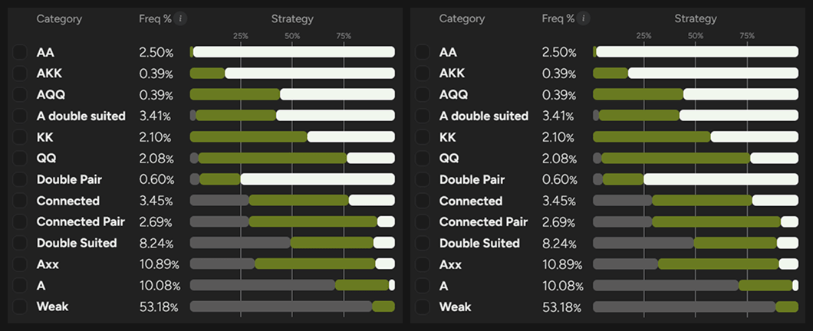
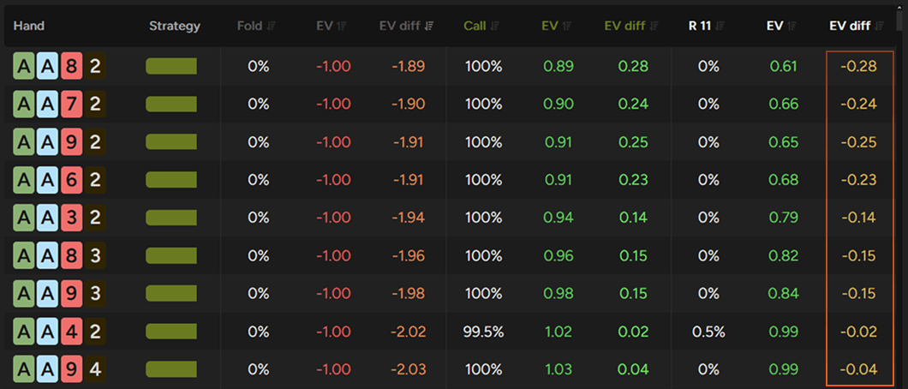
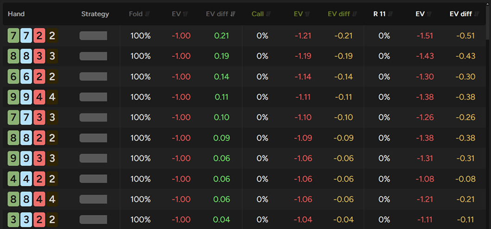
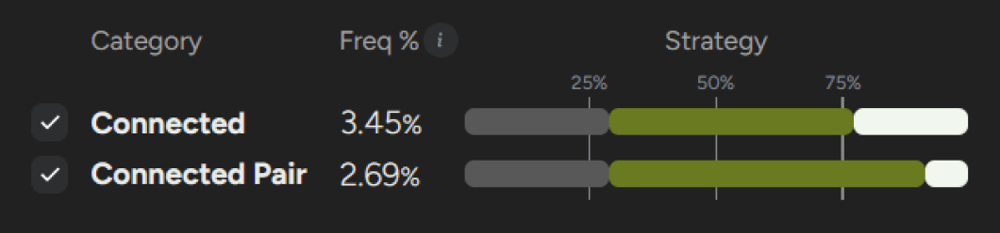
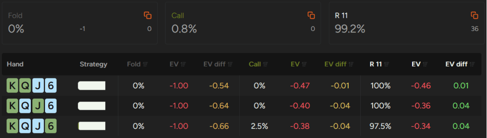

BTN 加注范围很广 - 你的 BB 防守策略应该相应调整。

在最近的文章中，我们探讨了 PLO 中最难的翻牌前场景之一：[“BB 如何防守对抗 UTG 开池加注”](pg36.md)。今天，我们将换个位置，分析面对 BTN 加注时 BB 的策略变化。

位置的改变显著改变了游戏动态。虽然你仍然处于不利位置，并且要承受抽水压力，但 BTN 的加注范围比 UTG 要宽得多，这从根本上改变了 BB 的应对方式。面对更弱、更宽的加注范围，你可以选择更宽的防守范围，并更频繁地采取激进策略。

## 理解范围差异

要理解为什么需要调整策略，我们首先需要了解加注范围的差异。假设你面对的是一位理论上合理的对手，PLO50 或同等抽水结构的对手，UTG 应该开池大约占总手牌数的 16.8%，这相当于大约 45,500 种组合。

这使得加注范围高度集中在优质牌型和强牌型上。 UTG 的牌型组合中，大约有 6700 种是 A-A，这意味着在 BB 防守面对 UTG 时，你大约每 7 次就会遇到一次 A-A。

BTN 的运作机制则截然不同。GTO 策略下，BTN 的开池范围扩大到约 48.3% 的牌型 - 近 131,000 种组合。虽然 A-A 的绝对数量保持不变，但它们现在只占总范围的略高于 5%。因此，在防守 BTN 的开池时，你遇到优质牌型的概率会显著降低。

更广泛地说，BTN 的牌型范围不仅更广，而且对优质高牌的集中度也低得多。虽然它自然涵盖了更多种类的牌面结构，但其平均牌力却大幅下降。即使不进行模拟，一个结论也显而易见：BTN 的平均牌力明显弱于 UTG 的平均牌力。

仅此一项差异就显著改变了 BB 最佳防守策略，使你能够更广泛地进行防守，并更频繁地采取激进策略。

## 如何防守 BTN 开池？

在 PLO50 的抽水假设下，面对理论上合理的 UTG 开池范围，BB 应该跟注约 13.6% 的手牌（36.6K 种组合），并进行 3-bet 约 3.9% 的手牌（10.5K 种组合），从而形成约 47K 种组合的整体防守范围。

BTN 则彻底改变了这些数字。最佳防守策略扩展到约 26.1% 的跟注（70.5K 种组合）和 10% 的 3-bet（27K 种组合），从而形成接近 97K 种组合的整体防守范围。

即使你仍然处于不利位置，并且继续面对高额抽水，但面对更弱的开池范围，你可以更广泛地进行防守。与 BB 对抗 UTG 相比，你现在可以防守的手牌数量几乎翻了一番。

以下是 BB 对抗 UTG （左）和 BTN（右）最佳行动的比较图表。

GTO 策略在 BB 对抗 UTG （左）和对抗 BTN（右）的行动

现在，让我们来分析一下各个牌型类别是如何变化的。

### A-A

不出所料，A-A 仍然是最容易驾驭的牌型。在对抗 BTN 时，策略比防守 UTG 时要简单得多，因为几乎所有 A-A 组合都足够强，可以进入 3-bet 的范围。

例外情况也相当直观。它们大多是彩虹牌型，边牌较弱，缺乏组成坚果牌的潜力，因此更倾向于跟注。

重要的是，这个牌型在简化策略方面也相当宽容。即使你选择对这种场景下的所有 A-A 组合都进行 3-bet，EV 损失仍然相对较小。虽然求解器的建议仍然倾向于混合一些跟注，但简化策略使用更激进比过于被动要好得多。

A-A 过于激进并不会让你损失太多 EV

### K-K 和 Q-Q

一旦我们是比 A-A 低的对子，情况就变得稍微复杂一些。和往常一样，评估 K-K 和 Q-Q 牌型时最重要的因素之一是边牌中是否包含 A。

A-K-K 组合相对简单明了。几乎没有人会弃牌，绝大多数人会选择 3-bet。大约 83.1% 的 A-K-K 牌型倾向于激进打法，只有彩虹牌型和少数较弱的三同花牌型会选择跟注。实际上，这些较弱的继续的牌大多是包含 2、6、7 或 9 等边牌的 A-K-K 牌型。

A-Q-Q 的模式类似。这些牌型都不会弃牌，其中 55.9% 会进入 3-bet 范围。其余的组合通常会选择跟注，主要包括彩虹牌型、大多数三同花牌型以及少数较弱的单同花牌型，例如 A-Q-Q-2。

一旦你的牌中不再包含 A，阻挡 A-A 的重要性就变得尤为突出。持有 K-K 和 Q-Q 但缺少 A 的玩家会变得更加谨慎，跟注和加注的比例也会显著增加。

例如，K-K 组合的跟注和 3-bet 比例约为 57.3% 比 42.7%。跟注成为默认选项，而那些仍然倾向于激进打法的牌型通常会通过其他优势来弥补 - 例如双同花、额外的对子价值或更强的边牌质量。

像 K♦️K♣️8♦️2♣️、K♣️K♦️J♦️9♦️ 或 K♣️K♦️J♠️J♥️ 这样的牌型，即使缺少 A 阻挡，也能产生足够的 EV，从而继续激进打法。

更广泛地说，K-K（尤其是 Q-Q）在面对 BTN 开池比面对 UTG 开池更容易应对。由于 A-A 在 BTN 的范围中所占比例要小得多，高对子的价值能够更稳定地保持，使得几乎所有 K-K 和 Q-Q 都能继续盈利。

### 双同花 A-x

双同花 A-x 是另一类在面对 BTN 开池时表现异常出色的牌型。实际上，大多数这类牌型都应该继续跟注，这意味着关键问题不再是是否跟注，而是跟注还是 3-bet 更有优势。

判断激进程度最明显的指标之一是高牌支持。包含 A 和多张强百老汇牌的牌型通常会进入 3-bet 范围。包含 A-K-Q-x、A-Q-J-x 或 A-J-T-x 等组合的牌型通常表现良好，值得采取激进策略。

连接性也至关重要。当边牌点数较高且连接性较好时，牌型质量会迅速提升。边牌点数为 6 或更高且牌型缺口不超过 1-2 的双同花 A-x 牌型通常会获得足够的 EV，从而不用来跟注。

最后一个重要的特征是对子强度。包含中等或更强对子的双同花 A-x 结构在 3-bet 时表现尤为出色，因为额外的对子权益自然而然地与坚果牌的潜力以及强大的公共牌覆盖率相结合。

总的来说，这一类别凸显了 BB 防守对抗 BTN 时的一个常见模式：兼具多种优势特征的牌型能够迅速积累价值，并常常从被动的继续打法转变为激进的打法。

### 两对牌型

在防守 BTN 开池时，两对牌型仍然是另一个高收益的牌型。求解器输出结果显示，只有 4.7% 的牌型会直接弃牌，19.8% 的牌型会继续跟注，而高达 75.4% 的牌型会进入 3-bet 范围。

彩虹和不相连的两对通常会弃牌

弃牌部分相对容易识别。这些牌型全部是围绕较弱的低对子（通常是 2-2、3-3 或 4-4）组成的彩虹牌型，要么完全无法组成顺子，要么主要只能组成非坚果顺子。例如 8-8-4-4、9-9-2-2 或 5-5-2-2（均为彩虹牌型）就属于此类。

跟注范围在连接性方面有所改善，但仍然倾向于由彩虹牌型或单同花牌型组成，这些牌型通常缺乏组成坚果顺子的潜力。例如单同花 9-9-3-3、彩虹牌型 T-T-6-6 或彩虹牌型 J-J-5-5 的表现通常足以继续跟注，但不足以构成激进的加注。

大多数剩余的两对牌型进入 3-bet 范围。表现最强的牌型通常是紧密相连的对子加上好的同花，特别是两个对子之间只有一张或没有缺口的双同花牌型。例如 7-7-6-6、T-T-8-8 或 8-8-7-7 这样的牌型产生的 EV 足以成为明确的加注。

这些牌型表现如此出色的原因其实很容易理解。它们能够在翻牌圈击中两对中的一对，同时还具备击中强顺子和同花的潜力，这使得它们在很多公共牌面上都能获得极高的权益。

### 连牌和连接对子

不出所料，这类牌型的情况就复杂得多，因为这两类牌型都包含了大量的弃牌、跟注和 3-bet。

在这些类别中弃牌变得越来越常见

从弃牌范围来看，它主要由低牌型（通常低于 10 点）的牌组成，这些牌型缺乏同花，且要么是彩虹牌，要么是三同花牌。很多弃牌都比较直观，但有些仍然会让人感到意外。像 9-8-6-5、Q-J-9-8 或 7-7-6-4 这样的牌 - 都是彩虹牌 - 乍一看似乎可以玩，但最终却无法产生足够的 EV 继续游戏。

与此相反的是激进型牌型。其中最突出的是优质的双同花高牌，特别是围绕 K-9 之间强牌组成的牌型。带有连牌的双同花对子也表现出色，像 J-J-T-8、Q-J-T-T 或 9-8-8-7 这样的牌型通常更适合激进玩法。

同样，牌面缺口不超过一个点数的双同花连牌也能产生足够的 EV，可以进入 3-bet 范围。激进型持续打法的最后一部分由优质单同花牌组成，这些牌型凭借强劲的高牌质量来弥补劣势，例如 A-K-Q-T、K-J-T-9 或 K-J-T-T。

这样一来，两类牌型加起来大约还剩下 55%，构成了跟注范围。

就像 BB 对抗 UTG 的情况一样，如果你想提升翻牌前直觉，这是最值得研究的领域之一。这类牌型中，许多牌型在不同行动之间的 EV 差异很小，因此从学习的角度来看，它们尤其有价值。

### 双同花牌型

双同花牌型是另一类理论基础薄弱的玩家容易犯错的牌型。虽然双同花在 PLO 中本身就是一个强大的特征，但许多玩家往往高估了它的价值。

计算结果显示，即使面对 BTN 较宽的开池范围，仍有 49.2% 的双同花牌型应该在翻牌前弃牌。

幸运的是，弃牌的牌型相对容易识别。它们主要由围绕多张低牌组成的牌型构成，尤其是包含两张 2-7 之间小牌的牌型。作为一条实用的指导原则，如果你的牌中有 2 或 3，通常应该更加谨慎地对待这手牌。

在激进的一方，优质的 K 高、Q 高和 J 高牌型经常会进入 3-bet 的范围。这部分主要由一些强力的三张连牌组成，例如 K-7-6-5 或 J-T-9-6，以及一些边牌质量更强的对子，例如 T-T-7-6 或 Q-T-8-8。

值得注意的是，许多理论上更倾向于 3-bet 的牌型，其相对于跟注的 EV 优势其实并不大。因此，简化策略选择跟注往往效果极佳，尤其是在面对那些翻牌后下注范围过宽或打法过于激进的对手时。

跟注和 3-bet 通常会产生非常相似的 EV

### A 高牌

最后，我们来看看 A 高牌 - 包括同花和非同花。虽然它们并非牌型中最令人兴奋的部分，但由于数量庞大，仍然非常重要，大约有 57,000 种组合，约占总牌型的 21%。

求解器输出结果显示，玩家通常采取较为被动的策略。大约 50.5% 的 A 高牌会直接弃牌，只有 6.3% 会选择 3-bet，剩余的 43.2% 会选择跟注。

重要的是，即使是那些激进的牌型，也并非特别强。因此，偶尔错过像 A-K-J-9 单同花或 A-K-T-9 这样的弱牌 3-bet，不太可能造成显著的 EV 损失。

这一类别的关键技巧在于识别哪些 A 高牌能够产生足够的 EV，从而在面对加注时继续跟注。

### 弱牌

最后，我们来到了牌型中数量最多，同时也是最弱的一类。弱牌约占所有牌型的 53%，但只有约 11% 的弱牌会在 BTN 开池时继续跟注。

在此尤其需要谨慎。虽然这些牌型在 BTN 开池时的表现自然优于 UTG 开池，但它们仍然属于低 EV 的范畴。

能够继续跟注的牌型通常是依靠其他优势而非单纯的牌力来弥补劣势。例如，A-A-A、具有额外可玩性的对子（如 K-T-9-9、J-J-4-3 或 J-T-7-7 单同花）或某些三同花高牌组合通常能够产生足够的 EV 来继续跟注。

在处理这类牌型时，略微过度弃牌通常比防守范围过宽更为有效。

## 防守 BTN 开池能带来更多提升空间

防守 BTN 开池比防守 UTG 开池拥有更大的策略灵活性。由于 BTN 的进攻范围更广，最佳防守策略也随之大幅扩展。

同时，在这种局面下，许多决策的 EV 差距相对较小。了解这些阈值所在，并建立相应的直觉，往往能带来翻牌前打法的长期显著提升。

希望这些指导原则能帮助你提升 BB 防守技巧，并让你更轻松地应对 BTN 开池。