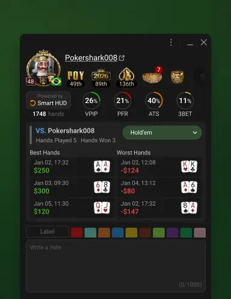

## 什么是智能 HUD？

- 智能 HUD 会追踪你的对手，分析你的牌局历史，并学习你和对手的打牌风格。所有 GGPoker 用户均可免费使用智能 HUD，它不仅为这款精彩的游戏增添了更多乐趣，也有助于营造更公平的竞技环境。
- 点击玩家头像或智能 HUD 图标上的任意位置，即可查看更多详情。
    
- 点击自己头像或智能 HUD 图标上的任意位置，即可查看更多详情。
    
在智能 HUD 框中查看你所有游戏的总统计数据。这些数据将展现你的游戏风格，以便你通过评估自身的优势和劣势来提升游戏水平。

### 数据指南

- VPIP（自愿投入资金）
玩家在有机会的情况下投入资金的频率
- PFR（翻牌前加注）
玩家在翻牌前加注的频率
- ATS（试图偷盲）
玩家尝试从 CO、BTN 和 SB 位置偷盲注的频率
- 3BET（3-Bet 加注）
玩家在翻牌前再次加注的频率
- CB（持续下注）
翻牌前加注者在翻牌圈下注的频率
- FCB（弃牌给继续下注）
玩家对持续下注弃牌的频率
- CCB（跟注持续下注）
玩家对持续下注跟注的频率
- RCB（加注持续下注）
玩家对持续下注加注的频率
- WT (WTSD = 玩到摊牌)
看到翻牌的玩家进入摊牌的频率
- WSD（W\$SD = 摊牌胜率）
玩家在摊牌时获胜的频率
- TAF（总攻击频率）
玩家下注或加注的频率
- Hands（手数）
总手数

## 对 GGPoker 数据使用的思考

GGPoker 是线上最大的扑克平台，不允许使用实时的 HUD，只能使用系统提供的智能 HUD，也就是只能看到对手的 4 个数据和自己 16 个数据。VPIP/PFR/ATS/3BET 是准确度很高的最重要的数据，能够体现对手的倾向性。注意：系统提供的这 4 个数据是当前牌局统计的数据，不是综合了历史数据，所以受到短期手牌，运气和牌局动态的影响，有时候会有很大的偏移。

除了智能 HUD，GGPoker 还提供了给玩家标注颜色和备注的功能，这是智能 HUD 的重要补充，有时候玩家可能数据类似，但是输赢结果却大不相同，这时候就可以用主观的判断给对手标记颜色。参见我之前写的 [“线上扑克玩家颜色分类系统”](player-color.md)。

记笔记（也就是备注）的方法注意要简单，记对手和通常行动线不一样的地方，标准的行动线就不用记了。比如翻前的特殊打法，河牌的特殊打法（包括偷鸡的尺度等）。这些备注将来在面临翻前 3Bet 或者河牌圈决定的时候会起很重要的作用。

在使用智能 HUD 的时候，不要忘了和标注玩家颜色和备注联合起来使用。

## 实时 HUD 的使用简介

假设你玩的线上平台可以使用 HUD，选择哪些数据就是一个需要仔细思考的问题。使用 HUD 并不能让你变成一个赢家，错误的使用数据可能会让你输钱。有几个原则简单的说一下：

- 数据尽可能的少而不是多，使用主要的几个数据结合玩家颜色和备注可能胜过使用几十个数据。
- 要清楚数据的含义，设置之后检查是否在特定的场景正确筛选你想要的行动的数据。
- 要选择在一定手数迅速向真实数据逼近的数据，有些翻后的数据可能几千手后才可靠，这种数据实际的作用很小。
- 要选择客观直接的数据，一眼看了就明白含义。有些数据看了不能马上对对手做出针对的调整，这些数据可能就是间接数据，比如激进度，对手可能是疯鱼，也可能是翻前很紧，翻后很激进，这些数据都不能给你直接的信息，要谨慎选择。最好把玩家的倾向性使用颜色和备注，这样一目了然。

有了上面的原则，下面介绍一种相对简单的 HUD，宗旨就是简单，容易判断对手。

- [Player Name]/[Total Hands]/[BB/100]
- [VPIP]/[PFR]/[ATS]/[3Bet]/[4Bet Range]
- BB Fold to [CO Steal]/[BTN Steal]/[SB Steal]  BB 3Bet to [CO Steal]/[BTN Steal]
- RFI [EP]/[MP]/[CO]/[BTN]/[SB]
- [Flop C-Bet]/[Turn C-bet]  [Fold to Flop C-Bet]/[Fold to Turn C-Bet]
- [Flop Raise C-Bet]/[Turn Raise C-Bet]
- [Flop Stab]/[Turn Stab]  [Fold to Flop Stab]/[Fold to Turn Stab]

上面使用的是英文，具体可能在 HUD 软件的使用的是类似的描述，请自行研究一下。

简单的解释一下 HUD 的选择的理由：
- 第一行的手数可以看出来数据是否可靠，胜率能看出对手是否是一个赢家。
- 第二行复用了 GGPoker 提供的智能 HUD 的数据，便于比较偏离有多大。增加了 4-Bet 的范围。
- 第三行是 BB 抵抗偷盲的数据，没有选择 SB 的数据是因为在 BB 位置能真实的反映玩家的倾向，SB 位置不是最终的行动者，受后面 BB 影响，数据稳定性差。SB 玩家的倾向可参考他在 BB 的数据。
- 第四行是各个位置开池加注的频率，能够看出对手是否对位置变化敏感，数据虽多但是一目了然。
- 第五行是持续下注频率和对应的弃牌频率。
- 第六行是加注持续下注的频率。
- 第七行是对手偷池的频率和面对偷池弃牌的频率。

上面已经说了原因没有添加有些间接的数据，这些数据已经足够多，对于中低级别已经足够。级别提高了，再根据需要添加自己认为重要的数据。这个 HUD 主要是针对中低级别的 PLO4，玩家的倾向是对 3Bet 弃牌率很低，所以有关的数据没有添加，请参考玩家颜色分类。

这个 HUD 只是抛砖引玉，如何选择一个实用的 HUD 是值得大家去思考和尝试实践的。